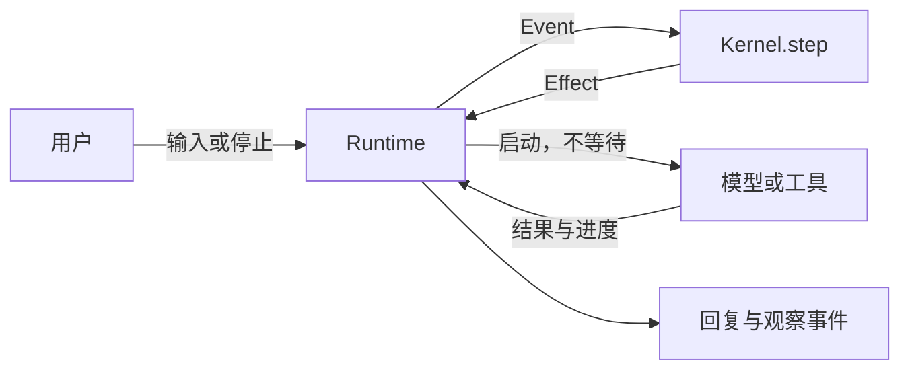

# bone-agent

一个同步内核，外接异步执行器。**主力决定怎么做，代码管理执行，协调只解释主力忙碌时的插话。**

```text
用户要求 → 主力 → 工具 → 主力 → …… → 答案
主力忙碌时的插话 → 协调：保持 / 重想 / 暂停
```

没有插话，协调调用为零。主力空闲时用户原话直接交给主力；工具结果、失败和软提醒也直接回到主力。
协调不选择工具、不重写要求、不制定方案、不审批专业答案。

## 从一次运行开始

```sh
cargo run -p bone-agent --example walkthrough
cargo run -p bone-agent --example interleaving
```

[walkthrough](examples/walkthrough.rs) 直接向真实 Kernel 喂事件，演示研究 A、询问进度、改 B、
旧答案暂存、主力交付 B。加 `-- --json` 导出每一步的完整输入、状态和指令。
修改一个预设 `WorkResult` 或 `InputReview`，即可观察规则如何处理不同选择。

[interleaving](examples/interleaving.rs) 接上真实 Runtime、可控端口和虚拟时间，演示工具卡住、
30 秒软提醒、两种模型并发、旧建议被撤销，以及卡住的只读调用如何结束本地等待。
模型输出是预设数据，状态变化、调度、取消和事件流都由实际实现完成。

## 三个模块



| 模块 | 职责 |
| --- | --- |
| [kernel.rs](src/kernel.rs) | 唯一持有会话状态；记录事件、检查建议、返回执行指令。 |
| [runtime.rs](src/runtime.rs) | 收件、启动异步作业、保管句柄、监督取消与截止时间。 |
| [ports.rs](src/ports.rs) | 模型与工具接口，以及输入、结果、快照和观察数据。 |

```rust,ignore
Kernel::step(event) -> Vec<Effect>
```

`step` 不调用模型或工具、不等待 I/O、不读取系统时间。
Runtime 分发 Effect 后继续收件，完成结果作为事件返回。
模型和工具共用启动、进度、完成、取消机制，端口内部不能再隐藏一个 Agent 循环。

## 两种模型用途，求解权属于主力

| 用途 | 输入与权限 |
| --- | --- |
| `Work` | 最新快照和固定用户批次。返回 `WorkResult`，决定工具、取消、回复和下一步。 |
| `ReviewInput` | 主力忙碌时的固定插话批次。只返回 `Keep / Reconsider / Pause`、简短交流和判断理由。 |

`WorkResult` 的六个字段：

| 字段 | 含义 |
| --- | --- |
| `note` | 明确返回的结论或材料，可供后续主力使用。 |
| `reply` | 要发布的用户回复。 |
| `requirement` | 主力根据本批原话更新的可选要求摘要，不能替代原话。 |
| `autonomy` | `Keep / Run / Pause`，保持、开启或暂停自主推进。 |
| `operation` | 最多一个 `Tool` 或 `Cancel`；也可以为空。 |
| `next` | `Continue / Wait / Finish`，继续推理、等待或交付。 |

`Continue` 立即开始下一次推理，可以完全没有工具；它不会等刚启动的工具。
下一步依赖工具结果时应选 `Wait`，结果到达后自动唤醒主力。工具等待不占住主力请求槽。
每次主力或协调各最多一个本地请求；主力返回但尚未提交时保存一份结果。
所有调用读取同一份会话记录的不可变快照，没有第二套聊天历史。

协调只在主力推理中或结果等待提交时解释插话：

- `Keep`：明确不影响当前任务，原推理继续；例如只询问进度。
- `Reconsider`：新增要求、改方向、专业追问或含义不明确，原话转给主力。
- `Pause`：本批输入要求暂停；保留此批之后的消息。

“进度如何，顺便不要 A”必须交回主力。协调对语言可能判断错误；类型和代码检查不能证明语义正确。
真实适配器给协调一个小视图，不包含工具定义、文件结果或完整分析产物。

## 插话与旧结果怎样交错

```text
主力 W1 正在推理 A
收到“不要 A，改 B” → 协调 C1 开始解释
W1 先返回 → 暂存，答案和工具建议都不发布
C1 返回 Reconsider → 撤销 W1，把原批次和新原话交给 W2
W2 自己研究 B → 检查通过 → 直接交付
```

协调尚未处理完时又收到新消息，新消息进入下一批，不能被当前批次误标为已处理。
`Reconsider` 完成的是分类，原消息仍需明确交给下一次 Work；单纯留在历史里不算移交。

主力整份 `reply / requirement / autonomy / operation / next` 提交前检查：

1. 请求与运行代次仍有效。
2. 没有尚未解释的新增输入，自己的固定输入批次除外。
3. 决定依据没有变化。
4. 工具及运行规则允许操作。

记录位置随新信息增长；依据版本只在实质变化时增长。普通进度和 `Keep` 不使推理过时。
工具实质结果会改变依据：工具先结束、旧建议后到达时，即使写入名额已空也不能执行旧建议。
过时或被规则阻止的结果作为材料保留，由主力重新考虑；不会排队等待条件满足后自动执行。

## 停止、取消与完成

`stop()` 立即撤销旧模型的执行资格。旧回调不能恢复或发布旧回复，真实工具结果仍被记录。
暂停不关闭对话。新输入由主力理解后才可能恢复，不能把“谢谢”写成自动恢复。
自然语言暂停的边界是它所属批次的记录位置：先收到“暂停”、后收到“继续 B”，B 不能被清空。

只读调用由 Runtime 在 Future 外层响应取消，即使端口不主动检查信号也能结束本地等待。
本地结束事件到达后才释放主力槽，启动替代请求。丢弃 Future 不证明服务商停止计算，
只保证已经收到的旧结果能保留；端口必须异步让出线程并正确管理自己的资源。

写操作继续采用保守规则：最多一个结果未明的写入，查询和取消仍允许。
取消、超时和传输错误不能当作“没有发生写入”；`Unknown` 继续占住写入名额，直到获得明确结果。
调用已返回后，宿主可用 `resolve_write(id, outcome)` 递交外部确证，经同一事件入口更新原作业。
只接受未知写入的明确工具结果；相同确证重复提交幂等，不同的再次改写会被拒绝。
该接口不自动查询，也不让模型凭文字确认成功。对本地已结束的未知写入请求取消会明确报错。

`Finish` 交付当前任务并停止自主推进，不能申请新工具调用。
未决写入阻止成功完成；废弃的只读调用可以进入清理阶段，通过 `Finished { cleanup }` 明确列出。
之后的完成通知不重复交付。任务完成、取消请求、远端确认停止是不同的事实。

当前有效模型失败或超时会释放槽、发布错误并暂停，不自动无限重试。
旧请求的取消或超时只记录，不能误停替代工作。
默认工具软提醒 30 秒，主力与协调截止时间各 120 秒，关闭清理时间 5 秒，均可配置。

## 观察真实运行

`AgentHandle::observe().await` 原子返回快照、当前序号和后续事件流，避免先查状态再订阅的间隙。
每个 `StepEvent` 对应一次完整 `Kernel.step()`：

| 字段 | 含义 |
| --- | --- |
| `sequence` | 会话内递增的处理序号。 |
| `elapsed` | Runtime 提供的单调运行时长。 |
| `event` | 输入、作业结果、进度、提醒或停止。 |
| `records` | 新增记录，包括 `InputReviewed`、`WorkHeld`、`PlanAccepted / PlanDiscarded`。 |
| `effects` | 实际发出的启动、取消、提醒和发布指令。 |

`Start` 摘要包含用途、输入消息 ID、记录位置、依据版本和运行代次，不递归嵌套快照。
`PlanAccepted` 表示主力整份建议通过代码检查；`Start` 仍只是指令，执行结果须看 `JobFinished`。
只暴露返回的结论和处理理由，不读取模型内部思考。

```rust,ignore
use tokio::sync::broadcast::error::RecvError;

let mut observation = agent.observe().await?;
loop {
    match observation.events.recv().await {
        Ok(step) => println!("{step:?}"),
        Err(RecvError::Lagged(_)) => observation = agent.observe().await?,
        Err(RecvError::Closed) => break,
    }
}
```

实时缓冲保留最近 256 步，订阅者独立接收。慢观察者不会阻塞 Kernel 或延长 Runtime 生命。
遗漏通过 `Lagged` 暴露，可重新获取一致快照；不会补发错过的原始步骤。进度按作业合并。
观察者需要改变工作时，仍使用显式 `post()`、`stop()`，不能在回调里直接执行操作。

终端前端可写出同一端口的事件：

```sh
cargo run -p bone-tui -- --events session.jsonl
```

文件必须不存在。JSONL 先写 `snapshot`，随后 `step`，落后时写 `gap`。
内容包含会话输入、明确返回的决定及工具数据；不收集登录通信或内部思考。
写出由独立消费者完成，关闭时等待它结束。这是观察接口，不是持久化恢复协议。

## 模型配置的归属

协调是系统级配置；主力允许任务级选择。两种用途可以选同一型号，但不能共用一把跨请求的锁。
`bone-agent::start` 从一次配置快照构造模型、工具和 Runtime；Kernel 仍然只接收普通参数，
不读取配置或选择提供商。

```json
{
  "agent.system": {
    "coordinator": { "model": "your-coordinator-model", "timeout_seconds": 120 },
    "default_solver": { "model": "your-solver-model", "timeout_seconds": 120 }
  }
}
```

配置默认在 `$XDG_CONFIG_HOME/bone/config.json`，该目录未设置时用 `$HOME/.config/bone/config.json`。
`BONE_CONFIG` 可指定另一个绝对路径。`config_builder()` 注册 Agent、LLM 和 Tools 配置，
前端可继续注册自己的配置段。配置在会话创建时读取，已有会话不热更新。
主力型号优先级：`--model`、`BONE_MODEL`、`default_solver.model`；不会修改协调或写回配置。
`TaskConfig` 也可覆盖主力的 `effort` 和 `timeout_seconds`。
独立推理强度支持 `none / minimal / low / medium / high / xhigh / max`，具体组合由提供商校验。
主力和协调截止分别传入 `KernelConfig::work_timeout / review_timeout`。

## 接入与源码阅读

```rust,ignore
let config = bone_agent::config_builder()?.build(bone_config::default_path()?)?;
let agent = bone_agent::start(
    &config,
    workspace,
    bone_agent::TaskConfig::default(),
    |prompt| show_login(prompt),
).await?;
```

使用同一凭据目录重新创建会话前，应先等待旧会话 `shutdown()`；当前订阅连接在存活期间独占该目录。

| 方法 | 完成意味着什么 |
| --- | --- |
| `post(text).await` | 内核已接收，返回消息位置；不等待整项任务完成。 |
| `stop().await` | 旧自主工作的执行资格被撤销。 |
| `snapshot().await` | 获取状态和完整内存记录。 |
| `resolve_write(id, outcome).await` | 宿主核实后确认一个已结束的未知写入；不自行查询或从停止中恢复。 |
| `observe().await` | 原子获取快照和后续处理事件。 |
| `subscribe()` | 独立接收回复、进度、结果与错误。 |
| `shutdown().await` | 清理后返回未解决作业；并发或重复调用共享最终报告。 |

所有 Handle 丢弃也会触发关闭。第一版只处理单进程内存状态，不提供外部操作恰好一次的保证。

阅读顺序：先看 [walkthrough](examples/walkthrough.rs)，再看 [Kernel 的 step](src/kernel.rs)、
[协议类型](src/ports.rs) 和 [Runtime 的 dispatch](src/runtime.rs)。
完整反例、设计取舍和开源依据见[模型职责设计](../../docs/agent-model-responsibilities.md)。
本轮测试与真实模型事件见[重构验收记录](../../docs/certifications/bone-agent-2026-09-06-solver-loop.md)。
