# BONE TUI · 可评审界面稿

这组稿件保留三栏，默认右栏空白。所有文字同一字号，按终端行列排布。英文用于匹配当前产品语言；等待配置稿含中文输入。示例不是实际 Agent 对话。

完整规格、交互、来源与实施步骤见 [设计方案](PLAN.md)。

## 01 空会话 · 160×40

输入框固定在中栏底部，空态只用两行文案；不加入首页 Dashboard 或大 Logo。

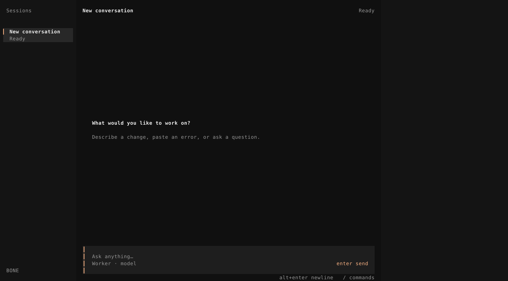

## 02 正常对话 · 160×40

主推荐稿。短对话顶对齐，用户、Agent、工具、代码有不同的排版，但不加身份标签和外框。

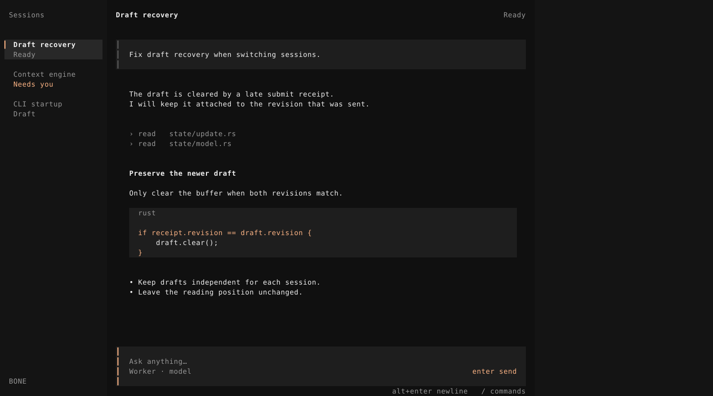

## 03 正在执行

活动在正文尾部，占用紧凑一行；输入可继续编辑，停止是清楚的局部动作。

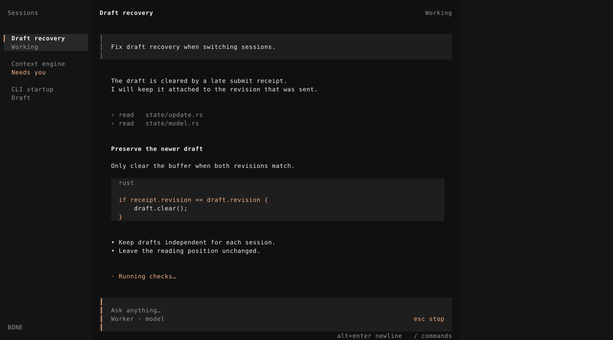

## 04 命令菜单

菜单锚定输入框，列对齐，Esc 只关闭菜单。/model 是本轮提议新增的接线，不是现有功能。

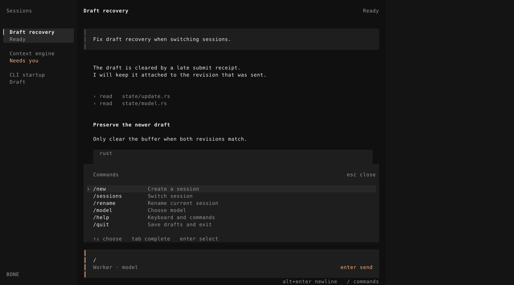

## 05 等待配置

明确区分已保存与已执行。保留用户文字，显示继续路径。

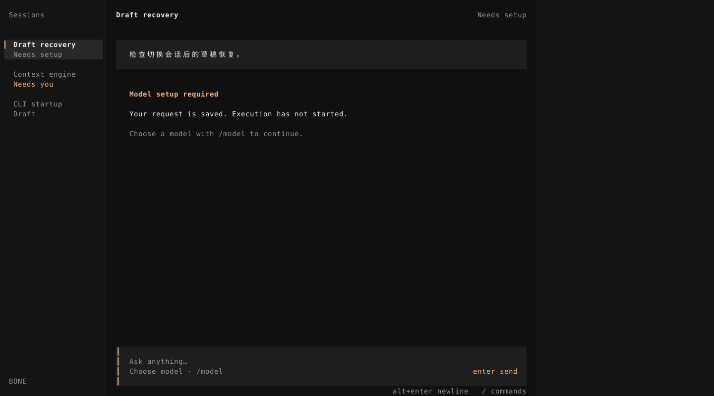

## 06 右栏 Job · 后续阶段提案

右栏由选中的真实对象激活，不自动塞入统计。此图说明容器与阅读层级，默认空白规则不变。

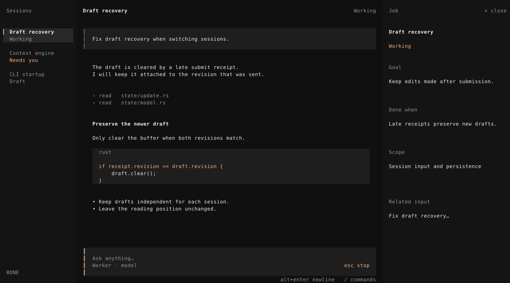

## 07 两栏、多行输入 · 120×32

右栏隐藏，输入向上增长，模型与操作提示有独立位置。

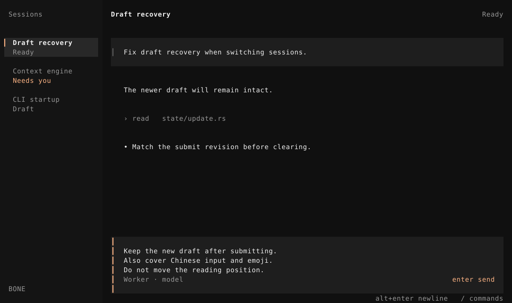

## 08 单区 · 80×24

保留会话切换命令提示；列表与对象阅读共用单区，返回后草稿和阅读位置恢复。

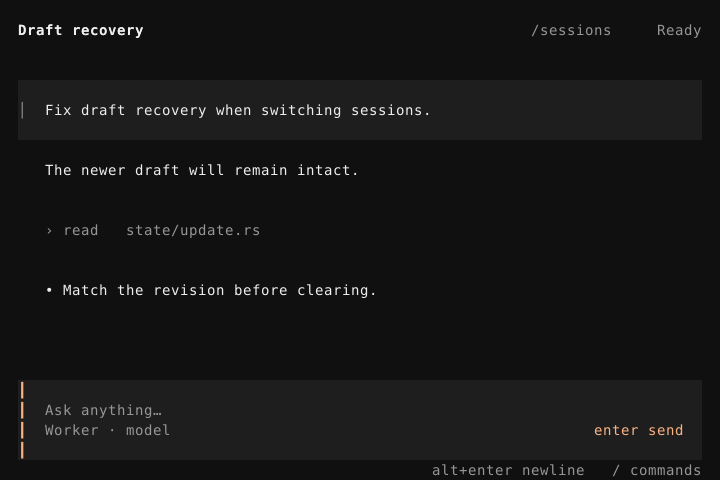

## 09 最小可用 · 40×12

去掉次要提示，保留问题原因、输入、模型入口与命令入口。

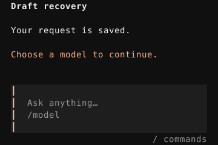

## 10 等待回答

问题仍在对话中；输入上方明确回复目标，Esc 取消本次关联，不取消运行中的其他工作。

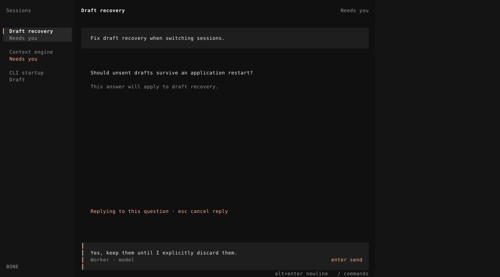

## 11 正在读历史

新消息不拉走阅读位置，回到最新是明确动作。图中数量为演示数据。

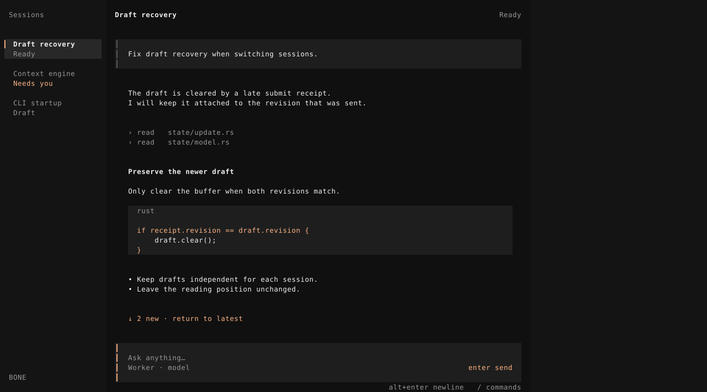

## 实际运行对照

以下是 tmux 实际屏幕捕获的颜色重建图；不是设计稿，也不是 OS 像素截图。ANSI 原始记录保存在 evidence。默认终端背景按 #101010 重建。

### 当前 BONE 空态

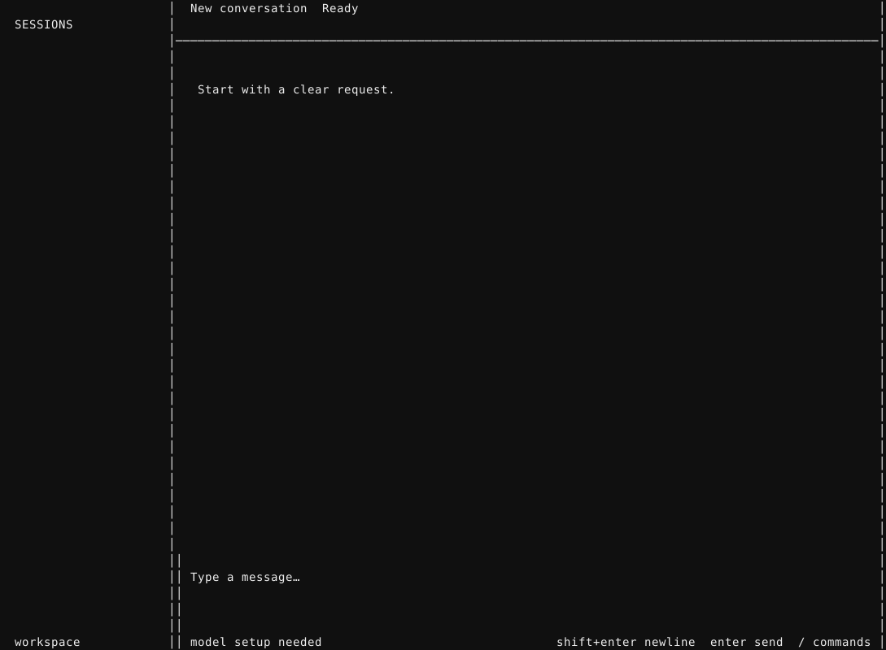

### 当前 BONE 无模型提交后

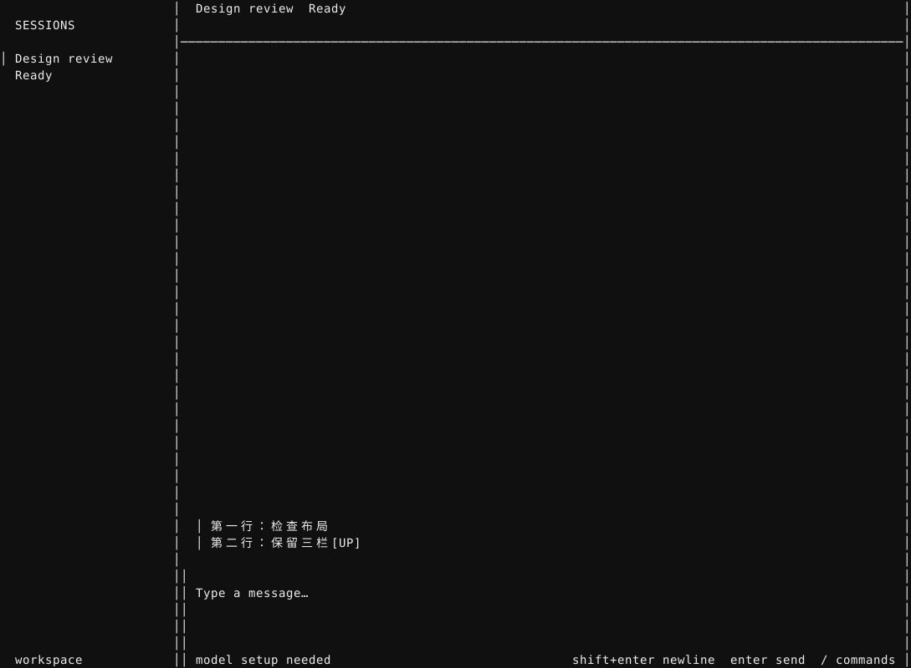

### 当前 BONE 最小尺寸

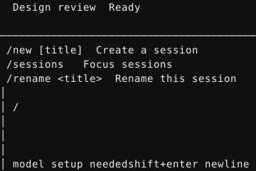

### 本机 OpenCode 空态与命令菜单

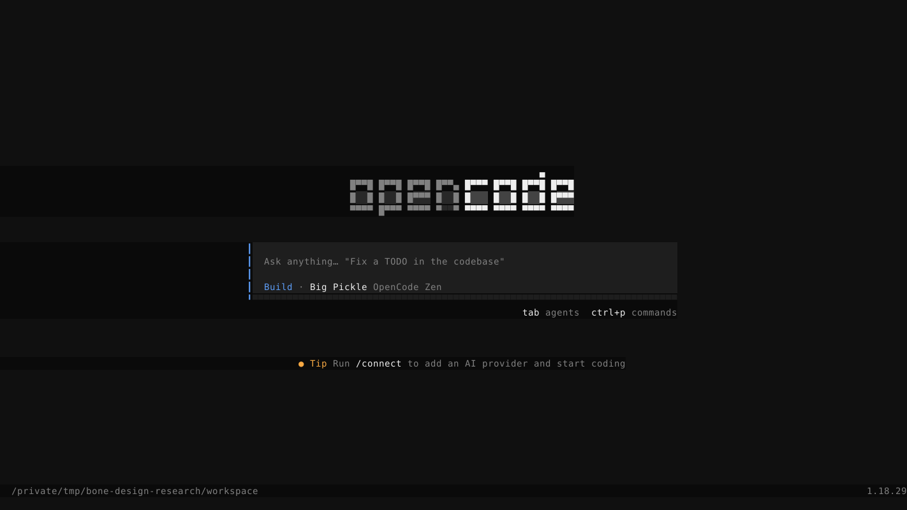

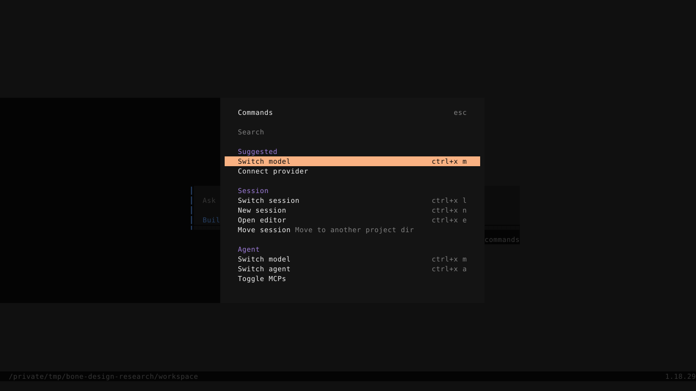
