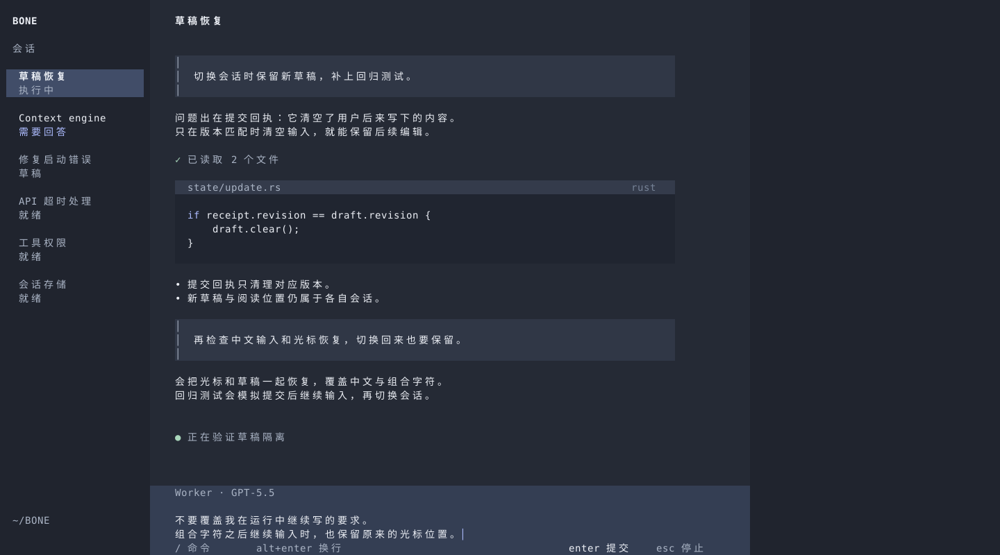
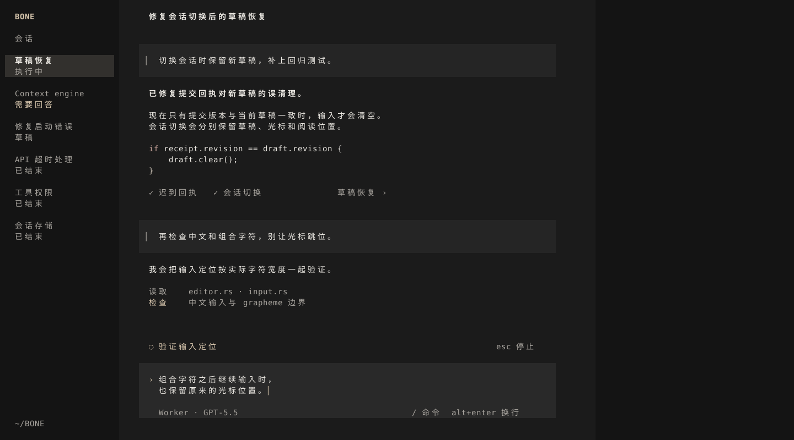
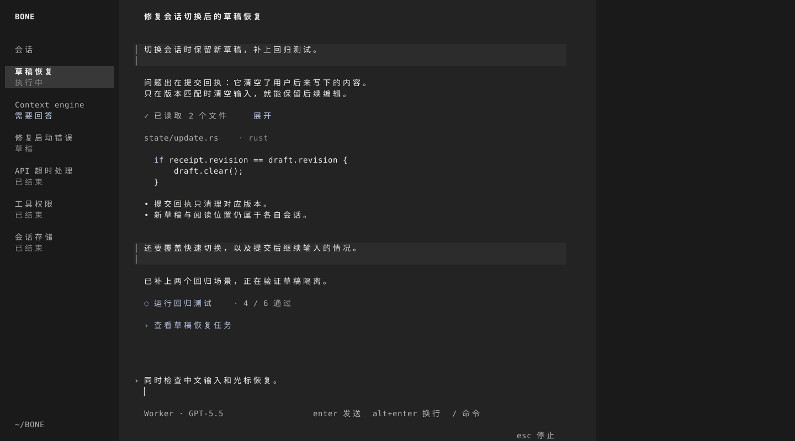

# 三个独立方向 · 修订后比较

均为160×40终端格，左24/中96/右40。任务主题相同，正文与草稿措辞不同；这不是控制变量实验，也不据此做精确量化评分。图中未接线的文字动作只是视觉提案。

## A：停靠式编辑工作区 · 推荐

工作面更完整、明度更明确。输入跟中栏边缘连接，单行4行、双行5行、三行6行。代价是它仍比透明输入有视觉重量。

## B：连续阅读与局部写作区

两轮内容更像连续文章，代码开放排版。编辑面浮于正文内部。代价是输入与用户历史消息仍使用相近的块状语法，独立性较弱。

## C：连续工作记录与原生输入

最轻的输入结构，正文与输入同轴。代价是空输入和焦点范围不如独立工作面可发现。没有因元素少而自动判定更好。

[返回选稿依据与完整研究](REVIEW.md)
