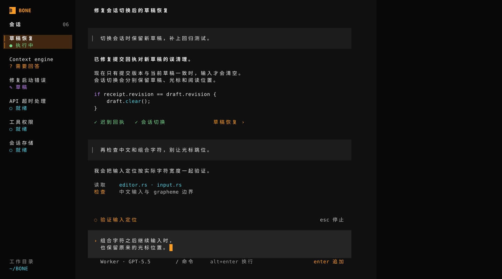

# BONE · B 方向完整设计

2026-09-10。基于用户更偏好的B构图补全，继续纳入“颜色对比度低”和“光标太细”的反馈。当前主张：连续阅读、开放代码、局部输入区；使用橘黄色强调色、中性深底与实心光标。设计方案，尚未修改产品代码。

## 本轮明确改变

- 保留B的局部输入面与连续对话，不引入A的整宽停靠台。
- 正文从米灰改为清白，辅助字提高亮度；历史消息、编辑区、选中区域拉开层级。
- 操作和选中标记用鲜橘黄，代码关键字用紫色、函数与文件路径用青色，通过状态用绿色；普通正文保持中性白。
- 细竖线光标改为一格实心块。输入失焦后隐藏；菜单与详情不能同时残留输入光标。
- 补齐菜单、问题、错误、详情、草稿恢复、长输出与尺寸变化，修复演示中返回错误场景的问题。

最新配色提案使用纯黑侧栏、炭黑画布和中性灰编辑面，去除蓝灰底色。橘黄为主强调色，青、紫、绿补充代码与状态层次。输入正文上下留白沿用用户已确认的布局；新配色尚待评审。

## 视觉系统

| 角色 | 色值 | 设计作用 |
|---|---|---|
| 主画布 | `#101010` | 对话底色 |
| 辅助栏 | `#080808` | 降低侧栏视觉重量 |
| 用户消息 | `#1c1c1c` | 标明消息来源 |
| 编辑区 | `#252525` | 当前写作位置 |
| 选中项 | `#402711` | 目录选择、对象来源 |
| 正文 | `#f5f5f5` | 清晰的阅读主体 |
| 辅助文字 | `#c2c2c2` | 模型、状态与过程说明 |
| 次要提示 | `#999999` | 快捷键教学等 |
| 动作与光标 | `#ff9d24` | 可操作位置和输入焦点 |
| 代码 / 成功 / 错误 | `#ca8cff` / `#78e08f` / `#ff667a` | 局部语义 |

按sRGB计算，正文/画布17.45:1，辅助字/编辑面8.61:1，橘黄色/编辑面7.37:1。比例用于校验可读性，审美以设计稿评审为准。

所有生产文字保持终端字号，不做网页式大标题。粗体只用于当前标题、结论与局部小标题。代码开放排版，不逐段包卡片。用户消息用低对比背景和细来源线；来源线不是输入光标。

## 输入区

根据用户最新反馈，输入正文上下各保留一行内边距。主图两行草稿的编辑面占四行：上留白一行、文字两行、下留白一行；模型、命令、换行提示与当前动作放在编辑面外紧邻的下一行。单行编辑面三行，三行编辑面五行，均另加一行框外工具行。停止放在活动状态行右侧。

| 状态 | 光标与文字 | 动作语义 |
|---|---|---|
| 普通输入 | 实心块，正文亮度 | Enter提交 |
| 执行中追加 | 可继续编辑 | Enter追加，不承诺立即打断当前执行 |
| 回答问题 | 独立答案缓冲 | Enter回答，绑定QuestionId |
| 提交待确认 | 保留后来输入 | 等待确认；不重复创建新请求 |
| 问题过期 | 答案保留可编辑 | 禁止作为旧问题答案提交，可转普通输入 |
| 菜单/详情焦点 | 输入光标隐藏 | Esc处理局部返回 |
| 停止中 | 草稿保留 | 等待停止结果，不提前宣称完成 |

实心块在图里占一个终端格。生产实现使用终端光标能力；位于中文等宽字符上时按显示宽度表现并保持字形可辨，行尾占一个空格。光标只表示插入位置，不能让实心块误成覆盖输入模式。图稿未演示实际闪烁、中文输入法或中间位置编辑。

## 布局与尺寸

| 终端尺寸 | 布局 | 主要处理 |
|---|---|---|
| 160×40 | 24 / 96 / 40 | 左会话，中对话与局部输入，右默认空 |
| 120×30 | 24 / 96 | 详情替换中栏阅读面，草稿保留 |
| 80×24 | 当前单区 | 标题、回复、输入重新排版；详情有返回来源 |
| 40×12 | 紧凑单区 | 缩减模型和帮助文案，保留输入与主要动作 |

宽屏正文从中栏+6格开始；历史消息与输入表面从+4格开始，宽84格。消息内文本再缩进4格。这是B原有的阅读轴与局部表面关系，不强制所有文字贴同一条线。窄屏表面宽度为中栏−8，较长内容真实换行。

右栏只有打开具体对象后才出现内容，默认不填提示卡、仪表盘或功能目录。来源选中与键盘焦点分开；详情关闭回到来源，再进入输入区。

## 场景入口

[打开主稿点击演示](boards/01-main.svg) · [完整场景目录](SCENARIOS.md)

| 场景组 | 直接查看 |
|---|---|
| 对话与写作 | [运行](boards/01-main.svg)、[空输入](boards/54-empty.svg)、[三行草稿](boards/03-multiline.svg)、[完成](boards/04-idle.svg) |
| 命令与会话 | [命令菜单](boards/05-menu.svg)、[新会话](boards/06-new.svg)、[会话切换](boards/17-sessions.svg) |
| 问题 | [待回答](boards/07-question.svg)、[问题过期](boards/34-expired-question.svg) |
| 配置与恢复 | [未选模型](boards/09-config.svg)、[模型菜单](boards/10-model.svg)、[执行失败](boards/14-failure.svg) |
| 阅读 | [右栏详情](boards/11-detail.svg)、[较早历史](boards/33-history.svg)、[长读取记录](boards/48-tool-long.svg) |
| 提交与停止 | [待处理输入](boards/15-queued.svg)、[停止中](boards/35-stopping.svg)、[提交未确认](boards/37-uncertain.svg) |
| 尺寸 | [120列](boards/22-medium.svg)、[80列](boards/23-narrow.svg)、[40列](boards/24-minimum.svg)、[80列详情](boards/39-detail-narrow.svg) |

### 建议按这些路径评审

1. 主稿 → 命令菜单 → 关闭：原草稿恢复。
2. 主稿 → 草稿恢复详情 → 返回来源 → 输入：焦点按原位置恢复。
3. 主稿 → 追加 → 停止全部 → 等待执行停止 → 恢复补充要求：内容仍然在历史中，恢复原文。
4. 三行草稿 → 追加 → 停止全部 → 停止结果 → 恢复三行：不丢第三行。
5. 待回答 → 选所有/只选最后一个/提交自写答案：三个分支展示各自答案。
6. 执行失败 → 准备重试草稿 → 提交：显示对应重试要求，未跳入无关历史。
7. 主稿 → 读取记录 → 完整记录 → 下一段 → 返回工具来源 → 编辑：返回正确来源。
8. 80列详情 → 返回来源 → 输入：保持相同尺寸与草稿。

这是页面之间的静态状态走查。只连接明确的示例路径；键盘提示、文字编辑、滚轮、真实异步事件并未实现。点击“等待执行停止”等状态文字，只是评审时跳到模拟结果，不是产品会提供的按钮。不同尺寸是独立样例，不代表resize保持状态已实测。

为避免错误跳转，三行独立稿和Idle稿不连接通用对象详情；取消/恢复样例的“较早对话”只显示静态提示，不跨到另一条时间线。这是演示边界，生产交互仍按原会话、草稿和阅读锚点恢复。

## App契约与拟实现内容

| 分类 | 内容 |
|---|---|
| 当前TUI已有基础 | 三栏断点、Session切换、普通提交、slash命令、历史数据流、停止入口 |
| App有能力，TUI需完善 | QuestionId关联回答、模型配置、输入重试、对象详情与相应状态呈现 |
| 本轮设计提议 | B视觉主题、实心光标呈现规则、按内容增长的局部编辑区、精确对象返回、失效问题草稿转换、改进的状态文案 |
| 仅演示内容 | 示例模型名、任务、代码、测试结论、具体回复与长记录片段 |

运行中提交不是简单的“等当前任务结束后执行”：App保存Queued后立即尝试投递。故显示“追加”，只有实际快照仍Queued时显示待处理。停止会取消Queued输入并停止Runtime，已有待处理输入时标为“停止全部”。停止确认前保留Stopping，不提前给出成功。

Question回答必须绑定问题身份。普通草稿与答案缓冲分开，过期答案不能被静默改成普通提交。模型菜单只显示实际配置可用项，配置/凭据变化后的恢复文案以真实App状态为准。示例中“选模型后恢复”不是对所有认证失败场景的承诺。

[详细交互与代码核查](INTERACTION.md) · [视觉规则与独立复审](VISUAL.md) · [反方验收记录](REVIEW.md)

## 实施方案

1. **视图与编辑几何**：抽出语义主题、局部表面宽度、输入可见行预算；实现实心光标与唯一焦点。先在真实终端还原主稿及四档尺寸。
2. **连续内容渲染**：Markdown段落、列表、开放代码、工具条目共享稳定身份；渲染行与滚动锚点一致。文字转义、控制字符过滤和显示宽度保留现有边界。
3. **交互状态**：区分focus、selection、overlay、reader、普通draft、answer buffer、pending submission。返回来源要保存对象身份与阅读锚点，不能保存旧屏幕坐标。
4. **App接线**：问题关联、配置、停止范围、重试身份、迟到回执。不从日志猜状态，不让视觉状态代替真实结果。
5. **验收**：迟到回执不清空新输入；三行/中文/组合字符草稿完整；Esc不误停；切会话和resize不丢锚点；失败与配置恢复不重复请求。最终检查真实字体、光标、输入法和终端色彩降级。

本轮检查了SVG边界与所有链接目标，并实际走查关键路径；没有改产品代码，也没有用静态稿冒充生产测试。多agent发现的实质导航问题已经修复；对配色与美感的评价仍然需要用户看图判断。

## 左栏视觉补充

品牌使用橘黄色单格标记与 BONE 字标，会话标题提高至正文亮度。状态采用符号和文字双重表达：运行绿色、待回答橘黄、草稿紫色、就绪青色、失败红色。当前会话使用细橘色竖线（│，非整格色块）和深橘底；会话数量以实际列表数量为准，图中为示例。底部以次要标签和青色路径标识工作目录。

## 实现期宽度修订（用户最新反馈）

左栏从24格改为32格。输入框与对话内容区共用左右各4格边距，去除84格内容宽度上限，随中栏一起拉伸。此前静态尺寸表为历史方案，实际实现按本修订。
