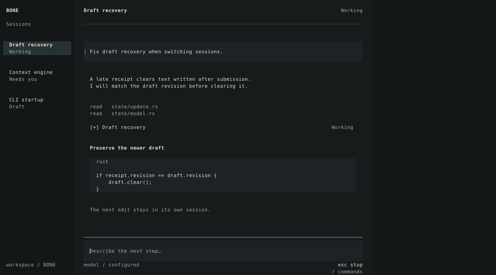
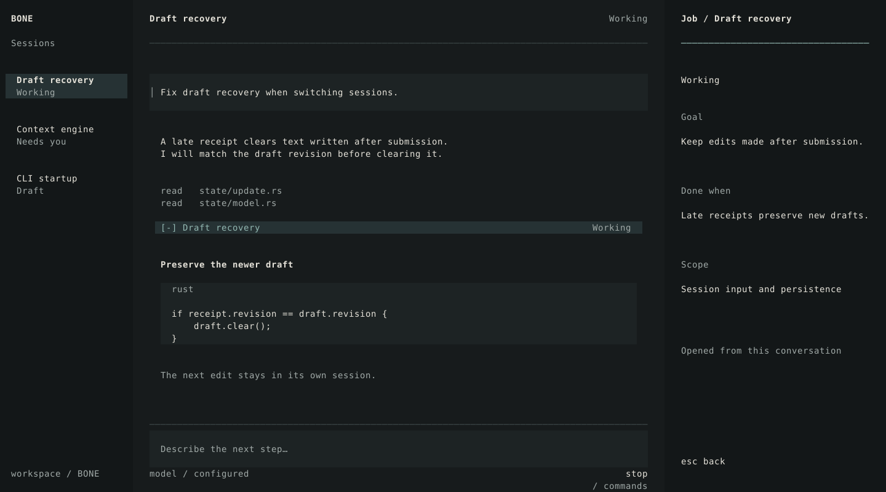
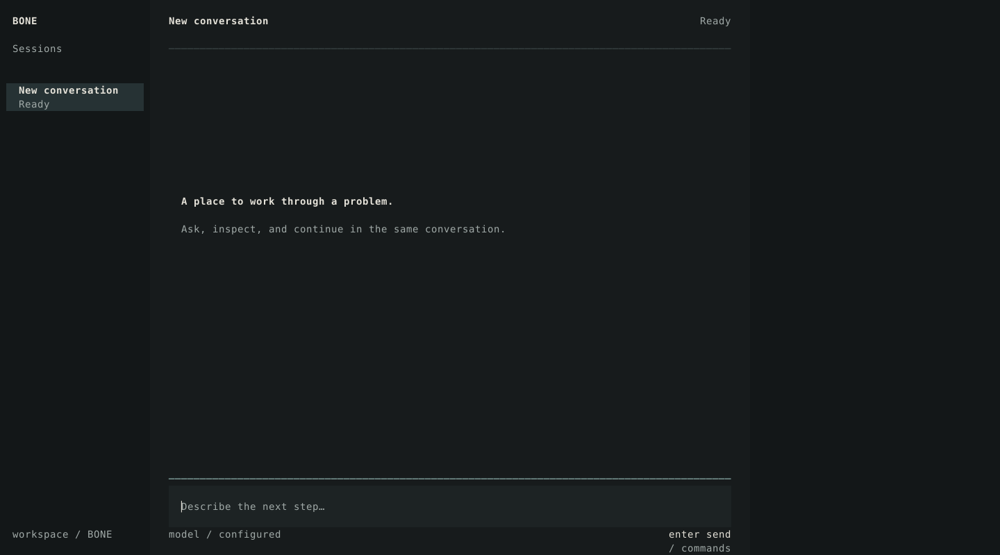
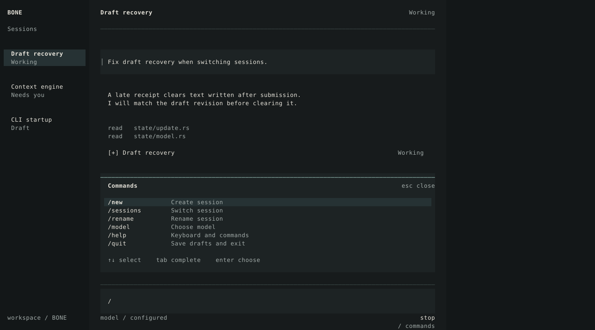
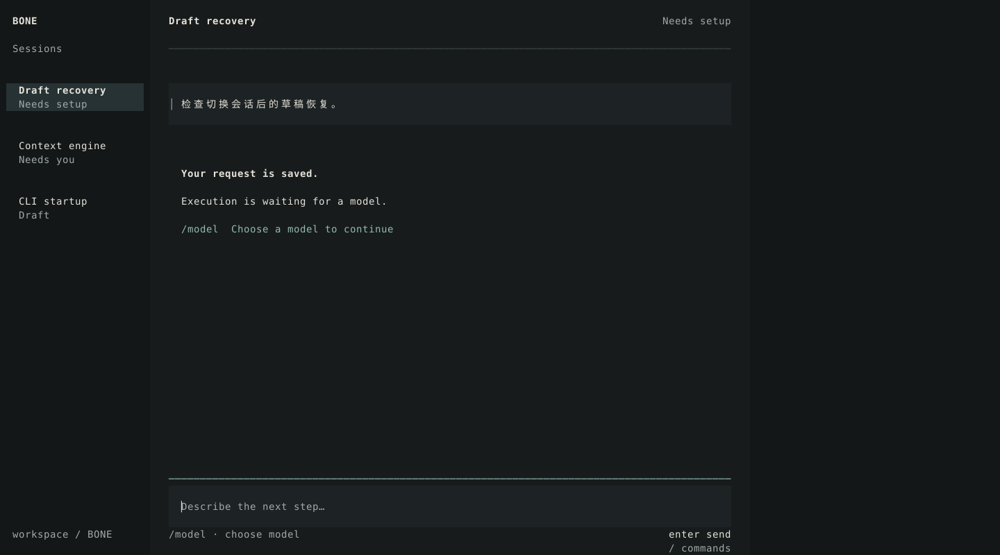
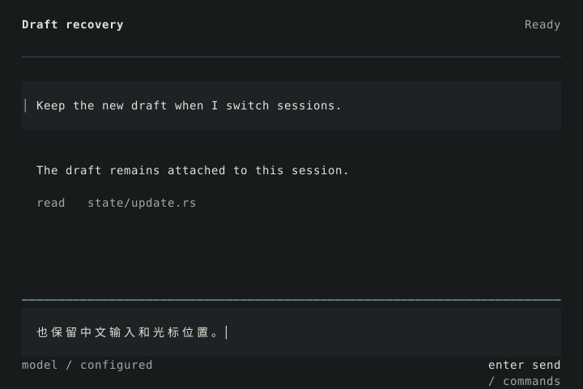
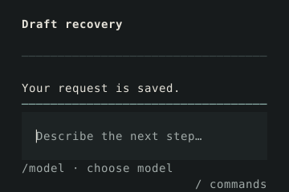

# BONE · 新视觉方向

保留三栏。水平编辑区、骨白文字与三栏对象联动是这版的主线；右栏默认空白。完整规则见 [设计方案](DIRECTION.md)。以下全部为静态设计稿。

## 主对话 · 160×40

## 打开对象 · 焦点移至右栏

## 空会话

## 命令菜单

## 等待配置

## 80×24

## 40×12

上一轮界面与OpenCode实际捕获见 [对照材料](../BOARDS.md)。
