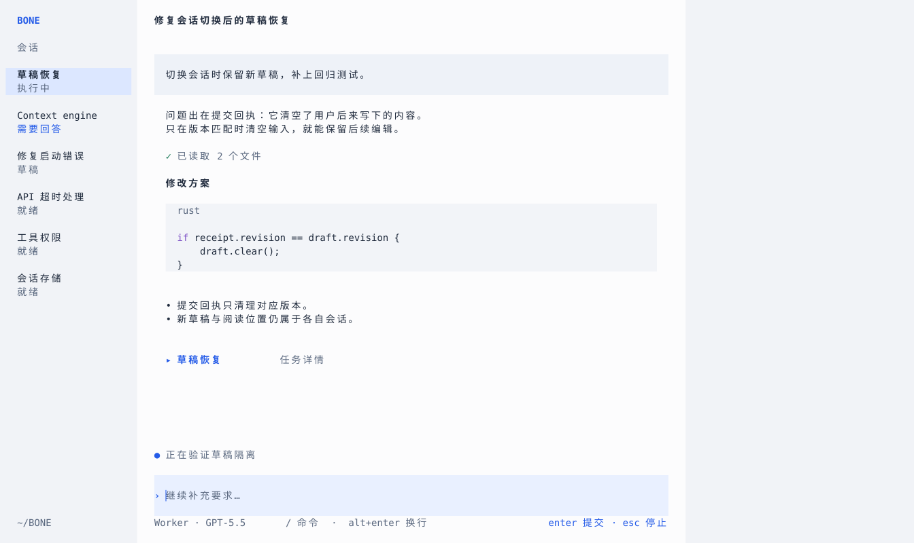
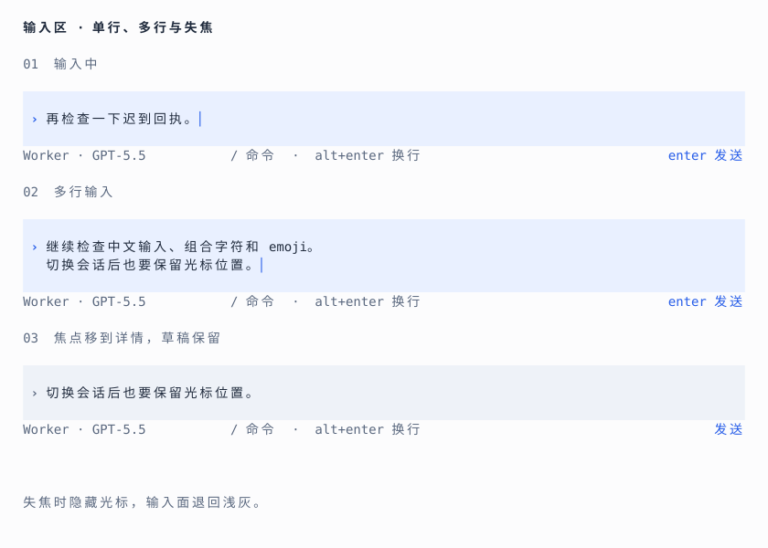

# BONE · 清亮方向

针对“太阴湿”与输入框厚重的反馈重新设计。此稿替代第三轮的视觉基调；三栏职责、草稿隔离、焦点恢复等行为约束延续。产品代码未修改。

## 视觉变化

主画布 `#fcfcfd`，辅助栏 `#f1f3f7`，正文 `#202b3d`，次级信息 `#59677e`。使用清晰的蓝色 `#245be8` 表达动作和需关注状态，用户消息与代码保持冷中性色。去掉灰褐强调和暗色大面积叠加。

160列仍采用24/96/40三栏，右栏默认留空。这里选择浅色作为新的完整视觉提案，尚未将其设为产品默认主题。

## 输入区重新设计

旧稿单行框体占5行，再加框外提示1行；新稿编辑面占3行，下面信息1行，总计4行。活动状态独立放在上方，不计入编辑区，两版均如此。

- 去掉整圈边框，使用浅蓝 `#e9f0ff` 的完整编辑面，与用户消息的浅灰表面区分。
- 编辑面中间一行放正文，顶部和底部各留一行。提示符位于左侧，输入正文与对话正文起线一致。
- 真实光标表示正在编辑。输入有内容时占位文字消失。
- 模型在面外下一行左侧，当下动作靠右，命令与换行提示放中间；空间不足时先省略中间提示。
- 多行每增加一行，编辑面向上增长一行；达到视窗预算后内部滚动。单行图中的大块空白不能成为实现时的固定分段高度。
- 失焦后隐藏光标，编辑面回到用户消息同级浅灰，保留草稿文字。右栏显示局部焦点，返回时先恢复来源对象。

新框取消了旧稿的断续框线，也降低底部面板感。无框结构仍依赖表面差异和光标来表明编辑区域；真实终端的色彩降级、光标与输入法效果需要实现后验收。

## 图稿与演示范围

- [主界面](boards/01-main.svg)
- [右栏详情](boards/02-detail.svg)
- [返回来源](boards/03-return.svg)
- [多行输入](boards/04-multiline.svg)
- [80列窄屏](boards/05-narrow.svg)
- [输入区近看](boards/06-composer.svg)

主稿可点击“草稿恢复”打开详情，再点击“返回来源”，最后点击输入面恢复编辑状态。展开行也可以收起到来源。其余键盘说明、发送、模型和命令均为视觉示意，SVG没有实现这些动作。

这组图仍按终端单元格绘制，实际查看了主稿、输入近看和80列稿；已走通详情返回点击路径。模型、代码和任务状态均是示例。没有修改生产Rust代码，也没有声称完成真实TUI的交互验证。
