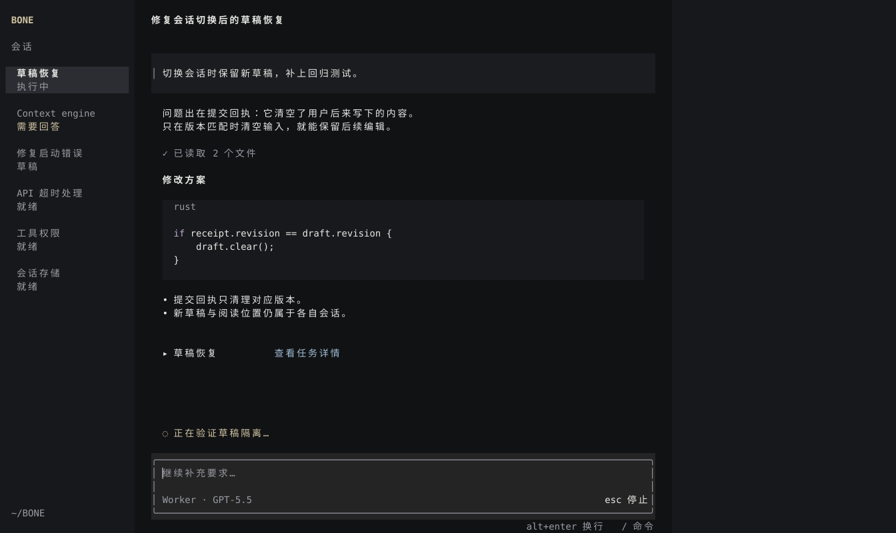
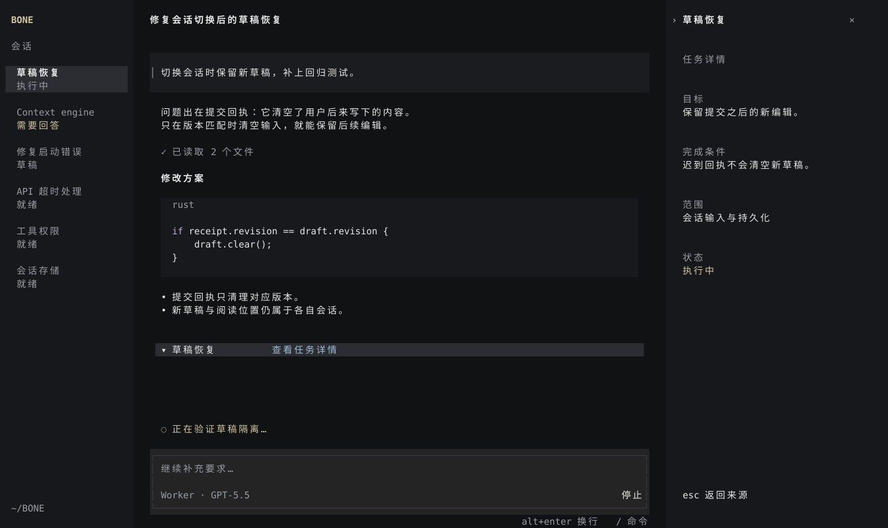

# BONE TUI · 第三轮设计提案

2026-09-10。推荐修订后的 A。保留三栏：会话目录、对话与输入、按需打开的对象详情。前两轮图稿留作比较，本稿是新的视觉提案；产品代码尚未修改。

## 这次具体解决什么

前两版的问题不只是颜色。第二版把输入框削成横线，又用空白和分隔线区分每种内容，削弱了编辑位置，也割裂了阅读。第一版有更清晰的输入区，但层级、焦点和原始文本渲染仍需要改善。第三版恢复明确的编辑表面，把内容关系放在起线、间距和明度上。

- 用户消息是较暗的整块背景；回答直接排在主画布上，不额外包卡片，也不添加 YOU/BONE 标签。
- 代码比输入框暗，保留语言标记和少量语法色。成功工具过程压到一行，失败原因就地展开。
- Composer 是主要的闭合轮廓，输入、正文和状态共用文本起线。骨白强调只用于少量状态，焦点不靠整片品牌色。
- 左栏选中用浅底；第二行保留真实短状态，“需要回答”提高明度。标题不重复执行状态。
- 右栏默认空白。打开具体任务后，来源行保留选中背景，焦点移到右栏标题旁。退出详情回到来源，再继续输入。

这是一种克制的终端工作界面。独立性来自三栏的职责与来源联动；不能仅凭配色宣称原创，也不以额外装饰制造区别。

## 联网研究与多 agent 讨论

三个 agent 分别做视觉批评、交互审查和参考研究，互相交换结论后，对 A/B 图片再次独立评审。最终主稿又由视觉 agent 实际看图复审。

| 第一方参考 | 实际研究内容 | 采用的原则 | 不照搬的部分 |
|---|---|---|---|
| [Crush](https://github.com/charmbracelet/crush) | 官方演示画面，包括初始与工具/差异相关画面 | 输入、过程、代码有不同层级，终端也需要明确视觉重心 | 紫色品牌、Logo、完整构图 |
| [Glow](https://github.com/charmbracelet/glow) | 官方阅读演示 | 段落、标题、列表、代码需要不同节奏 | 阅读器式单一用途结构 |
| [Yazi](https://yazi-rs.github.io/features/) | 官方预览与选择演示 | 选中对象与预览形成连续关系 | 文件管理器固定多栏内容 |
| [Zed panel design](https://zed.dev/blog/new-panel-system) | 2023 年面板设计文章与配图，属于历史设计资料 | 辅助面板保持低噪声、局部焦点明确 | 桌面按钮、工具栏与品牌样式 |
| [Zellij](https://zellij.dev/tutorials/basic-functionality/) | 官方分栏示例 | 分区与键盘焦点应清楚 | 每个区域都加完整边框 |

OpenCode 的已安装版本和源码探索来自前轮记录。以上参考共同用于判断成熟界面的基本功；最终选择是针对 BONE 的设计判断，不是这些产品的官方建议。

候选 B 在对话旁加 01–04 编号并使用平面输入区。三位评审均认为编号没有稳定含义，也没有节省高度，因此否决。用户不需要替我们从两个未成熟方向中做选择。

修订已落实：统一起线，分离三类背景，压缩段距，去掉“当前会话”伪状态，增加右栏焦点，补来源返回状态，新建保留旧会话，删除无去处的文件“查看”动作。

独立审查记录：[视觉](visual-critique.md)、[交互](interaction-review.md)、[参考研究](reference-research.md)。记录中的早期意见保留用于追踪；几何与最终规则以本提案和最终图稿为准。

## 可点击的状态走查

打开 [主稿 SVG](boards/01-candidate-a.svg)，可以沿已连接的控件跳转：

1. 查看任务详情 → 右栏返回来源 → 点击输入继续编辑。
2. `/ 命令` → `/new` → 新会话保留旧列表 → 点击“草稿恢复”返回。

这是 SVG 页面之间的点击走查。没有实现实际文字编辑、方向键、Esc、提交或模型配置；其它菜单项只展示设计位置。新会话页的完整菜单、滚动和会话切换仍属于实施范围。所有任务内容、模型名和结果均为示例。

| 场景 | 图稿 | 要验证的关系 |
|---|---|---|
| 首次空态 | [03](boards/03-empty.svg) | 不用大 Logo 或功能卡片占满空间 |
| 命令菜单 | [04](boards/04-menu.svg) | 覆盖层独占输入，关闭后恢复原光标 |
| 缺模型 | [05](boards/05-blocked.svg) | 已保存不等于执行中；配置入口可辨识 |
| 详情返回来源 | [10](boards/10-source-focus.svg) | 阅读焦点与输入焦点分开 |
| 既有会话中新建 | [11](boards/11-new-session.svg) | 原会话与其状态保留 |
| 等待回答 | [12](boards/12-question.svg) | 问题有来源，输入回答对应 QuestionId |
| 失败 | [13](boards/13-failure.svg) | 明确没有测试结果，保留错误原因 |
| 多轮历史 | [14](boards/14-history.svg) | 两轮来源清晰；阅读旧内容时不强制跳尾 |
| 120×30 | [07](boards/07-medium.svg) | 左栏24、中栏96，右栏隐藏 |
| 80×24 | [08](boards/08-narrow.svg) | 当前区域单页呈现 |
| 40×12 | [09](boards/09-minimum.svg) | 压缩提示仍保留输入和主要动作 |

## 布局和视觉规格

以终端单元格实现，不能按 SVG 像素机械移植。160×40 时左右栏分别24、40格，中栏96格。100–139列左栏24格；40–99列单区域显示；低于40列或12行显示尺寸不足提示。以上沿用现有断点。

中栏外表面从栏起点+3开始，宽为中栏−6；正文、用户文本、输入文本均从+5开始。代码文字再缩进2格。顶部标题两行高。单行 Composer 包含上下边框、编辑行、间隔、模型与动作，共5行；底部提示1行，活动状态位于输入上方。图稿40行时单行框为第34–38行（从0计），状态第32行。

多行输入按内容增长，40高最多6行编辑文本，30/24高最多4行；12高保持紧凑单行视窗。超过上限内部滚动，保证真实光标可见。历史占剩余区域，不能固定绘制坐标。缩放按消息锚点重排，不沿用旧屏幕行号。

| Token | 颜色 | 用途 |
|---|---|---|
| Canvas | `#111214` | 对话画布 |
| Rail | `#17181b` | 左右辅助区 |
| User | `#1b1c1f` | 用户消息表面 |
| Code | `#18191c` | 代码表面 |
| Editor | `#242424` | 输入表面 |
| Selection | `#2b2d32` | 当前项、对象来源 |
| Text / Muted | `#e8e8e6` / `#999ca5` | 正文 / 次级信息 |
| Accent | `#d1c4a4` | 需回答与局部活动 |
| Error / Link | `#db9c94` / `#9fbcd5` | 错误 / 有动作的文本 |

段内连续，普通段间一空行，身份变化适当增加空间。空白来自内容长度和固定底部编辑器，不把每个段落固定分配成大块。终端字体由用户决定；图稿用 Menlo 14px、8.4×20像素单元格辅助预览。

## 交互与数据约束

- Ctrl+方向键作空间焦点移动。普通文字键进入当前编辑器；详情阅读不能吞成输入。没有对象时右栏不可进入。
- Esc 一次只处理一层：关闭菜单 → 返回详情来源/取消局部选择 → 停止执行。停止确认前保持 stopping，不提前显示完成。
- Enter 提交，Alt/Shift+Enter 换行。中文组合输入、grapheme光标、上下行导航和鼠标定位需要真实编辑模型。
- 草稿、光标、阅读锚点属于各会话。提交时绑定会话和草稿版本，迟到回执只清理对应版本；切会话不清理新输入。
- 滚轮只作用于指针所在的可滚动区域。读旧消息时新事件不抢焦点；回到最新是显式动作。
- 详情用 objectId 与 generation 保持身份；切会话后旧请求不能回填到新详情。宽窄切换保留同一对象与返回位置。
- 工具名称、目标和结果只展示真实事件已有字段。未提供的数据不补造；App 未提供 token 流就显示真实活动和完整回复事件，不模拟逐字流。
- 缺模型、失败、等待回答分别读取实际 App 状态。模型配置成功后究竟自动恢复还是显式重试，需按 App 契约确定；本稿不声称该恢复链路已验证。

## 实施方案与验收

设计评审后，按四个可独立验收的阶段修改 `crates/bone-tui`：

1. **布局与主题**：提取统一间距、颜色和尺寸预算；实现真实状态的左栏、默认空白右栏、自适应 Composer。先用固定数据把160/120/80/40尺寸还原到真实终端。
2. **文本渲染**：把原始 wrap_text 替换为带来源身份的 Markdown 块渲染，支持标题、列表、代码、工具成功/失败及长输出；语法高亮降级不影响阅读。
3. **交互状态**：分开 focus、selection、overlay、reader；实现来源返回、草稿版本、阅读锚点与鼠标命中。不把正确交互作为最后补丁。
4. **App 接线与实机验收**：接真实问题、配置失败、任务对象及停止事件。验证中文多行、长代码、后台回执和终端缩放。只对真实能力提供动作。

必要测试：延迟回执不清空新草稿；A回执不修改B；Esc关闭菜单不停止任务；详情返回来源；空右栏滚轮不滚正文；阅读历史遇到新回复不跳尾。渲染用终端缓冲快照覆盖四档宽度和长内容，随后在真实终端检查光标、框线与中文宽度。图稿生成器的单元格近似不能替代生产Unicode实现。

本轮已检查生成边界、SVG有效性与链接目标；实际查看主稿、详情、三个尺寸、问题、失败和多轮状态，并点击走通两条演示路径。未修改产品代码，因此未运行产品回归测试。尚未验证真实终端字体下的框线连续性、交互延迟或长时间使用舒适度；这些是实施验收项，不是这份静态稿已经完成的效果。
