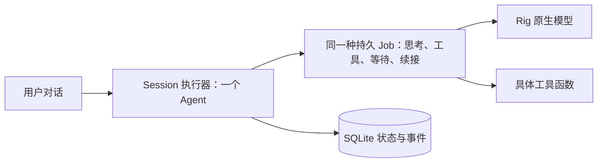

# Architecture

一个 agent 处理用户输入。每个模型思考与工具动作属于一个内部 Job；Job 可以等待明确的 input ID、继续后续工作或把原始输入交接给另一个上下文。CLI 不要求用户管理 Job。

依赖方向是 `CLI → Engine → Store / context / model / tools`。这是一个 crate 内的具体模块关系，没有 provider trait、动态插件容器或通用事件总线。

## 抽象必要性四问

每项保留实现都回答四问：①解决哪个明确需求或已复现失败？②普通函数、结构体或 Rig 原生类型为什么不够？③展开成直接实现后哪项验收/维护能力受损？④增加多少状态、接口或跨模块修改？这里保留的主体本来就是普通函数与结构体；没有进一步引入抽象框架。

| 实现 | ①明确需求或失败 | ②现有类型是否够用 | ③删除/散开后的损失 | ④增加的状态与边界成本 |
| --- | --- | --- | --- | --- |
| SessionState / Job / Budget | 保留输入归属、等待关系、后续任务及根输入预算 | 普通结构体足够；Rig 不保存 BONE 的调度事实 | 恢复后输入重复分配，子工作预算无法合并，等待拿错结果 | 3 个数据结构与 JobState；runtime/store 共用持久事实 |
| Event | 保存原生结果和输入/call 因果关系 | 原生 Message/CompletionResponse 足够承载内容；Event 只补持久身份 | delivery 无法指向唯一原生结果，重启无法区分已执行动作和迟到提案 | 1 个事件结构；payload 保留原生值；无第二份 message history |
| Engine | 并发 future 完成与新用户输入需要唯一裁决者 | 普通结构体和方法足够；单个异步函数无法兼顾可取消 CLI 与持续状态 | 新指令后旧模型继续启动工具；同一 history 被多个完成路径修改 | 1 个 owner；session、running task 和 write lease 均在此；CLI 通过明确操作调用 |
| Store / leases | 原子提交、重启恢复、跨进程 session/workspace 所有权 | SQLite 与普通锁 guard 足够 | 数据提交和物理效果失配；同时启动两个 writer；未知写被重放 | 1 个 Store 加 session/write guards；事务不跨 await；state/runtime/store 交界 |
| context 函数 | 保留完整工具 batch、摘要覆盖范围、正在处理的用户输入 | 原生 Message 足够；函数从 Event 派生，无新 message DTO | compaction 会切断 tool call/result 配对或删除 active input | 3 个公开函数；持久摘要仅引用原生 response 与 covered event IDs |
| Profile / ModelConnection | endpoint recipe、凭据来源与订阅锁需要跨调用保存 | 请求/response/stream 直接使用 Rig；原生 ProviderRef 不包含 BONE profile 名和锁寿命 | endpoint 配置丢失；缓存并发刷新；动作缺少 JobId/CallId | profile 配置字段与 1 个连接 owner；明确两种认证来源；不做认证框架 |
| tools / ToolOutcome | 文件 hash 冲突、shell 超时、rename 后目录 fsync 失败 | 工具定义直接用 Rig；普通函数返回 content + uncertain 标志 | 已经替换的文件被误报为无副作用错误并重试 | 1 个结果结构与具体文件/进程函数；权限由 runtime 检查 |

## 关键边界

用户输入提高 session revision。旧模型结果只能留下迟到记录，不能启动新的工具。已经开始的外部动作保留原始 input/call 身份；其后果不能被新输入抹掉。模型一次提出多个工具时，每个调用都需要原生结果；等待、交接、提问和暂停必须单独组成 batch。

最新用户输入优先处理，旧工作保留在对应 Job 的队列中。任何 Job 都可以提出问题，问题进入同一个用户对话；普通回答自动回到尚未回答的问题所属 Job。等待按输入身份匹配结果，已结束的依赖不会被误算成等待环。

Job history、交付和启动意图引用事件身份，正文保存在原生消息或结果中。压缩只在请求达到配置上限时发生：选择能装入摘要请求的完整历史前缀，保留未处理输入及未完成工具调用，不额外强制保留固定轮数。摘要也消耗所属输入的共享调用额度。

Session lease 阻止同时改同一会话。Workspace write lease 串行化 BONE 的文件写入和 shell 调用；它不能阻止用户或其他程序修改文件，因此 `write_file` 另需匹配读取时的哈希。未知写的记录不是完成证据，reconcile 是用户核查后的观察事实。

取消请求不代表物理写入已经停止。写任务和执行器共同持有同一文件锁，任务实际退出后才允许核销未知结果；重启也不会自动重放写操作。

Rig 负责 provider 语法、编码、解码、原生 stream fold 与凭据刷新。BONE 负责目录、profile 锁和恢复策略，也按显式配置只读现有 Codex 登录的 access token/account ID，交给 Rig 公开 authenticator。它不改 Codex 登录、不把它映射成 Rig 私有缓存，也不保留 provider 协议补丁。默认数据从 `~/.bone/v2` 开始，旧实现只在 Git 历史中保留。
