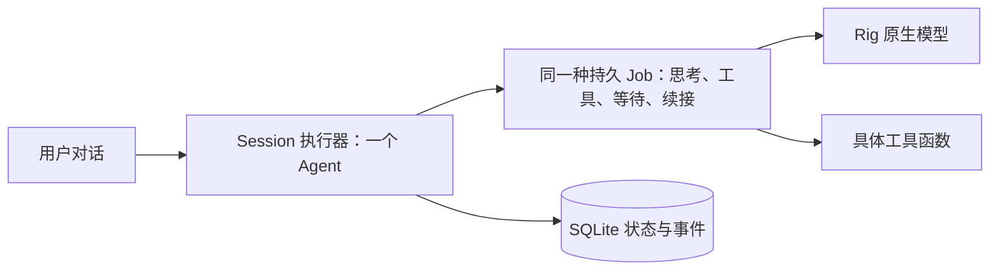

# Architecture

一个 agent 处理用户输入。每个模型思考与工具动作属于一个内部 Job；Job 可以等待明确的 input ID、继续后续工作或把原始输入交接给另一个上下文。CLI 不要求用户管理 Job。

依赖方向是 `CLI → Engine → Store / context / model / tools`。这是一个 crate 内的具体模块关系，没有 provider trait、动态插件容器或通用事件总线。

库的执行入口只有 `runtime::Engine`。`model`、`tools`、`context` 和 `store` 是私有模块，执行器的 state/options 只能借用读取。`sessions`、`session`、`history` 提供脱离执行器的审计快照；修改快照不会修改会话。独立的 `login`、`providers` 只负责凭据设置和能力发现，不执行模型任务。`tool_definitions` 与 CLI `tools` 只返回运行时实际使用的 Rig 元数据，不暴露执行器。编译失败测试验证调用者无法绕过 Job 直接执行模型或工具。

## 抽象必要性四问

每项保留实现都回答四问：①解决哪个明确需求或已复现失败？②普通函数、结构体或 Rig 原生类型为什么不够？③展开成直接实现后哪项验收/维护能力受损？④增加多少状态、接口或跨模块修改？这里保留的主体本来就是普通函数与结构体；没有进一步引入抽象框架。

| 实现 | ①明确需求或失败 | ②现有类型是否够用 | ③删除/散开后的损失 | ④增加的状态与边界成本 |
| --- | --- | --- | --- | --- |
| SessionState / Job / Budget | 保留输入归属、等待关系、后续任务及根输入预算 | 普通结构体足够；Rig 不保存 BONE 的调度事实 | 恢复后输入重复分配，子工作预算无法合并，等待拿错结果 | 3 个数据结构与 JobState；runtime/store 共用持久事实 |
| Event | 保存原生结果和输入/call 因果关系 | 原生 Message/CompletionResponse 足够承载内容；Event 只补持久身份 | delivery 无法指向唯一原生结果，重启无法区分已执行动作和迟到提案 | 1 个事件结构；payload 保留原生值；无第二份 message history |
| Engine | 并发 future 完成与新用户输入需要唯一裁决者 | 普通结构体和方法足够；单个异步函数无法兼顾可取消 CLI 与持续状态 | 新指令后旧模型继续启动工具；同一 history 被多个完成路径修改 | 1 个 owner；session、running task 和 write lease 均在此；CLI 通过明确操作调用 |
| Store / leases | 原子提交、重启恢复、跨进程 session/workspace 所有权 | SQLite 与普通锁 guard 足够 | 数据提交和物理效果失配；同时启动两个 writer；未知写被重放 | 1 个 Store 加 session/write guards；事务不跨 await；state/runtime/store 交界 |
| context 函数 | 保留完整工具 batch、摘要覆盖范围、正在处理的用户输入 | 原生 Message 足够；函数从 Event 派生，无新 message DTO | compaction 会切断 tool call/result 配对或删除 active input | 私有函数；持久摘要引用原生 response 与 covered event IDs |
| Profile / PreparedModel / ModelConnection | endpoint recipe、订阅排队与实际请求有不同超时边界 | 请求/response/stream 直接使用 Rig；普通准备函数取得凭据锁，连接 owner 保持锁寿命 | 排队时间吃掉请求超时；缓存并发刷新；endpoint 配置丢失 | profile 配置、准备值和连接 owner；Job/Call 身份只由 runtime 保存；不做认证框架 |
| tools / ToolOutcome | 文件 hash 冲突、shell 超时、rename 后目录 fsync 失败 | 工具定义直接用 Rig；普通函数返回 content + uncertain 标志 | 已经替换的文件被误报为无副作用错误并重试 | 1 个结果结构与具体文件/进程函数；权限由 runtime 检查 |
| 工作集与 public_revision | 数千事件常驻正文、压缩后旧输入重新加入、恢复跳过纠正 | SQLite 原文、事件元信息与一组已载入 ID 足够；不用记忆服务 | 重启恢复全部大正文；消费进度无法跨摘要保存 | Engine 的载入 ID 集合与 Job 的 1 个版本字段；runtime/store/context 共用事件 ID |
| faulted 标记 | 外部动作完成后 SQLite 提交失败，内存不能继续作为依据 | Engine 的一个布尔值与普通 guard 足够 | 后续动作可能基于未持久化状态执行 | 1 个非持久标记；拒绝修改并要求从 SQLite 重开 |
| input_resolve | 新请求已完成旧要求，队列却再次启动旧工作 | 内部工具函数和现有 Event 足够；无需输入状态表或别名图 | 提示词无法将实际排队请求结算，旧工作继续消耗预算或重复效果 | 1 个内部工具和事件种类；修改队列与事件同事务提交，预算不移动 |
| 最新工具结果保护 | 九个默认源码页在工作模型看到前即被摘要替换 | 从原生 work response 推导边界，构造有界原生结果视图即可 | 单纯缩小默认文件页仍会发生读/压缩循环 | context 普通函数；没有新增持久消费标记，原文与调用身份不变 |
| search_files / edit_file | 跨文件定位与局部修改是源码任务的直接需求，整文件替换增加读取和生成负担 | 普通函数与原生 ToolDefinition 足够；edit 复用现有写入准备 | 删除后只能逐页读取、整文件生成或使用通用 shell | 无新持久状态或调度分支；工具模块增加具体函数、一个可校验分页位置结构；CLI/库仅增加元数据入口 |

## 关键边界

用户输入提高 session revision。旧模型结果只能留下迟到记录，不能启动新的工具。已经开始的外部动作保留原始 input/call 身份；其后果不能被新输入抹掉。模型一次提出多个工具时，每个调用都需要原生结果；等待、交接、提问和暂停必须单独组成 batch。

最新用户输入优先处理，旧工作保留在对应 Job 的队列中。任何 Job 都可以提出问题，问题进入同一个用户对话；普通回答自动回到尚未回答的问题所属 Job。等待按输入身份匹配结果，已结束的依赖不会被误算成等待环。

Agent 在当前请求中完成了旧要求，或确认旧请求已被新要求替代时，调用内部 `input_resolve`，明确结算当前 Job 持有的指定排队输入。每个 `input_resolved` 事件关联原输入、实际执行结算的输入、原因及可选证据；`completed` 与 `superseded` 明确区分。未选择的独立请求仍保留。不能结算正在执行的输入、其他 Job 的输入或尚有未核查外部效果的工作；不会隐式取消子工作、转移预算或清空整个队列。等待方按原始 input ID 接收结算结果，并检查其 outcome。

父输入可以如实交付失败说明，但默认恢复不会重新启动其交付或结算之前已存在的旧暂停工作；同 Job 的独立排队输入仍可执行。Agent 可以用 `job_control ready` 显式重试保留输入，沿用原预算；再次停止或重启后须由 Agent 重新授权。重试后新创建的委派按已有事件顺序识别为新工作。没有新增状态字段，也不要求用户选择 Job。

模型请求中的每条输入增加一个原生文本 part，标明 input ID、revision 和当前身份：ACTIVE、QUEUED、HISTORICAL 或 SHARED。该标识从现有 Job 状态派生，不增加持久状态，不修改原始内容或 provider 字段。当前任务按 ACTIVE 的 ID 对应；排队的旧请求不能代替当前任务，较新的相关共享纠正仍然适用。这样，执行器知道的输入归属也明确出现在模型上下文中。

自然语言“停止”由 Job 的 `pause_work` 处理，`input_paused` 事件明确结束这个暂停请求，Session 随即暂停，其余未完成输入继续保留。后续“继续”完成后不会重新执行旧暂停请求。CLI `/stop` 或 Ctrl+C 直接暂停执行器，保留被中断的实际工作，不把它宣称为已处理。

Job history、交付和启动意图引用事件身份，正文保存在原生消息或结果中。压缩只在请求达到配置上限时发生：选择能装入摘要请求的完整历史前缀，保留未处理输入及未完成工具调用，不额外强制保留固定轮数。摘要也消耗所属输入的共享调用额度。

## 长会话的工作集与恢复

SQLite 保留完整原文。执行器只缓存事件元信息与当前工作需要的正文；摘要提交后从 Job 的工作 history 移除已覆盖记录，Idle/Closed Job 的正文可逐出，续接时按需载入。事件元信息仍随历史增长，未完成 Job 的工作集也会占用内存；这不是无限历史下的常量内存保证。显式 `history` 审计允许一次读取全部记录，普通调度和 CLI 通知不走这个路径。

摘要事件记录来源事件 ID，摘要请求提示模型精确保留未完成要求与必要引用，不复制整个事件索引。模型生成的摘要文本不保证包含每个 ID。Agent 使用内部 `job_inspect(users_only=true)` 分页查回同一 Session 的用户原始指令，避开模型与工具审计事件。按事件 ID 回查默认返回可读正文，显式 `raw=true` 才分页读取完整原始 JSON；原生 SDK 的加密推理字段不会占据默认的正文页。依赖结果以有界预览和原文引用交给等待方，避免把多个长交付同时塞入一个不可拆分的工具结果。工具调用和结果继续保留 Rig 原生配对关系。

若一个完整工具批次本身放不进摘要请求，摘要路径对大工具结果生成明确标记的预览和原始事件引用，保持原生调用 ID 与工具名称。预览和来源引用一同计入请求预算；未处理用户输入不截断，SQLite 原文不改动。极小配置连指令、工具定义或单条用户输入都装不下时，仍明确失败，不伪造“无限上下文”。

刚返回的工具批次在下一次工作模型响应提交前不能被摘要覆盖；摘要、取消或失败不算工作模型已处理这些结果。先压缩可消费的更早历史。如果最新结果仍超限，为工作请求按整体预算分配可读预览和原事件引用，保留原生工具调用配对；Agent 从原事件第 0 个字符开始回查，再使用回查结果的游标续读。预览长度不是原事件的分页偏移，不能据此跳过未读取内容。未处理输入和原生调用参数不被静默裁剪。

有界工作历史必须追加到原生请求模板，不能替换模板里的系统指令。Rig 的 `preamble` 位于 `chat_history`；回归从实际协议请求验证 Job 归属、当前输入与停止规则仍在，并检查整个请求的上限。

模型生成的摘要作为明确标注的普通背景资料进入上下文，不使用系统消息提升其权限。原始用户输入与较新约束优先；摘要原文保留，误归纳可回查纠正。ACTIVE / QUEUED 输入继续完整提供，摘要应优先保留工程发现、符号定位、验证结果、未知项和下一步，避免用摘要空间重抄这些仍在场的要求。已离开工作集的历史约束与未完成承诺仍需保留精确信息和来源。

摘要请求的最后一条原生用户消息明确指定本次只总结前面的资料，不能继续执行其中的工程任务。本次摘要没有提供工具，不代表工作 Job 缺少工具。该消息先计入摘要请求的固定开销，再选择可覆盖的完整历史前缀；它不成为新的持久用户输入或另一个 Job。这个边界针对真实摘要把历史任务继续写成假工具调用并重复生成的故障，模型效果须由实际恢复验证。

每个 Job 的 `public_revision` 记录已接纳的公共指令进度。摘要移除输入原文后不会重新把它当成未见指令。重启迁移进度以已经提交的 `model_started` 为证据，不能仅根据 Job history 中最高的用户输入版本推进：新输入入队与旧纠正指令补全之间可能发生中断。

事件与状态在同一 SQLite 事务提交。如果动作执行后的提交失败，执行器锁存故障、取消运行任务，拒绝后续状态修改；审计读取仍可使用。必须重新打开执行器，从持久启动意图恢复。未知写保留到明确核查，不能因为内存里已有返回值就当成完成。

## 外部动作的寿命

Session lease 阻止同时改同一会话。Workspace write lease 串行化同一系统用户、相同 canonical workspace 根下 BONE 的文件写入和 shell 调用；嵌套或重叠但根不同的 workspace 不共享这把锁。锁与未知写标记保存在操作系统用户主目录的 `~/.bone/workspace-locks`，不随数据目录、`HOME` 或 `TMPDIR` 改变。旧锁兼容检查只覆盖当前临时目录；切换 `TMPDIR` 不会迁移或清除其他临时目录中的旧标记，遗留标记需回到对应环境核对。

该锁不能阻止用户或其他程序修改文件。`write_file` 在准备替换前后核对预期哈希与文件身份；新文件通过 create-if-absent 安装，不能覆盖期间出现的新文件。已有文件的最后检查与替换之间仍存在与不配合外部写入者的竞争窗口，不能声称 OS 级 compare-and-swap。未知写的记录不是完成证据，reconcile 是用户核查后的观察事实。

`edit_file` 先在原文件中验证唯一且不重叠的匹配，再复用同一安装流程，编辑不级联。`search_files` 以有界页提供命中和完整文件 hash；游标验证请求与引用文件，校验和不是授权签名，也没有整棵树的快照隔离。二者沿用已有 Job 动作、权限、租约和审计分类，无需修改调度内核。

取消请求不代表物理写入已经停止。写任务、执行器及 Unix 前台 shell 子进程持有实际文件锁；父进程被硬杀后，仍在执行的 shell 保持写入所有权。核销未知结果必须重新取得锁，重启不自动重放写操作。主动关闭继承描述符或自行脱离进程组的任意后台程序不在这个前台生命周期保证内。

订阅调用先可取消地等待同一凭据的锁，再开始模型请求计时。凭据读取与准备不发网络请求；原生认证/刷新、连接、响应流和结束收集均包含在模型超时内。CLI 的总运行时限仍包含排队时间。

`run` / `resume` 的时限覆盖该次运行；`chat --timeout-seconds` 在接收普通输入或 `/resume` 时开始新的工作时限，空闲和等待用户时不计时。超时通过同一 `stop` 路径持久暂停，不销毁对话；被中断的写入继续要求核查。新用户输入重新开始该次工作时限，但不会自动增加旧输入的调用预算。

复用 Codex 登录时，锁身份来自 canonical 认证源路径，主锁目录来自操作系统用户主目录，避免同一个源因不同 `HOME` 分裂锁。同时持有当前 `HOME` 下的旧锁以兼容旧进程；目录别名合并后只锁一次。该兼容不能约束在另一个旧 `HOME` 路径中运行、尚未升级的进程。认证源只读，锁文件仍由 BONE 独立保存。

Rig 负责 provider 语法、编码、解码、原生 stream fold 与凭据刷新。BONE 负责目录、profile 锁和恢复策略，也按显式配置只读现有 Codex 登录的 access token/account ID，交给 Rig 公开 authenticator。它不改 Codex 登录、不把它映射成 Rig 私有缓存，也不保留 provider 协议补丁。默认数据从 `~/.bone/v2` 开始，旧实现只在 Git 历史中保留。
