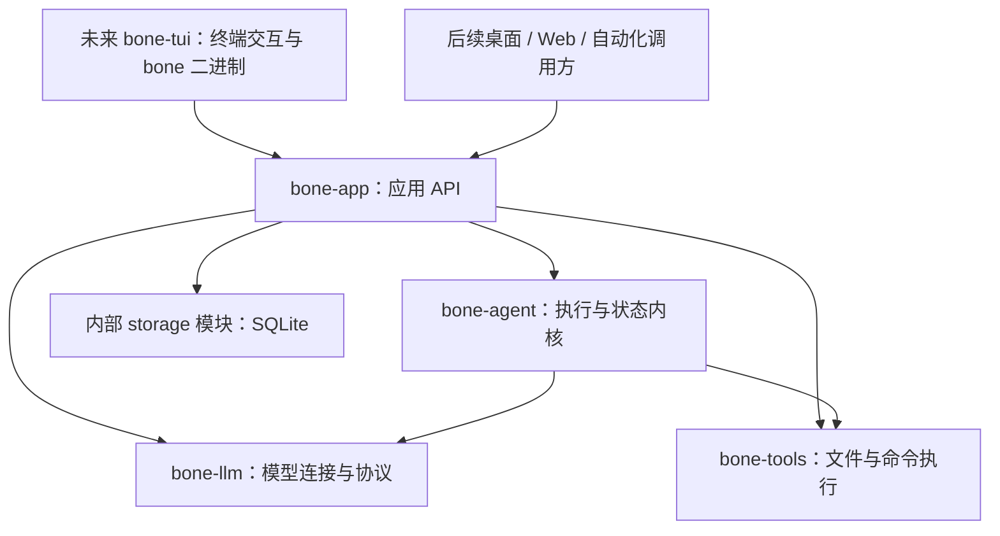
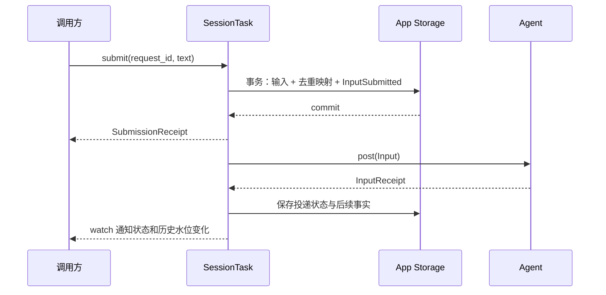

# bone-app 架构设计

日期：2026-09-09。状态：headless 核心已经实现；独立前端尚未重建。

`bone-app` 已按本文重写为 headless 应用层，旧 TUI、CLI 和独立 `bone-store` crate 已移除。本文同时记录已经落地的结构和仍待前端实现的边界；[旧 Agent API 迁移笔记](bone-app-agent-migration-plan.md) 仅保留为历史接口参考。

当前实现与初稿的少量接口差异是：`App::update_config` 接受 `(scope, change)`；`UnresolvedWriteView::job` 是 `Option<JobRef>`，因为进程可能在写入意图落盘后、Agent 的 Call→Job 记录归档前退出；前端证据定位 API 尚未公开，底层 journal 已支持按序号读取。`SessionEvent::JobFinished` 不重复保存可从当前 `JobView` 取得的 owner 和关联 Input。

## 1. 定位与关键决定

`bone-app` 是 BONE 的应用后端。它把模型、工具、Agent 和存储装配成用户可操作的会话，并提供与界面无关的 Rust API。

第一版确定以下选择：

| 问题 | 决定 |
| --- | --- |
| 对外对象 | `App` 和 `Session` 两个句柄；其余主要是数据结构 |
| 前端边界 | TUI 独立 crate，只调用 App API |
| 执行单位 | 一个 Session 同时最多一个 Agent Runtime，多个 Job 在该 Runtime 内执行 |
| 配置生效 | 保存后重装受影响的活跃 Session；`update_config().await` 是生效屏障 |
| 输入回执 | 返回成功表示输入已持久保存；Agent 接受、等待、完成分别表达 |
| 输出 | 当前状态用 `watch`；历史用同一份 SQLite journal 分页读取 |
| 持久化 | App 私有 `storage` 模块拥有 SQLite、journal、事务和 lease |
| 重启 | 恢复会话与历史；旧执行标为中断，新执行可参考历史重新工作 |
| 写工具 | 具体的 Patch/Bash 适配器，加执行前后落盘；同一 Workspace 的写调用在 App 内串行 |
| 扩展方式 | 具体模块和普通函数；沿用已有 `ModelPort`、`ToolPort` 扩展点 |

App 不参与拆分 Job、调度 Worker、压缩 Job 上下文或判断 Job 能否提交。这些继续由 `bone-agent` 负责。

## 2. Crate 与依赖



第一版只实现进程内 Rust API。以后需要 HTTP、SSE 或桌面 IPC 时，在 API 外加传输适配，不把网络路由、连接或终端事件传进 App。

当前 workspace 尚无 `bone-tui` 或 `bone` 二进制。重建时，`bone-tui` 只依赖 `bone-app`，不直接依赖 `bone-agent` 或数据库；one-shot 入口也调用同一 App API。

原 `bone-store` 的 SQLite 连接、事务、journal、lease 和相关测试已经搬入私有 `bone_app::storage`，独立 crate 已从 workspace 删除。Agent、LLM、Tools 都不依赖 App 存储。

`storage` 是私有模块。其他 App 模块调用具体业务方法，如 save_input、append_records、read_history，不把 DocumentKey、JournalKey、SQL 或通用 transaction API 暴露给前端。内部现有泛型辅助代码有用就保留，无需为了合并再加一层转发包装。

TUI 负责键盘、布局、焦点、滚动、输入框编辑和渲染。App 的状态中不出现 `UiSessionId`、panel、scroll offset 或终端可用性。显示偏好保存在前端自己的配置中；Session 草稿作为可选产品数据通过 App 保存，文本编辑过程仍属于前端。

## 3. 对象与所有权

### 3.1 App

一个 App 实例持有一个内部 `Store`、配置与凭据组件，以及已打开 Session 的注册表。它能管理多个 Workspace 和 Session。

```text
App
├── persistence::DataStore → storage::BoneStore
├── 配置 / Profile / Credentials
├── Workspace 数据与进程内写锁
└── SessionId → SessionTask
                 ├── Session writer lease
                 ├── 输入与历史的应用状态
                 ├── watch<SessionView>
                 └── Option<RunningAgent>
                      ├── RuntimeId
                      ├── 当前 RuntimeConfig
                      ├── Agent
                      └── Agent 观察水位
```

Session 注册表的锁把 open/create 的最终注册与 App shutdown 排成确定顺序，并覆盖 Session lease 获取；按 ID 读取 Session 记录可以在入锁前完成，注册时会再次核对 App 尚未关闭。该锁不跨网络或模型调用持有。当前 SQLite 访问使用短同步操作，同一 App 的写事务经一条 writer 连接串行；这些操作既可由 SessionTask 发起，也可由 App 配置 API 和写工具适配器发起。凭据访问使用 `spawn_blocking`，模型连接和退出收尾走异步路径。

### 3.2 Session

`Session` 是稳定业务对象。它有自己的 Workspace、标题、输入、历史和配置覆盖。打开历史不启动模型；首次需要执行输入时再启动 Agent。

每个打开的 Session 对应一个具体的 `SessionTask`。它按顺序接受 App 命令、处理 Agent 观察结果、提交存储变更。这里的串行化只决定应用操作的顺序；Agent 内部仍可并发执行多个 Job。

同一 App 多次取得同一 Session，返回同一个任务的克隆句柄。App 注册表持有任务，前端释放 `Session` 或停止观察不会取消工作。跨进程继续使用现有 Session writer lease；另一个进程不能取得同一 Session 的执行所有权。

当前方案支持多个客户端连接同一个 App。它不承诺多个独立 App 进程同时执行同一 Session，也不需要为此引入分布式协调。

### 3.3 生命周期

这些操作分别定义：

| 操作 | 行为 |
| --- | --- |
| 前端断开 | 释放该前端的订阅，Session 和 Agent 继续存在 |
| `stop` | 取消当前及此前已排队的工作；保留 Runtime，可以再提交 |
| `close_runtime` | 串行收尾并释放 Agent；保留 Session，随后处理队列中的新命令 |
| `archive` | 只改变 Session 的组织状态，不隐式关闭或取消 Runtime |
| `App::shutdown` | 收尾所有 Session 的 Runtime，保存结果，释放资源 |

SessionTask 不因为暂时无 Job 运行就自动销毁 Agent。同一 Runtime 内的后续输入可以继续使用其任务与记录上下文。

## 4. 公共 API

以下是当前公开接口的简化形状；省略了 `pub`、具体泛型参数和辅助 DTO。

### 4.1 App 入口

```rust,ignore
impl App {
    async fn open(options: AppOptions) -> Result<App>;

    async fn open_workspace(path: PathBuf) -> Result<WorkspaceInfo>;
    async fn create_session(workspace: WorkspaceId, title: String) -> Result<Session>;
    async fn session(id: SessionId) -> Result<Session>;
    async fn list_sessions(workspace: WorkspaceId) -> Result<Vec<SessionInfo>>;
    async fn unresolved_writes(workspace: WorkspaceId)
        -> Result<Vec<UnresolvedWriteView>>;

    async fn config(scope: ConfigScope) -> Result<RuntimeOverrides>;
    async fn update_config(scope: ConfigScope, change: ConfigChange)
        -> Result<RuntimeOverrides>;
    async fn resolved_config(session: SessionId) -> Result<ResolvedConfig>;

    async fn profiles() -> Result<Vec<Profile>>;
    async fn save_profile(profile: Profile) -> Result<()>;
    async fn set_api_key(profile: ProfileId, key: ApiKey) -> Result<()>;
    async fn login(profile: ProfileId) -> Result<LoginAttempt>;
    async fn logout(profile: ProfileId) -> Result<()>;

    async fn shutdown() -> Result<AppShutdownReport>;
}
```

`AppOptions` 只放宿主启动条件，例如数据目录；模型、工具配置有各自的持久化 API。测试和嵌入使用临时数据目录，App 自己构造 Store。Store 注入只作为 crate 内测试辅助，不成为公开 API，也无需存储 trait。

Workspace 是路径与身份的数据对象，不再增加一层必须串联使用的 service handle。前端需要的 profile/model 配置 DTO 从 App 导出，不需要自行连接模型。

### 4.2 Session API

```rust,ignore
impl Session {
    fn id(&self) -> SessionId;

    async fn submit(&self, input: SubmitInput) -> Result<SubmissionReceipt>;
    async fn reload_config(&self) -> Result<()>;
    async fn retry(&self, input: InputId) -> Result<CommandReceipt>;
    async fn control(&self, target: JobRef, action: JobControl)
        -> Result<CommandReceipt>;
    async fn stop(&self) -> Result<CommandReceipt>;

    async fn snapshot(&self) -> Result<SessionView>;
    fn observe(&self) -> watch::Receiver<Arc<SessionView>>;
    async fn history(&self, after: SessionSeq, limit: usize) -> Result<HistoryPage>;
    async fn rename(&self, title: String) -> Result<()>;
    async fn save_draft(&self, draft: String) -> Result<()>;
    async fn close_runtime(&self) -> Result<CloseReport>;
    async fn archive(&self, archived: bool) -> Result<()>;
    async fn resolve_write(&self, target: CallRef, resolution: WriteResolution)
        -> Result<CommandReceipt>;
}
```

`snapshot()` 请求一次新鲜的应用状态，适合明确查询；`observe()` 立即提供最近状态并持续通知这个 Session 引起的变化。它们返回 App 自己的 DTO，不返回 `Agent`、存储句柄或原始 Kernel 控制入口。跨 Session 的 Workspace 写入风险以 `App::unresolved_writes` 的即时查询为权威，前端在进入确认页或执行写操作前查询它，不要求 App 为这一个全局字段增加事件总线。

`CommandReceipt` 只有 `Applied` 和 `Unchanged`。公开错误区分 App 正在关闭、Workspace/Session 不存在、SessionBusy、RequestConflict、StaleRuntime、WriteInProgress、InvalidState、Configuration、LoginRequired、ProfileBusy，以及 Provider/Storage/Tools/Agent 边界错误。App 核对 Runtime 身份，Agent 控制方法返回实际状态变化。

### 4.3 身份

| ID | 含义与范围 |
| --- | --- |
| `WorkspaceId` / `SessionId` | 产品的稳定身份 |
| `RequestId` | 调用方提供的 UUID；一次逻辑提交的重试键，在 Session 内去重 |
| `InputId` | App 为已保存输入分配的 Session 内递增编号；直接用于 Agent InputId |
| `RuntimeId` | 每次创建 Agent 分配的 UUID |
| `JobRef` / `CallRef` | `{ runtime: RuntimeId, id: local_id }` |
| `QuestionId` | 带 RuntimeId 和 Record Seq 的问题引用，由 App 返回，前端原样带回 |
| `SessionSeq` | Session journal 的位置，跨 Runtime 单调递增 |

不再建立与 Input 一一重复的 Turn 对象。`RequestId` 解决提交回执丢失后的重试，`InputId` 标识已经进入产品历史的输入。

## 5. 输入与控制契约

### 5.1 输入结构

```rust,ignore
struct SubmitInput {
    request_id: RequestId,
    text: String,
    reply_to: Option<QuestionId>,
}

struct SubmissionReceipt {
    input: InputId,
    saved_at: SessionSeq,
}
```

第一版支持最多 1 MiB UTF-8 的文本输入；App 在写入任何 durable envelope 前检查该边界。附件、多模态和工具调用注入不加入此接口。

App 公开包含 InputId、RuntimeId 与问题 Seq 的 `QuestionId`。回答时 App 将它转换成 Agent 的 `Input::answering(reply_to, question_seq)`，由 App 核对 Runtime 身份、Kernel 在接受回答的同一步核对问题仍是当前问题；前端只原样带回 QuestionId，不理解 Routing。

一个 Input 可以关联多个必要 Job；多个 Input 可以更新同一个 Job。App 以 InputId 分别追踪状态，允许用户在执行中继续输入。

### 5.2 保存与投递



SessionTask 从收到命令起拥有整个提交操作。调用方取消等待、关页面或丢失回执，不取消已进入任务的操作。用同一 RequestId 重试：内容相同返回原回执，内容不同返回冲突。去重先于当前问题有效性检查，已经回答成功的请求再次提交仍取得原回执，不因问题已关闭而报错。

输入记录本身保存投递状态，不另建通用 outbox。基本状态为：

```text
Queued → Posting → Accepted → Finished(Completed / Failed / Cancelled)
   │                   ├── WaitingForUser
   │                   └── RoutingFailed
   ├── 依赖未就绪、容量 Busy 或启动失败：保留 Queued，带原因
   └── Agent 明确拒绝 → Rejected(reason)

丢失旧 Runtime 的非终态输入 → Interrupted
```

`WaitingForUser`、`RoutingFailed` 是可继续状态，完成后仍由对应 `InputFinished` 结算。`Interrupted` 是 App 对执行丢失的记录，不伪造 Agent 的 Failed 或 Cancelled。输入已保存后，Agent 仍可能因问题刚刚失效而返回 InvalidReply；此时写入 InputRejected 并结算为 Rejected，不能永久留在 Queued 或向已返回的 submit 再抛一次错误。Busy 属于暂时未接受，继续 Queued。

配置缺失、登录未就绪等原因会让输入保持 Queued。调用方修正已保存配置时，`update_config` 会直接重新应用；若只修复了凭据这类外部前置，调用 `reload_config()` 重试当前 desired，无需重写相同配置。`retry(input)` 处理普通 Queued 输入或同一 Runtime 的 RoutingFailed；已经 Finished/Interrupted 的输入不自动重做，要通过新的 submit 表达新工作。

Agent 容量满时，已保存输入留在 Queued。SessionTask 按接收顺序投递，并在状态变化后再试，不为每条输入另建 timer 或 retry worker。Session 命令 channel 容量为 64；当前没有给已经持久化的 Queued 输入另设总量上限。

### 5.3 stop 与提交顺序

App 的 submit、retry、stop 和 Job control 进入同一个 Session 命令队列。

当 stop 被处理时：

1. 此前已经保存但尚未投递的输入结算为 Cancelled。
2. 已进入 Agent 的输入通过 Agent stop 结算。
3. 此后进入 Session 队列的新提交可以开始新工作。

同一 Session 的 `Agent::post` 和控制调用按此顺序发出并等待各自接受回执，避免 Agent 内部分开的 input/control 通道导致停止后又交付旧排队输入。模型连接可以异步进行，但启动完成必须回到 SessionTask 核对当前状态，不能自行投递。

## 6. 输出、观察与历史

### 6.1 SessionView 是当前状态

```rust,ignore
struct SessionView {
    session: SessionInfo,
    runtime: RuntimeState,          // Detached / Starting / Running / Closing
    draft: String,
    inputs: Vec<InputView>,         // 当前未结算输入与待答问题
    jobs: Vec<JobView>,             // owner、关联输入、typed wait、报告和终态
    activity: Vec<ActivityView>,    // 正在执行的调用与最新进度
    history_through: SessionSeq,
    problem: Option<AppProblem>,    // 可匹配的配置/登录/Provider/存储等问题
}
```

这些 View 属于 App：例如 Job 的等待状态转换为调用方能展示的语义、可操作对象引用和摘要。Kernel 内部 Routing/Inquiry/Record 序号不会泄漏为前端似乎可以操作的 ID。它们不包含 Kernel 的 Ready 队列、Delivery 路由或可执行状态。

Agent 的 `AgentView` 是 Input↔Job 关系和 Job 状态的权威来源。当前 Record 没有包含全部状态变化，App 不靠 Record 自己再实现一次 Kernel。具体做法是在一批观察通知后刷新 AgentView，转换并发布应用 View。

View 中的历史水位只指向已成功保存的事实。Agent 的进度 Record 会进入内部原始 journal 以保持归档水位连续，但公开 history 会过滤它，SessionView 只投影最新进度；调用结束、回复和输入终态同样先保存再发布。

### 6.2 历史由 App 解释

公开历史条目使用产品类型，例如：

| Session 历史条目 | 含义 |
| --- | --- |
| `InputSubmitted` | 用户输入已保存 |
| `InputAccepted` | 运行时已接受输入 |
| `QuestionAsked` | 问题、QuestionId、关联输入 |
| `Reply` | 发言正文、JobRef、关联输入 |
| `JobFinished` | 某项工作结束，含摘要和剩余事项 |
| `InputFinished` / `InputRejected` | 某条输入完成执行，或已保存但被明确拒绝执行 |
| `ToolFinished` | 完整 `ToolOutcome`，保留成功/失败类别与副作用结论 |
| `RuntimeStarted` / `RuntimeReconfigured` / `RuntimeClosed` | 执行实例的生命周期与配置边界 |
| `Interrupted` / `WriteResolved` | 中断和后续核查事实 |

子 Job 的结果和面向用户的发言保持独立。当前 `JobFinished` 保存 JobRef、结果、摘要和剩余事项；输入是否结束只看对应的 `InputFinished`，不根据任意 Job Outcome 推断。Agent-local 证据序号仍完整保存在内部原始记录中，在证据读取 API 落地前不伪装成前端可操作的引用。

`Reply` 不意味着工作完成；直接 Finish 的 Job 也有可展示的 JobFinished。后续 one-shot 前端应等待自己的 InputFinished，遇到自己的问题或 RoutingFailed 则返回对应状态。

工具事实用 CallRef 标识。Unknown 后得到已知结果，更新同一次调用的事实；不能显示成第二次工具执行。当前 Agent 工具结束事件是 ToolFinished，不再等待一个不存在的第二条 CallFinished。

### 6.3 一个状态通知加一个分页接口

```rust,ignore
struct HistoryPage {
    items: Vec<HistoryEntry>,
    next_cursor: SessionSeq,
    has_more: bool,
}
```

前端接入流程固定：先 observe 取得 receiver，读取其当前 View，再调用 history 补到 `history_through`；之后每次 watch 变化，更新状态并继续补读历史。

`watch` 可以合并通知。回复和结果保存在 SQLite，前端不会因为少接收一次通知而丢消息。客户端重连带上最后的 history cursor 即可；不持有 cursor 的客户端从零读取。

不增加 App broadcast、客户端消费确认、EventBus 或独立历史推送缓存。未来的 SSE 适配可以封装相同的 watch + history 流程。

### 6.4 App 内部接 Agent

SessionTask 保存当前 Runtime 的 `agent_through`。收到 Agent 记录或 Lagged 时，用 Agent observe 取得新 baseline；持续唤醒仍复用 Runtime 启动时取得的 receiver：

1. 取出快照中超过已保存水位的记录，按 Seq 处理。
2. 在事务中归档记录、更新应用输入状态与 Agent 水位。
3. 事务成功后推进水位，发布由同一快照生成的 SessionView。
4. 原 broadcast receiver 只负责唤醒；即使 lagged，完整快照仍可补齐事实。

一次调度周期可以合并多个通知，避免每条进度都刷新完整快照。这是第一版的直接实现；Agent 当前返回完整保留记录，超长 Runtime 的增量查询优化留在 Agent API，不在 App 增加另一套执行状态缓存。

存储失败时不推进已保存水位，不发布“已保存的完成”。Session 停止接收新执行，尝试停止并收尾现有 Agent，在 View 中暴露存储问题；恢复存储后仍可从活着的 Agent 快照补读。已经发生的外部动作由写入记录核查，不用观察者落盘来保证执行前顺序。

## 7. 配置设计

### 7.1 配置只保存具体值

```rust,ignore
struct Profile {
    id: ProfileId,
    label: String,
    endpoint: bone_llm::EndpointConfig,
}

struct ModelSelection {
    profile: ProfileId,
    model: String,
    options: Option<bone_llm::ModelOptions>,
}

struct RuntimeSettings {
    worker: Option<ModelSelection>,
    coordinator: Option<ModelSelection>,
    limits: bone_agent::AgentLimits,
    tools: ToolSettings,
}

struct RuntimeOverrides {
    worker: Option<ModelSelection>,
    coordinator: Option<ModelSelection>,
    limits: Option<bone_agent::AgentLimits>,
    tools: Option<ToolSettings>,
}

struct ToolSettings {
    mode: ToolMode,                 // ReadOnly / WorkspaceWrite
    limits: bone_tools::ToolLimits,
}
```

User 保存默认值，Workspace 和 Session 保存显式覆盖。按字段选最近的设置：Session > Workspace > User。`limits`、`tools` 作为完整组替换，不做递归 JSON merge 或每个数值的多层继承。

`None` 在覆盖中表示继承。Coordinator 各层都未指定时，跟随最终解析出的 Worker；Worker 缺失则返回 NeedsModel。只读模式是默认值，启用 WorkspaceWrite 是明确的工具配置变化。

默认限额来自 AgentLimits 和 ToolLimits 自己的 Default。给 AgentLimits 补序列化支持，App 不维护另一份逐字段镜像。

配置修改用一个固定 `ConfigChange` enum 表达。Worker/Coordinator 接收 `Option<ModelSelection>`，None 清除该层选择并恢复继承；Workspace/Session 的整组限额与工具覆盖同样可以清除。每次变更在存储事务内读取当前值并只替换一个字段，并发修改不同字段不会互相擦除。前端不需要读整份配置再覆盖，也不需要任意字符串路径、配置描述器注册表或 schema 插件系统。

### 7.2 有效值和运行中值

```rust,ignore
struct ResolvedConfig {
    desired: Result<RuntimeConfig, ConfigProblem>,
    running: Option<RuntimeConfig>,
}
```

RuntimeConfig 包含已确定的两种模型、工具配置、AgentLimits 和 Workspace 路径。它没有 secret；记录配置本身，不只保存一个无法还原的 hash。首次尚未选模型可以成功保存配置，desired 用 ConfigProblem::NeedsModel 表达未完整，不阻止打开 App。

`update_config` 先在存储事务中修改一个字段，再通过各 Session 已有的命令队列通知受影响对象。它并发通知目标 Session、等待全部确认后才返回；返回成功意味着之后开始的模型调用、工具调用和调度都只能使用新配置。某个 Session 失败不会回滚其他已生效 Session；调用仍等完全部目标后返回首个错误，各自的 View 与 `resolved_config` 给出精确 desired/running 状态。配置调用一旦进入 App，取消 future 只停止调用方等待，不撤销这条命令；配置写入与生效确认由 App 自己持有，后续配置修改、`resolved_config` 和 shutdown 与同一屏障排序。User 作用于本 App 实例中全部已打开 Session，Workspace 和 Session scope 只通知自身覆盖范围。该实时屏障不跨进程广播；其他 App 实例在下次创建 Runtime 或由自身执行配置操作时解析持久值。未打开的 Session 在下次启动时直接解析最新值。

`save_profile` 使用同一生效屏障，因为 Profile 是 RuntimeConfig 的组成部分。API key 与登录状态属于连接凭据而不是 RuntimeConfig；修改凭据不暗中替换已建立的连接。若 Session 正因凭据缺失而挂起，前端修复凭据后调用 `reload_config` 重新应用已持久化的 desired；需要替换已建立连接时显式关闭 Runtime。

对运行中 Runtime，`update_config` / `reload_config` 的回执是完整重配屏障。对 Detached Session，回执表示新 desired 已接管后续启动、旧启动不可能胜出；Provider 连接结果仍是异步的，前端通过 SessionView 观察 Running 或 typed problem。

运行中的 Session 按 `suspend → reconfigure → 持久化 RuntimeReconfigured → resume_scheduling` 原地更新 Agent，保留 RuntimeId、Job DAG、记录和等待关系。新模型、工具集合与 AgentLimits 先在挂起状态下安装，精确配置边界落盘后才恢复调度，因此新配置不可能先于持久化产生外部动作。正在执行的旧模型调用被撤权；已经开始的工具调用仍按启动时捕获的边界完成。启动中的 Runtime 被作废并按新配置重新启动；Detached Session 不创建空 Runtime，但已有 queued input 会在配置完整后继续启动。

若活跃 Runtime 的新模型无法连接、工具无法装配、配置不完整或边界落盘失败，更新返回错误，`desired` 保留已经保存的新配置或具体 ConfigProblem，`running` 保留最后已持久化安装的配置快照，SessionView 同时给出可操作问题。此时 Agent 被 suspend：撤销旧模型调用、不再启动模型或待提交工具动作，但允许已经运行的工具按原调用边界收尾；新的输入只持久化为 Queued。修复配置后再次更新，或在仅修复凭据后调用 `reload_config`，会在同一 DAG 上恢复调度。

这不需要跨 Agent 和 SQLite 的两阶段提交协议：Agent 在 resume 之前本来就不能产生新配置的调用。持久化失败只保持挂起和问题状态；恢复存储后可重试同一 desired，不丢失 Job DAG。

角色调用超时由 AgentLimits 决定，删除旧 ModelSelection 中的另一套任务 timeout。Bash 的进程执行期限仍属于 ToolLimits；启用 `WorkspaceWrite` 时，运行时的 tool_timeout 必须大于最大 Bash timeout，给退出清理和结果归档留出时间。只读模式不会装配 Bash，因此不要求这两个值满足该关系。

## 8. 模型与工具装配

### 8.1 启动步骤

SessionTask 在需要创建 Runtime 时执行一个普通的具体装配函数：

```text
解析初始 RuntimeConfig
  → 构造 Workspace ToolEnvironment
  → 安装 read/glob/grep + session_history
  → 按配置安装 apply_patch/bash
  → 构造有预算的 Session 历史背景
  → 异步获取已有凭据并连接 Coordinator / Worker
  → Agent::with_ports_and_background(...)
  → 建立观察并保存 RuntimeId 与配置
  → 按顺序投递已保存输入
```

首次启动的连接异步执行；完成结果回到 SessionTask 后再核对是否仍需要启动。配置变更则作为 Session mailbox 中的显式屏障串行处理。一个 Session 同时只有一次启动操作，多个排队输入共享它。

`ModelAdapter` 和只读工具适配入口已经由 `bone-agent` 公开。App 直接组合它们，不复制 coordinate/work/compact 协议。

### 8.2 工具组成

| 工具 | 效果分类 | 装配方式 |
| --- | --- | --- |
| read / glob / grep | ReadOnly | 复用 bone-tools 和已有适配器 |
| session_history | ReadOnly | 具体 App ToolPort，按 `after` 游标逐个持久化位置读取本 Session 历史 |
| apply_patch | ExternalWrite | 具体 PatchPort，理解补丁执行及回滚结果 |
| bash | ExternalWrite | 具体 BashPort，记录命令实际结束状态 |

任意 Bash 命令都按 ExternalWrite 处理，不解析命令字符串猜测它是否只读。Bash 退出码不为零也可能已修改文件；退出码与副作用是否确定是两个字段。

同一个 App 中，共享 Workspace 的 Patch/Bash 适配器共用一个 `Mutex<()>`，一次只执行一个写调用。读工具继续并发。这个锁保护单次工具执行，不保证“之前读到的文件”到“后来写入”之间无人修改；Patch 自己的上下文匹配仍负责拒绝不匹配的修改。

第一版不自动创建 worktree，也不宣称不同 Session 拥有隔离的文件系统。需要隔离的任务使用不同 Workspace。跨进程共享 Workspace 的写隔离不在这一把进程内锁的保证范围内。

### 8.3 写调用记录

异步观察 CallStarted 无法保证先落盘再执行。写工具适配器在真正执行处记录一个具体 `WriteAttempt`：

```rust,ignore
struct WriteAttempt {
    call: CallRef,
    session: SessionId,
    tool: String,
    arguments: serde_json::Value,
    state: WriteState,              // Pending / Finished
}
```

顺序固定：取得 Workspace 写锁，检查同 Workspace 没有未决写，确认仍应执行，保存 Pending，调用工具，保存结果，再向 Agent 返回结果。Pending 保存失败就不调用工具。结果保存失败则该次写仍需核查，不把它当成确定未执行。

锁与 WriteAttempt 由实际工具执行任务持有到 commit、rollback 或进程清理结束；不能仅由可能被 Agent timeout 丢弃的外层 Future 持有。已有 Patch 事务会在外层 Future 被取消后继续收尾，适配必须覆盖这段真实执行期。

同 Workspace 有 Pending 或尚未被 Agent 事实确认的 Finished 写时，新的写调用返回待核查原因，只读检查仍可执行。Agent 的匹配 ToolFinished 与 WriteAttempt 在同一存储事务中确认结果后删除 attempt；若进程在两者之间退出，即使结果看似已知也继续要求核查，不猜测 Agent 是否收到。人工核查则原子地删除 attempt、保存独立的 resolution 幂等记录并追加历史。这样热路径只扫描当前 blockers，不会反复反序列化历史 Bash/Patch 大参数或历史 resolution。这个检查放在同一把写锁内，避免关闭旧 Runtime 再新建一个 Runtime 就绕过未决写。跨 Session 的实时权威结果只由 `App::unresolved_writes` 查询，前端可以据此导航到拥有者核查；核查后 `resolve_write` 更新事实即可放行。

只有能够确认发生在执行前的失败返回 ExternalEffect::None。已经正常结束的调用记录其已知结果；无法确认效果的取消、超时或执行中异常返回 Unknown。Bash 即使在超时前写过文件也只记 Unknown；Patch 的回滚结果由具体适配器或工具的类型化结果提供，不解析错误字符串。

这是 App 工具模块里的具体逻辑，不增加 middleware 管线、通用事务协调器或 exactly-once 框架。工具适配器只写属于该 Call 的 WriteAttempt；会话 metadata、输入和 journal 仍由 SessionTask 写入。

调用方通过 resolve_write 提交核查结论及依据。持久化成功但同步活 Agent 失败时，同一结论可以安全重试：App 读取已保存结论并再次同步 Agent，而不会重复写历史。活着的旧 Runtime 用其 CallRef 对应 Agent resolve_write；已经关闭的 Runtime 只更新持久事实，不把旧 CallId 发给新 Agent。一次核查不自动重发工具，也不恢复旧 Job。

## 9. 登录与连接

登录是 App 能力。前端负责显示 challenge 和用户交互，App 负责授权操作的生命周期。

`LoginAttempt` 是一个短期具体句柄，提供 `watch<LoginState>` 和 cancel。状态包括 Connecting、DeviceCode、Succeeded、Failed、Cancelled。DeviceCode 只放在这段临时状态中，不进入普通 Session 历史。

运行时启动只使用已有授权，授权不可用时返回 LoginRequired。显式 login 才允许交互式 device flow；`bone-llm` 已提供只读缓存的非交互连接入口。

API key 继续由系统 credential manager 保存。Profile 和 RuntimeConfig 不包含 key。每个新 Runtime 按当前 profile/key 构造 API-key endpoint。

同一 App 的多个 ChatGPT Session 共享一个有效的 ChatGPT endpoint/credential lease；现有 lease 是可克隆对象，不应为每个 Session 再取得一把相同的独占锁。连接的建立与释放由 providers 模块直接管理，不建通用连接池。Logout 先释放 App 自己的闲置连接；仍有 Runtime 使用时返回 Busy。

## 10. 持久化与重启

### 10.1 保持一个数据库

BoneStore 的 SQLite、typed Document、Journal、短事务和 lease 已经内移。私有 `storage` 模块提供底层原语，`persistence.rs` 定义 App 业务记录和原子写方法，前端不接触两者。

保存以下数据：

| 数据 | 内容 |
| --- | --- |
| Workspace / Profile / Config | 身份、路径、模型目录和配置 |
| SessionRecord | 标题、草稿、归档、输入计数、Runtime 与 Agent 水位 |
| SavedInput | RequestId 去重、输入正文、InputId、投递与完成状态 |
| Saved runtime | RuntimeId、配置快照、启动和关闭事实 |
| Session journal | App 输入/生命周期事实，以及带 RuntimeId 的 Agent 记录 |
| WriteAttempt | 写工具执行前的意图和后续已知结果 |

Session 的 journal 只有一份。内部用 `StoredEvent::Agent { runtime, record }` 保存原始 Agent 事实，公开 history 时转换成 Session 历史条目；不再落盘一份重复的“前端事件日志”。工作笔记、Checkpoint、Delivery 等内部事实不默认出现在用户时间线。

Agent Record（包括 CallProgress）按 `(RuntimeId, AgentSeq)` 归档去重，并在同一事务中更新输入投影和已保存水位；CallProgress 不转换成公开 history，只用于最新 View。当前不为这些事实复制第二份来源索引；后续证据定位 API 可以先按 journal 游标读取，再按实际访问规模决定是否增加索引。

公开 history 可能过滤掉内部事实，因此 SessionSeq 允许在返回条目之间有间隔。`next_cursor` 表示已经扫描到的位置，即使某页没有可见条目也必须推进；客户端以 has_more 继续读取，不能用最后一个可见条目的序号替代扫描水位。

模型侧的 `session_history` 每次从 `after` 之后扫描一个持久化位置。若该位置的公开事件单独就超过本 Runtime 的工具输出预算，只要预算容得下固定省略信封，工具仍返回成功页，用 `omitted` 标记替代事件正文，并把 `next_cursor` 推进到该位置；模型可以继续读取后页，不会被同一条不可返回的事件永久卡住。这里不截断或改写已保存事实，省略只发生在该次工具投影中。若配置小到连固定信封都放不下，则适用 Agent 的固定诊断规则。

Journal 已实现 SQL 级 `read_after(after, limit)` 分页、tail 查询和按序号读取。`Session::history` 已使用分页；按证据序号读取的公开 Session API 仍待补充。

底层 document/journal 单条上限是 8 MiB。Runtime 配置把模型上下文、单个模型来源 item、Agent 工具结果和 Patch 输入限制在 1 MiB，把每条工具文本流限制在 512 KiB；Agent 以这些限额判定模型和工具产物，超限时拒绝原产物或换成固定大小的诊断事实。配置只要求这些 byte limit 为正数，因此固定诊断不承诺继续小于任意荒谬的小配置值；它的实现大小固定并远低于 App 的 1 MiB 上界。Bash 的 stdout/stderr 分开保留，因此最坏 JSON escaping 仍能连同持久化包装落盘。超出 App 上界的配置被明确拒绝。

### 10.2 能恢复的内容

正常退出时：先关闭接收新命令，并发向所有已打开 Session 发出 shutdown；各 Session 结束或取消当前工作、等待自己的 shutdown grace、归档 Agent 尾部事实和 ShutdownReport，最后释放 Session writer。不会因为按 Session 串行等待而让后面的 Runtime 继续执行。App 随后扫描 Workspace catalog，退出报告包含本次未打开 Session 和上次崩溃遗留的全部未决写，不产生假的 all-clear。

为使最后一批记录可可靠取得，Agent shutdown 返回冻结的最终 AgentView。SessionTask 等待 shutdown 时不依赖排队的观察通知，而直接以该 View 作为关闭尾部的唯一补齐来源。仅排空 broadcast 不足够：批量 Stop 可能产生超过 256 条记录，而 Actor 退出后已无法重新 observe。这是一个具体的终态读取入口，不增加常驻归档服务。

冷启动取得 Session writer 后：

- 打开已保存输入、历史和配置；Runtime 未启动时 jobs/activity 为空。
- 上次 Runtime 没有正常收尾的非终态输入标为 Interrupted。
- 未完成的 WriteAttempt 显示为待核查，不自动重发。
- 只读浏览保持 Runtime Detached；新工作才创建新 Agent。

Queued 输入若能从持久投递阶段证明从未发往 Agent，保留为可显式 retry；一旦进入“准备投递”阶段却没有可靠确认，就按 Interrupted 处理。需要在调用 Agent post 前保存这个阶段，不能用“没有 InputAccepted 日志”推断 Agent 从未收到。

第一版不恢复 Kernel 的 Job DAG、Future 或精确执行位置。输入投影只描述交付与终态，不作为 Kernel restore 数据。

### 10.3 新 Agent 如何理解旧会话

新 Runtime 通过 Agent 的 `BootstrapContext` 读取旧 Session 历史；构造入口已经落地。

启动时 App 从 journal 起点线性扫描已保存的公开历史，跳过仍待投递输入的 `InputSubmitted`，并完整保留预选预算内较新的条目，生成结构化历史背景。当前没有背景摘要、tail 索引或专门的 memory service；启动成本随已有 journal 长度增长。

背景预选预算是 `context_bytes` 的四分之一，按条目的标签和事件 JSON 正文计量，并标明是否省略了更早或单条过大的历史。这是 App 的确定性选取额度，不是对最终序列化 `BootstrapContext` 的精确计量；Agent 启动时仍以完整 DTO 校验整个背景不超过 `context_bytes`。更多内容可通过 `session_history` 按游标读取；当预算容得下固定省略信封时，单条事件超预算会返回成功的 `omitted` 页并推进游标，而不是反复失败或截断事实。

Agent 的构造时只读 background 会作为历史资料进入 CoordinateInput / WorkInput，并计入同一个上下文预算。它不进入当前 Job/Input/Call ID 空间，也不伪造旧工具结果为当前执行事实。

用户重启后说“继续检查昨天的问题”，产生新 Input；Agent 参考背景并按需读历史，再决定接下来做什么。它可以重新检查文件和运行测试，但不会仅凭旧历史自动重复一项发布或修改。

## 11. 代表性调用流程

### 11.1 首次使用，尚未选择模型

1. 前端打开 App 和 Workspace，创建 Session，立即能保存草稿和读取历史。
2. 用户提交文本，App 保存输入并返回回执；View 显示 Queued / NeedsModel。
3. 用户通过配置 API 选择模型，必要时通过 login 完成授权。
4. 配置修改本身会重新投递 Queued Input；若之后才完成登录，调用 `reload_config`。
5. 前端从 history 获取回复，从 View 获取进度，直到自己的输入终态。

Shell 的存在与模型是否连接无关；这里不需要前端实现持久接受或 Runtime 启动逻辑。

### 11.2 正在查两个问题，用户补充范围

用户先提交“检查登录超时和连接池配置”，再补充“只看生产环境”。两次 submit 得到不同 InputId。App 按顺序交给同一 Agent，由 Coordinator 处理范围变化。

App 不尝试取消所有旧 Job，也不在外层重新拆任务。两个输入分别更新自己的状态，子 Job Outcome 不提前结束任一输入。

### 11.3 两个前端同时打开会话

两个客户端取得同一 Session，分别 observe，并各自保存 history cursor。一个客户端断开后，SessionTask 继续工作；它重连后可从自己的 cursor 补读。

如果两边都回答同一问题，两条输入都会先按 durable-submit 契约保存。第一条有效回答被 Agent 接受后 QuestionId 失效；第二条投递时由 Agent 拒绝，再通过 InputRejected 结算。它不会被当普通补充输入投递。

### 11.4 改模型

执行中保存新 Worker 配置时，App 通知该 Session 原地重配 Agent。模型旧调用先撤权，晚到结果不会进入 Kernel；仍未完成的 Job 保留原 ID 和依赖关系，由新模型继续调度。`update_config` 返回后，`resolved_config` 的 desired 和 running 都是新模型，RuntimeId 不变。

前端无需自行销毁 Agent，也不用拼接聊天记录实现上下文迁移。若新 provider 无法连接，调用返回错误，此时 desired 显示已保存的新选择，running 显示最后成功安装的旧选择；旧 Agent 已暂停新调度，不会继续偷偷使用它。

### 11.5 写文件时进程退出

PatchPort 已保存 WriteAttempt(Pending)，随后开始改文件。如果进程在结果落盘前退出，重启时能够指出哪次调用、哪个工具、什么参数仍未核实。

用户或宿主核查文件后通过 resolve_write 保存结论。旧输入保持 Interrupted；用户的新指令决定是否继续执行后续测试。这个流程只核实已有副作用，不重放旧调用。

### 11.6 后续 one-shot 前端

后续 one-shot 前端应创建或打开一个 Session，submit 后按 InputId 等待。收到 InputFinished 返回对应退出结果；需要用户回答、路由失败或输入被拒绝时返回明确状态及 SessionId。当前仓库尚未实现该命令行入口。

## 12. 代码组织与实现状态

当前 App 目录保持平直：

```text
crates/bone-app/src/
├── lib.rs          公共类型与入口
├── api.rs          请求、回执、View、历史 DTO
├── app.rs          依赖所有权和 Session 注册表
├── session.rs      会话任务、提交、观察、关闭
├── config.rs       typed 配置及解析
├── persistence.rs  App 业务记录与原子更新
├── providers.rs    模型连接与显式登录
├── credentials/    复用具体凭据实现
├── error.rs         前端可处理的统一错误
├── tools.rs        工具装配、历史读取、写入记录
└── storage/        原 bone-store 内移，私有 SQLite 原语
    ├── mod.rs      crate-private 导出
    ├── sqlite.rs   连接与短事务
    ├── journal.rs  记录、分页和来源定位
    ├── schema.rs   当前 schema 创建与结构校验
    └── ...         复用的 document / lease / 路径与测试

未来 crates/bone-tui/src/
├── main.rs         bone 二进制与启动
├── app.rs          前端交互状态
├── render.rs       展示
└── ...             输入与终端适配
```

函数增多后可按明确职责拆文件，但不预先增加 domain/application/infrastructure 三套同名对象。

### 12.1 上游改动状态

| Crate | 已落地改动 |
| --- | --- |
| bone-agent | 公开 ModelAdapter/只读工具装配；BootstrapContext；控制回执；问题 Seq；shutdown final View |
| App 内部 storage | 从 bone-store 内移；提供 journal 分页、tail、定位读取及明确的单条记录边界 |
| bone-llm | ChatGPT 缓存非交互连接入口；显式登录保留 device flow |
| bone-app | App/Session、配置、持久化、Provider、读写工具装配及未决写核查 |

这些改动服务于实际装配，不重做 Agent 调度和上下文内核。

### 12.2 后续工作

1. 为需要直接展示证据的前端补 Session 级证据读取接口。
2. 新建独立 TUI crate，只消费 App/Session API。
3. 让 one-shot 命令复用同一 Session 提交、观察和历史协议。

每一步用实际 API 场景验收，不先建立一套无人调用的通用服务层。

### 12.3 数据边界

App 记录使用 `app` namespace。数据库只接受当前 schema，不设计双读、双写或迁移分支。

## 13. 验收与规模约束

重点测试应用边界，不复制 Kernel 测试：

1. 没有 TUI，直接通过 App API 完成一次输入和结果获取。
2. 相同 RequestId 重试不产生第二条输入；取消调用方等待不撤销已保存提交。
3. 多 Input、多 Job 的回复和终态关联正确；旧问题的回答被拒绝。
4. stop 之后没有此前尚未投递的输入突然启动。
5. 两个客户端观察同一 Session；慢消费者与重连能完整分页读取历史。
6. 配置改变原地重配活跃 Runtime，保留 Job DAG，撤权旧模型调用且不重放在途工具动作。
7. 同一 App 两个 ChatGPT Session 能共享凭据连接。
8. 写入意图先于实际工具调用落盘；结果不确定时可定位、核查。
9. 正常关闭保存最后结果；冷启动区分未投递、Interrupted 和未决写。
10. 对实际序列化上限、分页游标和一次事务失败做边界验证。

测试使用 crate-private ModelPort/ToolPort 注入与临时数据目录；原 bone-store 的事务、分页和跨进程 lease 测试已迁入 App。实现没有增加 AppApi、Repository 或 ProviderFactory trait。

当前不加入分布式执行、通用插件容器、工作流引擎、审批框架、动态配置 schema、自动补偿系统和自动执行恢复。也不主动加入一套端口、服务、适配器同名转发层。每个新增类型都应有独立的数据含义、所有权或调用职责。

## 14. 当前实现入口

- [Agent 输入、控制和观察](../crates/bone-agent/src/runtime.rs)：公开 Agent 句柄、快照与 broadcast 的真实边界。
- [Input / ModelPort / ToolPort](../crates/bone-agent/src/ports.rs)：当前输入为文本，端口支持取消和进度。
- [Record 定义](../crates/bone-agent/src/context.rs)：Reply、Outcome、InputFinished 的不同语义。
- [App](../crates/bone-app/src/app.rs) 与 [Session](../crates/bone-app/src/session.rs)：公开应用入口、会话 actor 与 Agent 生命周期。
- [公共 DTO](../crates/bone-app/src/api.rs) 与 [配置](../crates/bone-app/src/config.rs)：前端契约和 Runtime 解析。
- [持久化](../crates/bone-app/src/persistence.rs) 与 [私有 storage](../crates/bone-app/src/storage/mod.rs)：业务记录、事务、journal、SQLite 和 lease。
- [Provider](../crates/bone-app/src/providers.rs) 与 [工具装配](../crates/bone-app/src/tools.rs)：模型连接、历史工具和写入效果账本。
