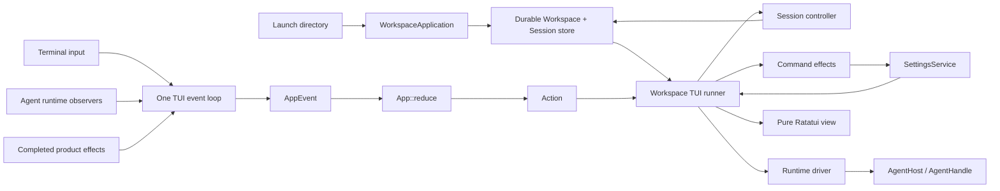

# BONE TUI architecture

The full-screen BONE product has one interactive entry point:
`bone_app::run_workspace`. The `bone` executable opens the directory from
which the user launched it as a durable Workspace, opens or creates a logical
Session, and then starts the TUI.

There is no separate in-memory frontend API or compatibility execution path.
The TUI is a product surface for durable Workspace and Session state, not a
thin wrapper around one process-local Agent runtime.

## Start BONE

For normal use, start from the directory BONE should work in:

```sh
cd ~/code/my-project
bone
```

During development from this repository:

```sh
cd ~/code/my-project
cargo run --manifest-path /path/to/bone/Cargo.toml -p bone-app --bin bone
```

The exact launch directory is the Workspace boundary. BONE canonicalizes it
for stable identity, but retains the user's spelling for display. It does not
walk up to a Git root and does not create `.bone/` in the project.

The interactive CLI follows this product path:

```text
launch directory
  → BoneStore::open_default
  → WorkspaceApplication::open_with_store
  → SettingsService::open(same store)
  → bone_app::run_workspace
```

Settings failure does not prevent the terminal from opening. The shell shows
the durable sessions and a truthful repair/setup state instead of hiding the
user's history. Normal configuration is performed through supported TUI
commands rather than by editing an internal file by hand.

One-shot `bone <message>` and `--events` are CLI automation/export surfaces.
They do not replace the full-screen Workspace/Session lifecycle described in
this document.

## Product shape



The essential boundary is:

> `bone-agent` decides what an attached runtime does. `bone-app` owns durable
> Workspace/Session identity, user configuration, terminal interaction, and
> presentation state.

The terminal never implements model or tool policy. Conversely, the Agent
runtime never assigns product session identity, writes Session journals, or
chooses what the TUI displays.

## Ownership and module boundaries

`bone-app` deliberately contains the product-only durable and terminal code in
one package. The important boundaries are modules, not publishable crates.

| Area | Owner | Responsibility | Does not own |
| --- | --- | --- | --- |
| Workspace identity | `durable/workspace_identity.rs` and `registry.rs` | Canonical launch directory → stable Workspace ID | Git-root discovery, Agent handles |
| Session facts | `durable/session.rs` and `journal.rs` | `SessionRecord`, drafts, writer leases, append-only history | Presentation state, live runtime futures |
| Product bootstrap | `product_workspace.rs` | Open Workspace, select/create initial Session, locate private state | Terminal input, Agent policy |
| TUI reducer | `tui/app.rs` | `AppEvent`, `App::reduce`, local UI state and projection | File I/O, Settings persistence, Agent lifecycle |
| Durable session control | `tui/session_controller.rs` | Hydration, writer leases, recovery, record/journal mutation, accepted-turn boundary | Terminal polling, Agent handles |
| Typed commands | `tui/command_effects.rs` | `/model`, `/new`, `/resume`, `/archive`, `/status`, and settings-facing effects | Raw key handling, journal recovery |
| Runtime attachment | `tui/runtime_driver.rs` | `AgentHost`, `AgentHandle`, tagged observers, reset after broadcast gaps | Durable Session identity and persistence |
| Product runner | `tui/workspace.rs` | Dependency assembly, event loop, effect dispatch, orderly shutdown | Direct mutation of `App` fields |
| Rendering | `tui/view.rs` | Pure `&App → Ratatui frame` projection | I/O, Agent calls, durable writes |
| Terminal lifetime | `tui/terminal.rs` | Raw mode, alternate screen, bracketed paste, restoration | Product state |

This organization prevents a future feature such as a model picker, session
search, permissions prompt, or diagnostics panel from turning `App` into a
storage or runtime coordinator.

## Three different identities

BONE keeps process-local UI routing separate from durable product identity:

| Identity | Meaning | Lifetime |
| --- | --- | --- |
| `WorkspaceId` | Canonical launch-directory identity | Stable across launches |
| durable `SessionId` | Logical conversation identity | Stable across launches and processes |
| `UiSessionId` | TUI reducer/observer routing ID | Current BONE process only |

`UiSessionId` is never persisted and must not be confused with a Session ID in
a journal, lease, configuration scope, or CLI-visible session reference.

## Presentation data flow

The TUI follows a reducer/effect loop:

```text
terminal event / runtime update / completed I/O
                 ↓
              AppEvent
                 ↓
           App::reduce()
                 ↓
          Action (effect request)
                 ↓
session controller / command effects / runtime driver
                 ↓
     result, failure, or notice as a new AppEvent
                 ↓
           App::reduce() → pure view
```

`App::reduce` is the only writer of presentation fields. Product effects may
read durable state and perform I/O, but they do not set composer text, session
selection, timeline rows, badges, or render flags directly. They route the
observable outcome back through the reducer, including user-facing notices.

The runner currently performs some SessionStore, journal, and SettingsService
work on the TUI task. The data-flow boundary is already strict; moving those
blocking operations behind workers is a future responsiveness improvement, not
a reason to add a second presentation-state writer.

## Workspace and Session lifecycle

Opening BONE performs the following product sequence:

```text
open launch-directory Workspace
  → list active logical Sessions
  → open or create the selected Session
  → obtain its writer lease before changing durable facts
  → hydrate draft and journal into App
  → resolve saved settings/model readiness
  → attach an Agent runtime only when user work requires it
```

A Workspace may contain many durable Sessions. Background Sessions remain
visible even if they are not logged in, lack a model, have no live runtime, or
are currently held for writing by another BONE process.

Each logical Session has an OS-backed writer lease. A process without that
lease presents the session as read-only and the reducer blocks draft edits,
local commands, posting, and stop requests. Switching to a Session attempts
to acquire its lease and then refreshes its durable state. Idle leases can be
released after a switch; a Session with active work, a pending turn, or a
startup task remains owned until it reaches a safe boundary.

`SessionStore::replace` uses SQLite document revision compare-and-swap for
individual record writes. On a normal cross-process conflict, the product
runner reloads once and reapplies only fields owned by the current effect. The
lease prevents competing normal writers; SQLite CAS remains the narrow
document-level integrity check.

## Durable input and recovery

The durable acceptance boundary for a user turn is:

```text
draft
  → resolve complete immutable runtime config and model
  → one SQLite transaction: Session summary + UserTurnAccepted { turn, text, runtime_fingerprint, model }
  → AppEvent::TurnAccepted clears the composer and shows the message
  → attach runtime / AgentHandle::post
```

If that transaction fails, the composer remains intact and the Agent never
receives that message. Once the fact is accepted, the message is visible and a
runtime receipt is tracked separately. A connection/start/post failure leaves
the turn in a truthful retryable or interrupted state; it is not silently
discarded or automatically replayed.

On a cold restart, BONE reads the journal before trusting the Session summary.
It repairs the last-known summary from durable facts, marks unconfirmed work
as interrupted or requiring recovery, and never guesses that an external model
or tool request did not happen. Automatic replay requires an end-to-end,
idempotent durable turn receipt protocol and is intentionally not inferred by
the TUI.

## Settings and slash commands

Users configure the product inside the TUI. Configuration files are product
implementation details; first use creates safe storage automatically.

```text
/model <id>             save a model for the current Session
/model default <id>     save a Workspace model default
/model global <id>      save a user model default
/model inherit          remove the current Session override
/login                  connect or retry the model service
/new /sessions /resume  create and navigate Workspace Sessions
/rename /archive        organize a Session
/status /workspace      inspect current product state
```

The model resolution order is:

```text
Session override > Workspace default > User default
```

Settings writes are immediate and durable. An already attached Agent runtime
keeps its pinned model; a new or recreated runtime resolves the newly saved
selection. The UI describes this as saved/pending-next-runtime rather than
claiming a live runtime hot-swapped its model.

Only a typed, single-line slash command becomes a local command. Pasted or
multi-line slash text remains normal model-visible input. `//text` explicitly
sends slash-prefixed text to the model.

## Runtime attachment and observation

`AgentHost` connects the model service once for the TUI process and can start
independent `AgentHandle` runtimes. A durable Session is not itself an Agent
runtime: its title, draft, journal, and identity survive even when no handle is
attached.

For every attached runtime, the runtime driver:

1. calls `AgentHandle::observe()` for an atomic Snapshot and sequence;
2. follows later steps through the runtime broadcast receiver;
3. forwards tagged `Step`, `Reset`, or `Closed` updates to the TUI loop;
4. reacquires a Snapshot after a sequence gap or broadcast lag.

Observers never mutate `App`, draw the terminal, append a journal entry, or
choose a model. A broadcast gap rebuilds only the affected Session's runtime
projection; drafts, scroll anchors, other Sessions, and durable history remain
unchanged.

## Interaction and rendering

At a wide terminal width, BONE shows a Session rail beside the conversation.
At narrow widths it replaces that rail with a full-screen Session list while
keeping the same selection and keyboard semantics.

```text
Composer focus
Ctrl-N          new Session
Ctrl-Left       focus the rail or open the narrow Session list
Enter           send
Ctrl-J          insert newline
PageUp/Down     move through history
Ctrl-Home/End   oldest item or live tail
Esc             stop the selected Session

Session focus
Up/Down         select a Session
Ctrl-Right      return to its composer
Enter/Esc       return to its composer

Ctrl-C          exit BONE
```

Each Session owns its draft, scroll anchor, visible timeline, unread state,
and model/readiness state. Switching Session changes selection only: it does
not move composer text, restart background work, unsubscribe its observer, or
mutate another Session's durable facts.

The view is an immediate-mode Ratatui projection. It renders immutable user
and Agent timeline records plus a compact mutable activity tail for ongoing
work. Successful tool activity honors `show_progress`; errors and unresolved
external effects remain visible. Rendering reads `App` only and never performs
I/O or runtime work.

## Exit and failure behavior

Terminal restoration happens before slow shutdown. On `Ctrl-C`, terminal EOF,
or a TUI error, BONE leaves raw/alternate-screen mode and restores bracketed
paste and the cursor first. It then requests shutdown for live Agent handles
concurrently and waits for their reports.

An observer task is cancelled with its process-local runtime attachment. A
durable Session is not deleted merely because its runtime closes. Any accepted
but unresolved turn remains recorded for the next product startup to explain
and reconcile.

## Code map

```text
crates/bone-app/src/
├── main.rs                  CLI: interactive and one-shot mode selection
├── product_workspace.rs     Workspace bootstrap policy
├── durable/
│   ├── workspace_identity.rs canonical directory identity
│   ├── registry.rs           private Workspace registry
│   ├── session.rs            SessionStore, drafts, writer leases
│   └── journal.rs            append-only recovery facts
└── tui/
    ├── mod.rs                product TUI facade and public exports
    ├── workspace.rs          runner composition and event/effect loop
    ├── session_controller.rs durable Session lifecycle and recovery
    ├── command_effects.rs    typed local command effects
    ├── runtime_driver.rs     Agent attachment and observer fan-in
    ├── app.rs                AppEvent, reducer, conversation presentation
    ├── commands.rs           command parsing and suggestions
    ├── view.rs               pure responsive rendering
    ├── terminal.rs           terminal lifetime guard
    └── events.rs             JSONL observation export
```

## Invariants

- The launch directory maps to one durable Workspace; BONE never creates
  project-local hidden state.
- Durable `SessionId` and process-local `UiSessionId` have different jobs and
  never substitute for one another.
- A Session's writer lease is required before any local durable mutation.
- A user turn is durable before the reducer clears its composer or the runtime
  receives it.
- Journal facts are the recovery authority; Session summary is a repairable
  last-known status.
- All presentation changes cross `AppEvent → App::reduce`; effects never write
  UI fields directly.
- A runtime observer is tagged to one UI Session and a broadcast reset changes
  only that Session's runtime projection.
- Rendering is pure and terminal restoration precedes slow runtime shutdown.
- BONE never claims an action, model switch, or external effect that the
  underlying durable/runtime boundary has not confirmed.

For product requirements and detailed screen behavior, read the
[TUI workspace PRD](product/tui-workspace-prd.md),
[interaction design](product/tui-interaction-design.md), and
[product runtime architecture](product/tui-runtime-architecture.md).
