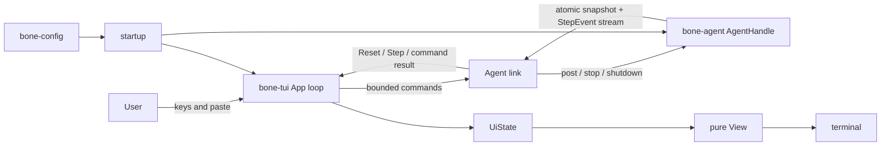

# BONE TUI architecture

Status: accepted design for the first full-screen implementation, 2026-09-06.

## Decision

The first TUI will use:

```toml
ratatui = "0.30.2"
crossterm = { version = "0.29", features = ["event-stream", "bracketed-paste"] }
ratatui-textarea = "0.9.2"
futures-util.workspace = true
```

Ratatui 0.30.2 has a Rust 1.88 minimum. The implementation change will declare
`rust-version = "1.88"` under `[workspace.package]` and add
`rust-version.workspace = true` to every member package instead of leaving that
build contract implicit. Cargo does not make members inherit workspace package
fields automatically. See the [Ratatui package manifest] and [Cargo workspace
package inheritance].

It will be a projection and control surface for `bone-agent`. It will not own an
Agent state machine, call models, run tools, or interpret whether work is still
valid.

There are only three moving parts:

1. **App loop** receives terminal input and Agent updates, and is the only owner
   of UI state.
2. **Agent link** observes the Agent and sends commands to it without blocking
   the App loop.
3. **View** draws the current UI state. It has no async work and no side effects
   other than drawing the supplied frame.

`UiState` is data owned by the App loop. `TerminalSession` is a resource guard.
Neither is another service or lifecycle.

## System boundary



The most important boundary is this:

> `bone-agent` decides what the Agent is doing. `bone-tui` decides how that
> state is displayed and which user command to send.

The TUI therefore treats model work and tool work uniformly. Both are Agent
jobs. `JobRequest` is used to choose a label or detail view, but the TUI does
not create a separate model lifecycle.

## Why this stack

Ratatui is an immediate-mode rendering library: the application keeps its own
state and event loop, then draws a frame from that state. It does not impose a
second application runtime. Its `Terminal` performs buffer diffing, and its
`TestBackend` makes the final terminal buffer testable. Crossterm 0.29 is
Ratatui 0.30's matching default backend, and its optional `EventStream` exposes
terminal input as an async stream suitable for Tokio. The Ratatui documentation
warns against mixing incompatible Crossterm versions because they can maintain
separate input queues and raw-mode state. See [Ratatui rendering], [Ratatui
backends], [Crossterm EventStream], and [Ratatui TestBackend].

`ratatui-textarea` is used for the composer because cursor movement, selection,
undo, multiline editing, Unicode, CJK width, and soft wrapping are editor
problems rather than BONE problems. It is still pre-1.0, so it will be contained
inside the App instead of appearing in `bone-tui`'s public API. See the
[ratatui-textarea documentation].

| Candidate | What it gives us | Cost in BONE | Decision |
| --- | --- | --- | --- |
| Ratatui + Crossterm | Explicit loop, layout, diff rendering, async input, test backend | One small UI state | **Use** |
| [Crossterm] alone | Direct terminal control and async input | We would rebuild layout, diffing, widgets, scrolling, and render tests | Reject |
| [Cursive] | Retained view tree and built-in loop | Its callback/view lifecycle would sit beside the Agent event lifecycle | Reject |
| [tui-realm] | Components, ports, commands, messages | It adds a second event architecture on top of BONE's | Reject |
| [iocraft] | Declarative components, hooks, async rendering | Component task lifetimes would become another source of truth | Keep as a future alternative |
| [Termwiz] | Rich low-level terminal primitives | More integration work and a less natural Tokio input boundary | Reject for the first version |

This conclusion also matches current production Agent TUIs without copying
their scale. The comparison used the Codex 0.153.4 release and OpenCode's `dev`
source available on 2026-09-06. OpenAI Codex uses Ratatui, Crossterm
`event-stream`, and Tokio; its terminal, Agent, draw, and timer events converge
in one application loop. Its Agent protocol keeps work lifecycle in the
backend. OpenCode likewise keeps its terminal package on the presentation side
of the backend boundary. See the [Codex TUI release], [Codex TUI dependencies],
[Codex TUI event loop], [Codex app-server protocol], and [OpenCode TUI package
specification].

We will not add a UI framework, a component trait, a generic command bus, or an
Elm-style `Cmd -> Msg` layer. BONE already has an event-driven domain runtime;
duplicating it in the frontend would hide control flow.

The rejection column is an architectural judgment for BONE based on each
project's official interface, not a claim that those projects are generally
inferior or unmaintained.

## The App loop

The App loop is the only code allowed to mutate `UiState` or draw the terminal:

```rust,ignore
while !app.is_done() {
    if app.take_dirty() {
        frame_deadline.request();
    }

    tokio::select! {
        terminal = terminal_events.next() => {
            app.on_terminal(terminal.transpose()?);
        }
        update = agent_link.recv() => {
            app.on_agent(update.ok_or(Error::AgentLinkClosed)?);
        }
        _ = frame_deadline.wait(), if frame_deadline.is_armed() => {
            terminal.draw(|frame| view::render(frame, app.state()))?;
            frame_deadline.disarm();
        }
    }
}
```

`on_terminal` handles presentation input. `on_agent` applies authoritative
Agent data. They are ordinary methods, so the first version does not need one
large enum that mixes terminal keys with Agent domain events.

Drawing is coalesced to at most 30 frames per second and stops waking the task
when nothing changed. This prevents progress bursts from starving keyboard
handling while keeping typing responsive. The Agent runtime already coalesces
tool progress by job; the TUI performs only visual frame coalescing.

`frame_deadline.request()` arms an unarmed deadline. It never pushes an already
armed deadline farther into the future. Continuous progress can therefore
coalesce into the next frame but can never postpone drawing forever.

`KeyEventKind::Release` is ignored. `Press` and `Repeat` go to the editor so key
repeat works, while Stop and Quit bindings respond only to `Press`. Crossterm
can report both press and release on some platforms, and treating every event
as a press can execute a command twice.

Application bindings are intercepted before an event reaches `TextArea`:

- `Press Enter` submits; an Enter repeat is ignored;
- `Press Ctrl-J` calls `insert_newline()`;
- `Press Esc` requests Stop;
- `Press Ctrl-C` requests shutdown;
- `Event::Paste(text)` normalizes CRLF/CR to LF and calls
  `composer.insert_str(text)` directly.

Other Press and Repeat events go to editing or navigation, so holding Backspace
or an arrow key continues to work. Global commands and transcript
PageUp/PageDown/Home/End handling always run before the remaining input is
passed to `TextArea`; this intentionally overrides the editor's default
bindings.

Mouse capture is out of scope for the first version. Bracketed paste is enabled
and disabled together with the terminal session; enabling the terminal mode is
not a substitute for handling its distinct paste event. See [TextArea API] and
[Crossterm Event].

## The Agent link

Calling `post()` normally finishes quickly, but it is still async. Calling
`shutdown()` may wait for the configured cleanup period. Awaiting either in the
App loop would freeze input and rendering. Spawning every call independently
would allow two user messages to reach the Agent in a different order.

The Agent link exists solely to solve those two mechanical problems. It owns
two supervised tasks:

- an observation task that follows `AgentHandle::observe()`;
- a command task that calls `post`, `stop`, and `shutdown` in order.

`AgentLink` retains both task handles. A panic or unexpected exit in either task
becomes a fatal `AgentUpdate`; tasks are never detached and forgotten.

Its small protocol is:

```rust,ignore
enum AgentCommand {
    Post { local_id: u64, text: String },
    Stop,
    Shutdown,
}

enum AgentUpdate {
    Reset { snapshot: Snapshot, sequence: u64 },
    Step(Arc<StepEvent>),
    Posted { local_id: u64, result: Result<MessageReceipt, HandleError> },
    CommandFailed(HandleError),
    ShutdownComplete(Result<ShutdownReport, HandleError>),
    Closed,
}
```

Both channels are bounded. The command channel reserves two slots for control:
if at most 16 Posts may be outstanding, its physical capacity is 18. A normal
Post uses `try_send`; when the Post budget is exhausted, the current draft stays
in the composer and the frontend reports that it is busy. One Stop and one
Shutdown can still enter the same ordered queue without waiting. Repeated Stop
input is coalesced until the corresponding Agent record arrives; Shutdown can
be registered only once and immediately closes input. If a reserved control
send ever reports `Full`, that is an invariant failure and becomes a fatal
update rather than a dropped command.

This preserves the order of accepted commands, gives control commands a
guaranteed path, and never blocks rendering. The exact capacities remain
private constants rather than configuration settings.

A slow UI can make the observation task fall behind, but it cannot block
`bone-agent`. Recovery uses a new snapshot rather than an unbounded frontend
queue.

The command task is transport plumbing. It does not decide whether a message
changes the task, whether work should stop, or whether a tool may run. Those
decisions remain inside `bone-agent`.

## One recoverable source of truth

The full TUI uses `AgentHandle::observe()`. It must not build the primary view
from `subscribe()`.

`observe()` atomically returns:

- a `Snapshot` containing the complete in-memory record and current jobs;
- the sequence represented by that snapshot;
- a receiver for later `StepEvent`s.

This avoids the race in `snapshot().await` followed by `subscribe()`, where an
event could occur between the two calls.

`AgentLink::connect()` obtains this initial observation before the program
enters raw mode or the alternate screen. The App builds its initial projection
from that snapshot, then creates `TerminalSession` and starts following the
already subscribed receiver. Events that occur during terminal setup remain in
the receiver. This makes the first drawn frame a real baseline instead of a
temporary empty screen.

The observation task follows this algorithm:

```rust,ignore
loop {
    let mut observation = agent.observe().await?;
    let mut expected_sequence = observation.sequence + 1;
    updates.send(AgentUpdate::Reset {
        snapshot: observation.snapshot,
        sequence: observation.sequence,
    }).await?;

    loop {
        match observation.events.recv().await {
            Ok(step) if step.sequence == expected_sequence => {
                expected_sequence += 1;
                updates.send(AgentUpdate::Step(step)).await?;
            }
            Ok(_) | Err(RecvError::Lagged(_)) => break,
            Err(RecvError::Closed) => {
                updates.send(AgentUpdate::Closed).await?;
                return Ok(());
            }
        }
    }
}
```

After a gap, the outer loop obtains another atomic baseline. `Reset` replaces
only the Agent projection. It preserves the user's draft, focus, local command
status, and scroll anchor.

Plain one-shot output uses the same rule with a `last_record_cursor`: after a
gap it obtains another observation and emits only notices whose record cursor
is newer than the last one already printed. It therefore neither duplicates
output nor loses the terminal `Finished`, `Paused`, or `Stopped` state.

Normal presentation consumes `StepEvent.records`. It does not also consume
`EffectSummary::Publish`, because every published notice is first stored as a
record and would otherwise appear twice. Effects remain useful in the existing
JSONL diagnostic export.

`RecordEntry.cursor` is the stable identity for transcript items and scroll
anchors. Wrapped rows and Ratatui buffers are disposable render output. A
resize rebuilds them from semantic records.

## UI state and view

The first state is intentionally small:

```rust,ignore
struct UiState {
    agent: AgentProjection,
    composer: TextArea<'static>,
    scroll: ScrollState,
    submissions: Vec<PendingSubmission>,
    closing: bool,
    agent_closed: bool,
    shutdown: Option<Result<ShutdownReport, HandleError>>,
    local_error: Option<String>,
}

struct AgentProjection {
    sequence: u64,
    transcript: Vec<TimelineItem>,
    jobs: BTreeMap<JobId, JobView>,
}
```

`AgentProjection::reset(snapshot, sequence)` rebuilds from a baseline.
`AgentProjection::apply(step)` applies only the new records. Tests must prove
that incremental application and rebuilding from the resulting snapshot
produce the same visible state.

The view has three vertical regions:

```text
┌ BONE · workspace · current activity ─────────────────────┐
│                                                           │
│ transcript                                                │
│ user messages, replies, errors, and compact tool activity │
│                                                           │
├───────────────────────────────────────────────────────────┤
│ composer                                                  │
└ Enter send · Ctrl-J newline · Esc stop · Ctrl-C exit ─────┘
```

There is no permanent side panel in the first version. It consumes scarce
terminal width and encourages a second navigation hierarchy. Full job detail
can later use a temporary overlay. The normal transcript shows semantic
records; internal effects are available only in the event log or a future
debug overlay.

The projection does not reconstruct private Kernel state such as an exact
"autonomous" phase. The first version shows observable jobs and notices. If a
future design needs a precise session phase, `bone-agent` should expose a small
typed status in its snapshot and steps; the TUI must not duplicate the Kernel
state machine.

When the transcript is at the bottom, new items keep it at the bottom. When the
user scrolls up, new items do not move the viewport; an unread count is shown.
The anchor is a record cursor plus an offset in the original item text at a
grapheme boundary. Screen row numbers are recalculated for the current width.
A resize can therefore rewrap without confusing row five at 80 columns with
row five at 40 columns.

Messages are added to the transcript only when their authoritative
`UserMessage` record arrives. Submitting clears the editor but retains a local
backup until `post()` succeeds. If posting fails and the editor is still empty,
the text is restored. If the user has already started another draft, the failed
submission remains a recoverable item instead of overwriting new text.

The first renderer wraps replies as plain text. Markdown support will sit
behind one function:

```rust,ignore
fn message_lines(text: &str, width: u16) -> Vec<Line<'static>>;
```

This avoids adopting the currently experimental [tui-markdown] package or
letting a parser's types spread through UI state. Replacing this function later
does not change the event or state architecture.

## Terminal ownership

The first version uses a full-screen alternate buffer. This is the smallest
implementation that satisfies this version's scrolling, overlay, resize, and
recovery requirements: the App owns the whole viewport, resize means re-layout
and redraw, and scroll behavior is deterministic. `TerminalSession` enters raw
mode, the alternate screen, and bracketed-paste mode; explicit restore plus a
best-effort `Drop` path restore the cursor and terminal modes on normal exit
and error. Panic restoration follows Ratatui's supported setup.

This choice has real costs: the transcript is not left in native shell
scrollback after exit, and native selection behavior varies by terminal. A
plain one-shot mode remains available for scripts and users who need ordinary
stdout.

Inline mode is not a boolean that merely skips `EnterAlternateScreen`. A
correct Agent chat implementation must separate immutable committed history
from the changing tail, insert completed history into native scrollback,
maintain a scrolling region, and reflow correctly after resize. Codex's current
inline implementation has dedicated viewport, history insertion, resize, and
suspend/resume machinery. See the [Codex terminal implementation], [Ratatui
inline example], and [Ratatui alternate-screen description].

We will consider an opt-in inline renderer only after:

1. transcript items have a stable committed-versus-active lifecycle;
2. resize and reflow have PTY tests;
3. tmux, Zellij, Windows Terminal, SSH, and macOS terminals are exercised;
4. selection and native scrollback work during streaming output;
5. approvals and overlays work without clearing terminal history.

Until that work exists, configuration will not expose a misleading screen-mode
switch.

## Use cases

### Start or reconnect

```text
main builds configuration and starts bone-agent
  -> AgentLink::connect calls observe()
  -> observe returns one atomic Snapshot + sequence + live receiver
  -> App builds AgentProjection before entering the alternate screen
  -> observation task starts with the already subscribed receiver
  -> View draws one complete first frame
```

There is no empty-screen window followed by a guessed series of updates. The
first frame already represents one known Agent position.

### Submit while work is running

```text
user presses Enter
  -> App sends Post to the bounded Agent link and keeps reading keys
  -> command task calls AgentHandle::post in submission order
  -> Kernel accepts UserMessage and emits a StepEvent
  -> observation task forwards Step
  -> App displays the recorded user message
  -> bone-agent decides whether to keep, reconsider, or pause current work
```

The composer remains active throughout. A coordinator-model review, if needed,
is shown as another running job. The TUI does not decide whether the new message
invalidates the solver's direction.

### A tool appears stuck

```text
Agent record says JobStarted
  -> activity line shows the running job
  -> tool future remains inside bone-agent Runtime
  -> terminal input continues independently
  -> bone-agent's soft deadline creates another Agent event
  -> Agent may reason again, wait, or request cancellation
  -> each resulting record updates the projection
```

The TUI has no timeout for Agent jobs. Its own frame clock affects drawing only.
This keeps operational truth in one place.

### The user changes direction before an old result returns

```text
new UserMessage is recorded
  -> bone-agent reviews or gives it to the solver
  -> an old model/tool result later reaches the Kernel
  -> Kernel/model freshness logic accepts, holds, or discards its proposal
  -> TUI displays only the resulting records
```

The TUI never compares prompts or asks a second model whether the old result is
relevant. That is Agent behavior, already covered by the Agent loop.

### The UI falls behind

```text
broadcast receiver reports Lagged, or sequence is not contiguous
  -> observation task stops applying that stream
  -> it calls observe() again
  -> App receives Reset from a fresh atomic baseline
  -> AgentProjection is rebuilt
  -> draft and reading position remain intact
```

No completed answer or error can disappear silently just because rendering was
slow.

### Stop and continue talking

```text
user presses Esc or enters /stop
  -> Agent link sends Stop
  -> App may show a local "stop requested" indicator
  -> bone-agent changes generation and requests cancellation
  -> authoritative Stopped and late tool results arrive as records
  -> composer remains usable
  -> a later post can resume work
```

The UI does not claim that an external operation was cancelled merely because a
cancel request was sent.

### Exit

```text
user requests exit
  -> App enters closing state and stops accepting new submissions
  -> ordered command task calls shutdown after earlier posts
  -> observation continues updating the screen during cleanup
  -> ShutdownReport returns and the observation stream closes
  -> App loop ends
  -> TerminalSession restores the shell
  -> unresolved jobs, if any, are printed in plain terminal output
```

Waiting for cleanup never freezes the raw terminal with no redraw path.
`Closed` and `ShutdownComplete` come from different tasks and may arrive in
either order, so normal closing waits for both. It never exits merely because
the observation stream closed and thereby loses the shutdown report.

Terminal EOF, a draw error, or an AgentLink task failure enters this same outer
cleanup path. If the terminal can no longer draw, cleanup still shuts down the
Agent and restores terminal modes before returning the error.

## Crate shape

The first implementation adds four files and keeps the existing configuration
and event-export files:

```text
crates/bone-tui/src/
├── main.rs          arguments, configuration, login, Agent startup, mode choice
├── lib.rs           stable frontend entrypoint and exports
├── app.rs           App loop, UiState, composer, projection, scrolling
├── agent_link.rs    recoverable observation and ordered Agent commands
├── view.rs          pure Ratatui rendering
├── terminal.rs      raw/alternate/paste setup and restoration
├── config.rs        tui.display configuration
└── events.rs        JSONL diagnostic observer
```

`state.rs`, `input.rs`, and component traits are deliberately absent. They can
be extracted when a concrete type becomes independently complex; file count is
not an architecture goal.

The reusable frontend boundary is:

```rust,ignore
pub async fn run(
    agent: AgentHandle,
    config: TuiConfig,
) -> Result<ShutdownReport, TuiError>;
```

`run()` is awaited directly by the binary's main task. It is not passed to
`tokio::spawn`: `TextArea` is neither `Send` nor `Sync` and lives across awaits
inside the App loop. Only the two AgentLink tasks are spawned and required to
be `Send`. See [TextArea API].

`main.rs` remains the composition root. It reads the shared `bone-config`
snapshot, starts `bone-agent`, and chooses full-screen interactive or plain
one-shot output. The TUI library receives an already constructed Agent handle
and presentation settings. It owns interactive shutdown so the screen can keep
updating until cleanup finishes, then returns the report to `main.rs`. Other
future frontends use the same Agent API and do not depend on `bone-tui`.

The outer `run()` cleanup path owns the Agent and `AgentLink` task handles. UI
input, drawing, and link errors leave the inner loop but still request Agent
shutdown, join the link tasks, and restore the terminal before returning the
original error. An early `?` inside the inner loop cannot abandon the Agent.

## Validation

The implementation is accepted when these behaviors are deterministic:

- A controlled Agent snapshot produces the expected 40x12 and 80x24 buffers
  with Chinese, emoji, long paths, and multiline text.
- Applying steps incrementally produces the same Agent projection as rebuilding
  from the final snapshot.
- A lag forces a reset while preserving the draft and logical scroll anchor.
- Two rapid posts reach `bone-agent` in the original order while a Work job is
  still running.
- `Posted` may arrive before or after the matching `UserMessage` step; neither
  order duplicates or loses the submission, and a Reset between them is safe.
- With the Post queue full, Stop and Shutdown each still reach the Agent exactly
  once and no later Post overtakes them.
- A permanently pending tool does not delay typing, posting, resize, or stop.
- Progress bursts produce bounded redraws and do not lose final semantic events.
- A dirty frame's first deadline is never postponed by later progress; held
  Backspace and arrow keys continue through Repeat events.
- PageUp/PageDown and resize do not force a user who is reading history back to
  the bottom, and the same source-text region remains near the top after rewrap.
- Both `Closed -> ShutdownComplete` and `ShutdownComplete -> Closed` exit paths
  retain the cleanup report.
- Shutdown continues to draw until the report arrives and restores the terminal
  afterward.
- Non-TTY and one-shot execution use plain output and never enter raw mode.

Most tests use pure state transitions and Ratatui's `TestBackend`. A small PTY
suite covers startup, resize, Ctrl-C, panic restoration, and exit. Tokio virtual
time verifies frame coalescing. Initial acceptance targets the environments
actually run in CI and development. We will test on macOS Terminal/iTerm2,
Linux, tmux, Zellij, Windows Terminal, and SSH before claiming broad terminal
support.

## Implementation order

1. Add the three selected TUI dependencies plus `futures-util`, declare the
   workspace Rust version, and establish `TerminalSession`, one static frame,
   and `TestBackend` tests.
2. Add `AgentLink` and the projection with atomic baseline, ordered commands,
   lag recovery, submission-failure recovery, and both shutdown arrival orders.
   Prove these event interleavings before adding the full UI.
3. Add the transcript/activity view, textarea, keyboard scrolling, and
   dirty-frame scheduling.
4. Replace the current line-based interactive path. Keep plain stdout and the
   JSONL format, but move one-shot completion detection from `subscribe()` to
   the same recoverable Observation feed so a lag cannot hide `Finished`.
5. Run the controlled interleaving scenarios through the TUI and then perform
   the terminal compatibility pass.

This first TUI can faithfully expose the current Agent, but the current Agent
only registers `read`, `glob`, and `grep`. Reaching a complete coding-Agent
experience later requires shell/write/patch tools and a durable, ID-based
approval/question protocol in `bone-agent`. Streaming text also has to become a
formal Agent event before the TUI can render it. None of those capabilities
belong inside the frontend.

[Ratatui rendering]: https://ratatui.rs/concepts/rendering/
[Ratatui backends]: https://ratatui.rs/concepts/backends/
[Ratatui package manifest]: https://docs.rs/crate/ratatui/0.30.2/source/Cargo.toml
[Cargo workspace package inheritance]: https://doc.rust-lang.org/cargo/reference/workspaces.html#the-package-table
[Crossterm]: https://docs.rs/crossterm/0.29.0/crossterm/
[Crossterm EventStream]: https://docs.rs/crossterm/0.29.0/crossterm/event/struct.EventStream.html
[Ratatui TestBackend]: https://docs.rs/ratatui/latest/ratatui/backend/struct.TestBackend.html
[ratatui-textarea documentation]: https://docs.rs/ratatui-textarea/0.9.2/ratatui_textarea/
[TextArea API]: https://docs.rs/ratatui-textarea/0.9.2/ratatui_textarea/struct.TextArea.html
[Crossterm Event]: https://docs.rs/crossterm/0.29.0/crossterm/event/enum.Event.html
[Cursive]: https://docs.rs/cursive/0.21.1/cursive/
[tui-realm]: https://github.com/veeso/tui-realm/blob/main/crates/tuirealm/docs/en/get-started.md
[iocraft]: https://docs.rs/iocraft/0.8.5/iocraft/
[Termwiz]: https://docs.rs/termwiz/0.23.3/termwiz/
[tui-markdown]: https://docs.rs/crate/tui-markdown/0.3.9
[Codex TUI release]: https://github.com/openai/codex/releases/tag/rust-v0.153.4
[Codex TUI dependencies]: https://github.com/openai/codex/blob/rust-v0.153.4/codex-rs/tui/Cargo.toml
[Codex TUI event loop]: https://github.com/openai/codex/blob/rust-v0.153.4/codex-rs/tui/src/app/startup.rs
[Codex app-server protocol]: https://github.com/openai/codex/blob/rust-v0.153.4/codex-rs/app-server/README.md
[OpenCode TUI package specification]: https://github.com/anomalyco/opencode/blob/dev/specs/tui-package.md
[Codex terminal implementation]: https://github.com/openai/codex/blob/rust-v0.153.4/codex-rs/tui/src/tui.rs
[Ratatui inline example]: https://ratatui.rs/examples/apps/inline/
[Ratatui alternate-screen description]: https://ratatui.rs/concepts/backends/alternate-screen/
