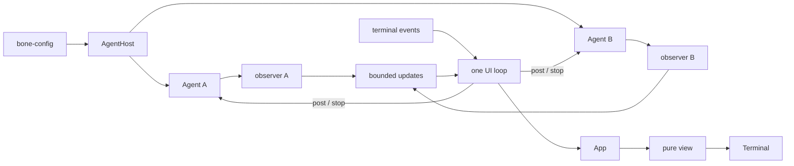

# BONE TUI architecture

Status: implementation contract for the first full-screen, multi-session TUI.

## Purpose

`bone-tui` is a presentation layer for `bone-agent`. One terminal can keep several independent conversations alive, switch between them instantly, and accept input while every session continues running models and tools.

The implementation has four parts:

1. `AgentHost` shares one authenticated model connection.
2. Each `AgentHandle` owns one independent Agent session.
3. One UI loop owns all terminal and presentation state.
4. One observer per session forwards tagged Agent updates to that loop.

There is no frontend Agent state machine, session framework, command bus, or component system.

## Technology

```toml
ratatui = { version = "0.30.2", features = ["unstable-rendered-line-info"] }
crossterm = { version = "0.29", features = ["event-stream", "bracketed-paste"] }
ratatui-textarea = "0.9.2"
futures-util.workspace = true
```

[Ratatui] is immediate-mode: BONE retains its state and event loop, while Ratatui provides layout, terminal-buffer diffing, and a test backend. [Crossterm EventStream] supplies asynchronous terminal events. [ratatui-textarea] handles Unicode-aware multiline editing, wrapping, selection, and undo without adding another application runtime.

The workspace declares and explicitly inherits the Rust version required by these dependencies.

## System shape



The boundary is strict:

> `bone-agent` decides what a session does. `bone-tui` decides which session is visible, how its records look, and which user command to send.

The TUI never calls a model or tool, starts work itself, checks plan freshness, or reconstructs Kernel policy.

## AgentHost and sessions

The ChatGPT credential store permits one live endpoint for a credential root. Repeated calls to the single-session `bone_agent::start` would compete for that lease, so multi-session frontends connect once:

```rust,ignore
let host = bone_agent::connect(&config, on_login).await?;
let first = host.start(&workspace, task.clone()).await?;
let second = host.start(&workspace, task.clone()).await?;
```

`AgentHost` owns the cloneable `Endpoint` and configuration manager. It does not store sessions or assign session IDs.

Every `AgentHost::start` creates a fresh workspace tool environment, model selection, Kernel, Runtime, record, and job registry. Agent and tool settings come from a new configuration snapshot. The endpoint and credential lease are shared. The credential root is connection-level configuration and changes on the next `connect`.

The free `bone_agent::start` remains the convenience API for a single session.

## Ownership in bone-tui

Runtime resources and presentation data stay separate:

```rust,ignore
struct LiveSession {
    id: SessionId,
    agent: AgentHandle,
    observer: JoinHandle<()>,
}

struct App {
    sessions: Vec<SessionUi>,
    current: usize,
    workspace: String,
    viewport: Viewport,
}

struct SessionUi {
    id: SessionId,
    conversation: Conversation,
    background_unread: bool,
    state: SessionState, // Opening, Live, or Offline(reason)
}

struct Conversation {
    projection: Projection,
    composer: TextArea<'static>,
    anchor: Option<ScrollAnchor>, // record cursor + wrapped-line offset
    unread: bool,
    cursor: u64,
}
```

Each conversation owns its draft and scroll position. Switching changes only `App.current`; it never moves text between composers, restarts work, or unsubscribes a background session.

`SessionId` is private to `bone-tui`. It routes events within the current process and is not part of the Agent protocol.

## Observation fan-in

Every session begins with `AgentHandle::observe()`. It atomically returns a Snapshot, its sequence, and a receiver containing only later steps.

A small Tokio task follows each receiver and sends tagged updates through one bounded channel, currently sized at 256:

```rust,ignore
enum SessionUpdate {
    Step { id: SessionId, step: Arc<StepEvent> },
    Reset { id: SessionId, snapshot: Snapshot },
    Closed { id: SessionId },
}
```

The observer accepts only the next sequence. A different sequence or `RecvError::Lagged` makes it call `observe()` again and send `Reset`. A closed Agent stream produces `Closed` and ends the observer.

The bounded channel prevents a slow terminal from turning Agent traffic into unbounded memory. Backpressure may make an observer lag; [Tokio broadcast] reports that gap explicitly, and the atomic reset path makes it safe.

Observers only move observations. They never mutate `App`, draw, post, stop, or shut down a session.

## The UI loop

The UI loop is the sole writer of `App` and the terminal:

```rust,ignore
loop {
    terminal.draw(|frame| view::render(frame, &app))?;

    tokio::select! {
        input = terminal_events.next() => match app.on_event(input?) {
            Action::Post { id, text } => accept_or_mark_offline(id, session(id).post(text).await),
            Action::Stop { id, .. } => accept_or_mark_offline(id, session(id).stop().await),
            Action::NewSession => {
                let id = next_id();
                app.begin_session(id);       // immediately owns focus and a draft
                pending.push(open(host.clone(), id));
            }
            Action::Quit => break,
            Action::None => {}
        },
        opened = pending.next(), if !pending.is_empty() => {
            attach_or_mark_offline(opened); // never changes the current selection
        },
        update = updates.recv() => app.apply(update?),
    }
}
```

`post`, `stop`, and `observe` wait only for the Runtime actor to accept a command and execute synchronous `Kernel::step`; they never wait for a model or tool. Direct calls preserve message order without a command worker, while every Agent continues long-running work independently. A command failure marks only its session offline; it does not close the workspace.

The first implementation redraws after each delivered terminal or Agent event. It has no frame timer or animation loop. Agent Runtime already coalesces progress.

`Ctrl-N` always inserts and selects a new `Opening` placeholder with its own composer, then starts the Agent asynchronously. The result carries the preassigned `SessionId`, so out-of-order completions bind to the right placeholder without stealing focus. Input typed while it opens stays in that draft; Enter begins routing only after the session becomes `Live`. A start or observation failure leaves that placeholder visibly `Offline` while other sessions keep running. Authentication happened before raw terminal mode, so new sessions reuse the connected host.

## Projection

`Projection` is a display cache rather than another Agent model. It stores immutable timeline items, active Work/Review/Tool jobs, a display status, and the tool names needed to join `JobStarted` with `JobFinished`. The session owns only three frontend lifecycle states: `Opening`, `Live`, and `Offline(reason)`.

Reset rebuilds it from `Snapshot.record`. A normal Step applies only `StepEvent.records`. The normal view does not also consume Publish effects because every Notice is already recorded and would otherwise appear twice.

The timeline contains:

- user messages and Agent replies;
- one compact immutable row for each completed tool;
- errors and Paused, Stopped, or Finished transitions.

Work and input review appear only in the live activity line. Successful tool rows obey `show_progress`; failures and unknown external effects always remain visible. An unknown external effect is tracked by Job ID and disappears from the warning state only when that same job receives a conclusive result. Ordinary cancellation is neutral. Raw tool artifacts and JSON arguments do not enter the chat.

`RecordEntry.cursor` identifies timeline items. A scroll anchor adds a wrapped-line offset within that item, so every part of one long reply remains reachable. Resize keeps the same timeline item and clamps its row after rewrapping; it does not promise to keep the same character at the top. New items follow the live tail unless the user is reading history; in that case the anchor stays and a simple unread marker appears. Tail rendering measures backward from the newest items, so normal typing does not remeasure the complete history.

## Layout and interaction

At 72 columns or wider, the left 22 columns form a read-only session rail followed by a one-column divider. Its header shows the current position and total count. Each row shows a title plus a compact opening, working, waiting, complete, unread, unresolved-effect, or offline badge and never receives focus.

Below 72 columns the rail disappears. The header carries the context as `BONE  2/4 * · current title`: `*` means a background conversation has new content, `!` means one is offline or has an unresolved external effect, and `…` means one is opening. New content has priority over the persistent warning. At 40x12, session help and conversation help use separate footer rows so the composer remains clear.

```text
Ctrl-N          new conversation
Alt-Up/Down     previous or next conversation
Enter           send
Ctrl-J          insert newline
PageUp/Down     move through history
Ctrl-Home/End   oldest item or live tail
Esc             stop the current session
Ctrl-C          exit and close all sessions
```

The composer always has focus. There is no sidebar mode, overlay, mouse input, box border, or animated spinner. The terminal keeps its default background; cyan, green, yellow, and red are reserved for accent and semantic status.

Until a message is sent, a session title uses the first non-empty draft line. It then comes from the first non-empty line of the first user message and is clipped to the available width. Naming a session never invokes a model.

## Runtime flows

### Background completion

```text
A starts a tool -> user switches to B -> observer A keeps forwarding
-> App updates A and its unread marker -> switching back reveals the result
```

The switch does not pause A and cannot disturb B's composer.

### Observer gap

```text
observer B detects a gap -> B.observe() -> Reset(B, fresh Snapshot)
```

Only B's Projection is rebuilt. Its record cursor makes newly recovered visible items raise attention correctly. Its draft and scroll anchor, every other session, and all live Agents remain intact.

### Stop

`Esc` targets the current `SessionId`. The Kernel records Stop and revokes autonomous work in that session. Other sessions continue.

### Exit

`Ctrl-C`, terminal EOF, or UI failure leaves the inner terminal scope first. `TerminalSession` disables bracketed paste and restores the cursor, alternate screen, and raw mode.

After the shell is restored, `run` requests shutdown on every `AgentHandle` concurrently. Cleanup time is therefore bounded by the slowest session rather than the sum of their grace periods. Observer tasks finish as their streams close, and `run` returns every `ShutdownReport`.

`LiveSession::drop` aborts its observer. This is normally a no-op after graceful shutdown, and ensures that cancelling the public `run()` future cannot leave a detached observer holding an Agent alive.

## Plain execution and event output

`bone <message>` remains a plain single-session path. It observes before posting and tracks the last printed record cursor. On lag or sequence gap it observes again and prints only newer Snapshot records, so Finished, Paused, and Stopped are neither lost nor duplicated.

The JSONL writer remains an independent consumer of the public observation port. It is diagnostic output, not the TUI's state source.

## Code map

```text
crates/bone-tui/src/
├── main.rs       arguments, config, login, mode selection
├── lib.rs        live sessions, observers, UI loop, shutdown
├── app.rs        App, Conversation, Projection, input actions
├── view.rs       pure responsive rendering
├── terminal.rs   raw/alternate/paste lifetime guard
├── config.rs     presentation settings
└── events.rs     JSONL observation export
```

There are no component traits or generic frontend protocols. A type is split out only when the current implementation gives it an independent job.

## Invariants

- One `AgentHandle` is one independent session; one `AgentHost` may create many.
- Only the UI loop mutates `App` or draws.
- Each observer reports events for exactly one `SessionId`.
- Inactive sessions continue executing and being observed.
- A sequence gap replaces only that session's Agent projection.
- Opening owns a composer immediately; completion binds by ID and never changes selection.
- A local start, observe, post, or stop failure takes down only its session.
- Reset never replaces a composer, scroll anchor, or another session.
- Presentation consumes records and never duplicates Publish effects.
- The TUI never makes Agent validity or completion decisions.
- Terminal restoration precedes slow Agent cleanup.
- All shutdowns run concurrently and all reports remain observable.
- Cancelling the frontend future cannot detach an observer that keeps a session alive.

## Verification covered

- Two sessions from one host have independent records/jobs, share one endpoint, and read fresh session configuration.
- Tagged A/B updates change only the matching projection.
- Switching preserves each draft and background updates raise attention only on their own session.
- A background completion updates its marker without changing the active composer; selecting it clears background unread.
- Opening sessions retain typed drafts and attaching a background session never steals focus.
- A long, automatically wrapped Chinese reply can be paged through line by line.
- Lag resets only the affected session and retains local interaction state.
- [Ratatui TestBackend] proves that 80x24 shows the 22-column rail and 40x12 hides it while retaining title, session position, activity, composer, and help.
- Paste normalization, key repeat, multiline input, and combining characters stay intact.
- Quiet mode hides successful tool noise but keeps failures, cancelled writes with unknown outcomes, and later resolutions.
- Pure reasoning that chooses to wait no longer appears as active work, and current progress messages replace earlier ones without entering history.

## First-version boundary

Sessions live only for the process and share the startup workspace and task settings. Individual close, persistence, restored history, workspace browsing, rename/reorder/search, mouse control, Markdown rendering, streaming text, approvals, and inline rendering remain outside this version.

The Agent currently exposes read-only workspace tools. Shell, patch, write, approval, and question protocols belong in `bone-agent`, never as frontend improvisations.

[Ratatui]: https://ratatui.rs/concepts/rendering/
[Crossterm EventStream]: https://docs.rs/crossterm/0.29.0/crossterm/event/struct.EventStream.html
[Ratatui TestBackend]: https://docs.rs/ratatui/latest/ratatui/backend/struct.TestBackend.html
[ratatui-textarea]: https://docs.rs/ratatui-textarea/0.9.2/ratatui_textarea/
[Tokio broadcast]: https://docs.rs/tokio/latest/tokio/sync/broadcast/
