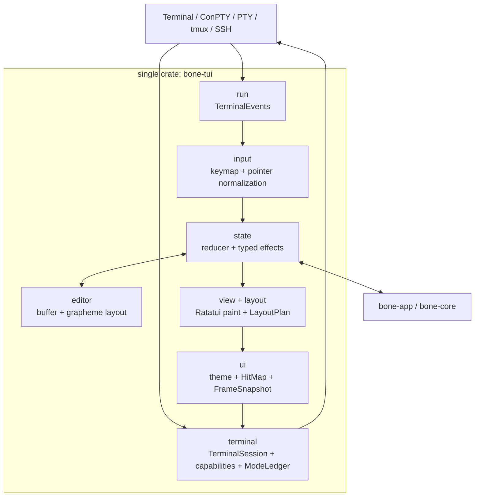

# BONE TUI 平台架构调研与技术决策

> 日期：2026-09-11
> 状态：技术决策已批准；阶段 0–4 的基础切片已实现，阶段 5 的性能与真机认证尚未完成
> 范围：跨 Windows / WSL、macOS、Linux 的高表现全屏 TUI；不修改宿主终端配置
> 依据：BONE 当前源码、Codex CLI、OpenCode / OpenTUI、Claude Code、Ratatui、Crossterm 和现代终端协议的官方资料

## 0. 决策

BONE 应继续使用 **Rust + Ratatui**，但不能继续把 Ratatui 当作完整的前端框架。Ratatui 只负责 Cell buffer、Widget 和最终绘制；BONE 在现有的单一 `bone-tui` crate 内建立自己的终端平台层和交互组件运行时：

- `terminal` 模块：终端所有权、键盘能力协商、模式账本、恢复和 renderer 生命周期；
- `input` 模块：Crossterm 事件规范化、唯一 keymap、鼠标命中与语义动作；
- `editor` 模块：多行文本、grapheme 光标、选择、撤销、粘贴、软换行和 viewport；
- `ui` 模块：语义主题、交互命中和已完成帧快照；
- 现有 `layout`、`state`、`view` 与 `run` 模块：产品布局、reducer/effect、视图和运行循环。

这些名称表达内部责任边界，不创建额外 crate。workspace 继续只保留现有的 `bone-tui` 前端 crate；模块通过私有可见性和只读数据结构协作，不承担独立发布、独立版本或跨 crate API 成本。

正式产品采用 **全屏 alternate screen**。主界面、输入框、滚动、选择和复制都由 BONE 管理，以换取稳定的左右栏、固定底部输入区、浮层和鼠标交互。Ratatui 0.30.2 是当前版本，BONE 现为 0.29；Crossterm 现为 0.28.1，官方当前版本为 0.29。升级应在终端层抽离后进行，并用既有快照与 PTY 测试守住行为，而不是与视觉改版混在一个变更中。[^1][^2][^3]

**OpenTUI 是唯一值得保留为迁移挑战者的方案，但现在不重写。** 它的保留式组件树、Solid API、Yoga 布局、编辑器和鼠标体系明显比裸 Ratatui 完整；OpenCode 证明它能承载复杂产品。代价是为现有 Rust 产品引入 Bun / TypeScript / Zig 原生构件、跨平台原生包、IPC 或 FFI、双进程崩溃边界和新的发布链。OpenTUI 自己也要求应用正确调用 `destroy()`，不能替 BONE 消除终端协议和宿主恢复问题。[^9][^10][^11]

这项决策承诺两种一致性：

1. 在经过认证的 **Full Terminal Profile** 中，BONE 保证相同的 Cell 布局、显式 RGB、边界连续性、命令语义、物理快捷键、焦点规则和鼠标行为。
2. 在能力不足的终端中，BONE 进入明确标识的 Compatibility Profile；它不会伪装成完整支持，不会暗中增加快捷键，也不会写宿主配置来“修复”环境。

BONE 无法在通用 TUI 内保证相同的字体家族、字号、真实字重、抗锯齿、中文 fallback 字体和 emoji 图形。这些像素由终端模拟器和操作系统控制。若把这一部分也定义为必须完全一致，就需要控制宿主渲染器，那已经不是通用 TUI。BONE 能做的是让组件在 Cell 网格上更舒展、主文字更亮、层级更清楚，从视觉上消除“小、细、像蚯蚓”的感受，同时不触碰宿主字体。

## 1. 把要求变成可验收的工程契约

“不同机器体验一致”和“不污染宿主”需要拆成具体责任，否则后续仍会在字体、快捷键和 ANSI 序列之间反复修补。

| 项目 | 实际控制者 | BONE 的承诺 |
| --- | --- | --- |
| 区域宽度、高度、留白、边框 | BONE | Full Profile 中逐 Cell 一致 |
| 颜色值和层级 | BONE + 终端色彩能力 | Full Profile 发送相同 RGB；低色彩档位尚未认证 |
| 字体、字号、具体粗细 | 宿主终端 | 不读取、不设置、不写配置；通过 Cell 密度和颜色弥补视觉差异 |
| 中文、emoji、组合字符宽度 | Unicode 策略 + 终端 | 使用统一测量模块并在认证矩阵验证 |
| `Enter` / `Shift+Enter` | 键盘协议 + BONE | Full Profile 精确区分；不支持时明确报告 |
| `Ctrl+C` / `Ctrl+D` | BONE 命令系统 | 按产品契约执行，不注入额外别名 |
| 鼠标点击、滚动、拖动 | 终端鼠标协议 + BONE | Full Profile 一致；同一布局树负责绘制和命中 |
| raw mode、鼠标、粘贴、键盘协议 | BONE 运行期 | 只临时启用；尝试修改前先登记对应恢复动作，退出逆序恢复 |
| profile、settings.json、shell rc | 用户 | BONE 永不自动修改 |
| 光标颜色与形状、终端标题、palette | 宿主会话状态 | 完全不设置；BONE 只控制 viewport 内的 Cell 和原生 cursor 位置/可见性 |

Full Profile 的最低能力定义为：

- UTF-8；
- 至少 24-bit RGB；
- alternate screen；
- 可识别的 paste 边界；当前 Unix 路径使用 bracketed paste；
- SGR mouse；
- synchronized output 可作为可选优化，不能影响交互语义；
- 能可靠区分修饰键的输入通道：Kitty keyboard / CSI-u，或 native Windows key events；
- 经过 BONE 实测的 Unicode width profile。

Windows、macOS、Linux 都是目标平台，但并非当前每条 transport 都满足这组能力。Crossterm 0.28.1 的原生 Windows event backend 只解析 console key、mouse、focus 和 resize records，没有 bracketed-paste parser；`Event::Paste` 的 parser 只编译在 Unix backend。[^30] 因而原生 Windows 当前不宣称具备可识别的 paste 边界，安全多行粘贴仍是发布前限制。Kitty keyboard 协议采用查询和 push/pop 的渐进增强方式，并把 main screen 与 alternate screen 的键盘模式栈分开。[^18]

## 2. 主流产品实际上怎样做

### 2.1 Codex CLI：Ratatui 只是绘制基础

Codex CLI 的官方 TUI 使用 Rust、Ratatui、Crossterm、Tokio、`unicode-segmentation`、`unicode-width`，并用 VT100 与快照设施测试。[^4] 它在这些库之上实现了自己的终端对象、事件流、键盘模式探测、keymap、composer、textarea、bottom pane、overlay 和恢复守卫。`tui.rs`、键盘模式、composer 与 textarea 的规模本身已经说明：成熟 AI TUI 的主要工作量在产品运行时，不在画一个 `Block`。[^5][^6][^7]

值得 BONE 借鉴的部分是：

- 终端副作用集中处理；
- keyboard enhancement 根据 WSL、VS Code、tmux、Ghostty、iTerm2 等实际环境选择 flags；
- 能力查询有截止时间，查询期间误读的用户输入会重新送回事件流；
- 外部程序、suspend/resume、panic、初始化中断都有恢复路径；
- composer 长期存在，临时 picker / popup 使用额外视图栈；
- 多行 editor 维护原文位置、grapheme、视觉行列、软换行缓存和 viewport；
- keymap 先解析成语义动作，再按上下文分发。

Codex 的公开样式指南大多使用终端默认前景、ANSI 基础色、bold 和 dim，目的是适应用户已有主题，而不是追求固定品牌外观。[^8] BONE 的目标更强调跨机器观感一致，因此不应照抄这一取舍。BONE 的 Full Profile 应在自身 viewport 内绘制显式背景和显式 RGB，组件不能依赖用户的默认 palette。

Codex 的常规对话模式偏向保留 shell scrollback，需要时再进入 alternate screen。BONE 已经是带左右栏、详情区、固定 composer 和鼠标分栏的工作台，更适合始终使用全屏 alternate screen；我们借鉴 Codex 的终端平台与编辑器纪律，不照搬它的主视图形态。

### 2.2 OpenCode：精致感来自完整组件系统

OpenCode 当前把 TUI 放在独立的 `packages/tui` 中，使用 `@opentui/core`、`@opentui/solid`、`@opentui/keymap` 和 Solid。renderer、keymap、theme、route、prompt history、dialog、toast、editor、clipboard、permission、project 等能力通过统一 provider 树进入组件。官方的包提取规范把 TUI 与 SDK / contracts 的边界写得很清楚；当前代码仍有少量对 core 的直接依赖，所以它代表演进方向，而非已经完全解耦的现状。[^12][^13]

OpenTUI 的核心是一棵保留式 Renderable 树：组件保留身份和状态，Yoga 计算 Cell 布局，Zig native core 合成并 diff buffer，只输出变化。它原生提供输入、textarea、scroll box、selection、鼠标、能力检测、alternate screen、suspend/resume 和测试 renderer。[^9][^10][^14]

OpenCode 现在的视觉规律很具体：

- 主内容左右通常留 2 Cell；组件间常用 1 行节奏；
- prompt 不在宽屏无限拉长；
- sidebar 使用独立 surface、2 Cell 横向 padding、标题粗体和普通正文；
- prompt 左边用完整高度的连续 `┃`，而不是多个子组件各画一截；
- textarea 最小 1 行并按内容增长，下面有统一 status baseline；
- `background`、`backgroundPanel`、`backgroundElement`、`backgroundMenu` 形成四级 surface；
- `text`、`textMuted`、`border`、`borderActive`、状态和 diff 都是语义 token。

默认 OpenCode 暗色主题的层次接近 `#0a0a0a`、`#141414`、`#1e1e1e`、`#282828`，正文接近 `#eeeeee`，muted 接近 `#808080`，暖色 accent 接近 `#fab283`。这不是要求 BONE 复制配色，而是说明它的“漂亮”主要由稳定 surface、克制字重、固定间距和连续边界构成，不是调大终端字体。

OpenCode 也没有解决所有终端的 `Shift+Enter`。官方文档承认部分终端不传 Enter 的修饰键，并为 Windows Terminal 提供写 `settings.json` 的映射；默认 newline 还包含 `Ctrl+J`、`Ctrl+Return` 和 `Alt+Return` 等 fallback。[^15] 这些是 OpenCode 的兼容策略，不符合 BONE 已确定的快捷键和零宿主污染要求，不能照抄。

OpenTUI 的 renderer 虽然有集中清理和幂等 `destroy()`，官方仍明确要求应用主动调用；直接 `process.exit` 或未处理异常不会自动替应用完成所有清理。[^10] 它是更完整的 UI runtime，不是终端隔离沙箱。

### 2.3 Claude Code：通过兼容矩阵、配置和 fallback 解决差异

Claude Code 官方文档直接承认 `Shift+Enter` 的支持取决于终端。有些终端开箱可用，有些需要 `/terminal-setup` 修改宿主配置；tmux 还可能要求 `allow-passthrough`、`extended-keys` 和 `terminal-features`。[^16] 它同时提供 `Ctrl+J` 等兼容输入方法。BONE 已经明确不接受自动改键和额外默认快捷键，因此应采用更严格的支持档位，而不是复制 Claude Code 的设置助手。

Claude Code 新的 fullscreen 模式使用 alternate screen、只渲染可见消息、提供鼠标滚动与选择，以减轻长对话的闪烁和内存问题。[^17] 这与 BONE 的工作台方向一致，也说明全屏 TUI 必须自行补足 transcript 搜索、选择、复制、跳到底部和新内容提示。

### 2.4 三者共同的工程模式

三个产品没有任何一个能在任意终端中控制物理字体，也没有任何一个能从相同的输入字节中猜出丢失的 Shift。它们共同依赖：

1. 一套现代终端能力基线；
2. 运行时能力检测和终端特例；
3. 自己维护的 composer / editor；
4. 语义主题和稳定空间节奏；
5. 集中的终端进入、退出、suspend 和错误恢复；
6. 快照、虚拟终端、协议和真机矩阵测试。

## 3. 框架比较

| 方案 | 丰富交互基础 | 与 BONE 的集成 | 跨平台发布 | 终端隔离 | 结论 |
| --- | --- | --- | --- | --- | --- |
| Ratatui + BONE runtime | 需要自建，但边界可完全按产品设计 | 最好；现有 Rust 核心和约 1.48 万行 TUI 可渐进迁移 | 单 Rust 二进制，最简单 | 必须自建 `TerminalSession` | **正式路线** |
| OpenTUI + Solid | 组件树、Yoga、editor、mouse、selection 很强 | 需要 TS UI 与 Rust core 的 IPC/FFI | Bun + Zig native 多平台包 | 有 lifecycle，仍需应用纪律 | 研究后备；当前不做原型 |
| Bubble Tea + Lip Gloss | Elm 模型成熟，颜色与输入能力不错 | 整个 UI 改写成 Go，收益不足 | Go 单二进制较好 | 仍需终端生命周期 | 只作参考 |
| Textual | CSS、组件、焦点、TextArea、测试最完整 | Python runtime 和整体重写 | 依赖 Python 打包 | 框架较完整 | 不适合现有 Rust 产品 |
| Ink | React / Yoga 易上手 | Node runtime 和整体重写 | Node 发布链 | 终端能力弱于 OpenTUI | 不选 |
| iocraft | Rust、声明式、Taffy、内建输入 | 生态和复杂产品验证较少 | Rust 单二进制 | 仍需自建平台层 | 观察，不押主线 |
| 直接 ANSI | 表面上最自由 | 所有协议与 Unicode 都自负 | 容易部署 | 风险最高 | 不选 |

Ratatui 0.30.2 的 `Terminal` 已维护前后 buffer 并只刷变化的 Cell，`TestBackend` 可以验证最终 buffer。[^2][^29] BONE 不应一开始就重写 diff renderer；先在它外面增加帧调度、synchronized output、整帧失效和性能指标，只有基准证明默认 diff 不够时才自定义。

Taffy 是纯 Rust 的 Flexbox / Grid / Block 布局引擎，已被多个 UI 项目使用。[^24] 本轮只把它作为调研候选，没有加入依赖，也没有把当前 AppShell 改成 Taffy。现有纯 `LayoutPlan` 已能表达三档响应式布局、栏宽约束和分隔条；只有未来布局复杂度出现明确证据时，才在同一模块边界后重新评估布局引擎。

Termina 是 Helix 团队开发的跨平台 VT 层，目标就是让新终端扩展以类型化事件进入应用。[^25] 它在状态保存与协议扩展上值得继续观察，但目前不是 BONE 依赖。当前实现继续使用 Crossterm 0.28.1，并先用私有终端边界和 PTY 测试约束副作用；底层替换必须先通过 Windows、WSL、macOS、Linux、tmux 和恢复测试。

## 4. BONE 当前实现说明了什么

当前 `bone-tui` 使用 Ratatui 0.29、Crossterm 0.28.1、`unicode-width` 和 `unicode-segmentation`。本轮重构已经形成以下边界：

- [`terminal/`](../crates/bone-tui/src/terminal/) 内的 `TerminalSession`、`ModeLease` 和 `ModeLedger` 统一拥有 renderer、能力协商、临时模式、panic/signal 恢复与 resume；
- [`input/`](../crates/bone-tui/src/input/) 把终端事件转换为可忽略事件或语义动作；composer 的提交、换行、清空与退出严格使用 `Enter`、`Shift+Enter`、`Ctrl+C`、`Ctrl+D`，不含隐藏别名，`Ctrl+P` 不绑定命令面板；
- [`editor/`](../crates/bone-tui/src/editor/) 统一维护 grapheme、CJK/emoji 宽度、CRLF、软换行、viewport、指针定位和 selection 几何；
- [`ui/`](../crates/bone-tui/src/ui/) 集中语义 theme、active-scope 判定、应用 caret、`HitMap` 与 `FrameSnapshot`；[`layout.rs`](../crates/bone-tui/src/layout.rs) 提供纯 `LayoutPlan`，[view/](../crates/bone-tui/src/view/) 返回本帧真实几何和命中结果；
- [`state/model.rs`](../crates/bone-tui/src/state/model.rs) 使用四个 workspace `Focus`：`Sessions`、`SessionTitle`、`Composer`、`RightRail`。`last_center` 只记录 `SessionTitle` 或 `Composer`，让左右侧栏返回用户上次使用的中栏编辑区；面板保留准确的 workspace 返回焦点，切换 Session 保留当前四区域焦点。
- [`bone-app::SessionSummary`](../crates/bone-app/src/api.rs) 提供 Session rail 所需的 durable read model；持久化层按 record 与 payload 双预算增量推进摘要投影，TUI 不为列表加载完整历史。

左右栏鼠标调整、连续全高分隔、稳定 SessionId/CommandKind 命中和即时重绘已经证明 Ratatui 能承载当前交互。继续演进时仍要控制 reducer 体量和焦点复杂度，但没有证据要求额外 crate 或另一套运行时。

装饰性光标颜色与形状修改已经删除。BONE 在 `SessionTitle`、Composer 或连接表单的可见 caret 相位绘制主题化 Cell，并把原生 cursor 定位到同一 Cell 以保留 IME 与辅助功能锚点。它不发送终端标题、palette、字体或字号、窗口尺寸、cursor color 或 cursor shape 修改。

## 5. 当前架构与后续边界

`bone-tui` 仍是唯一的 TUI crate。当前目录结构如下：

```text
crates/bone-tui/src/
├── terminal/
│   ├── mod.rs
│   ├── session.rs
│   ├── capabilities.rs
│   └── modes.rs
├── input/
│   ├── mod.rs
│   ├── keymap.rs
│   └── pointer.rs
├── editor/
│   ├── mod.rs
│   ├── buffer.rs
│   └── layout.rs
├── ui/
│   ├── mod.rs
│   ├── caret.rs
│   ├── focus.rs
│   ├── frame.rs
│   ├── interaction.rs
│   └── theme.rs
├── run/
├── state/
├── view/
├── layout.rs
├── text.rs
├── lib.rs
└── main.rs
```

`terminal` 的模式写操作保持私有；其余模块只能取得规范化事件、不可变的 `TerminalCapabilities` 和受控的 frame 数据。通过 `pub(super)` / `pub(crate)`、不向 crate root 重导出底层命令，以及扫描终端副作用的架构测试，单 crate 仍然维持严格隔离。



### 5.1 `terminal` 模块

`terminal` 是唯一允许改变终端模式的模块。`TerminalSession` 同时持有 Ratatui renderer、独占的 `ModeLease`、唯一可 join 输入 worker、`TerminalCapabilities` 和 panic hook；`ModeLedger` 通过私有 backend 执行 raw mode、alternate screen、mouse capture、Unix bracketed paste、键盘增强和最终显示光标。它不设置 focus reporting、synchronized output、terminal identity、palette、标题、字体、字号、窗口尺寸或装饰性光标属性。

`run` 持有 bounded channel 的异步 `TerminalEvents` receiver，但不直接写终端模式。能力查询完成后，BONE 启动唯一标准线程，在该线程内以有限 timeout 调用 Crossterm `poll/read`；队列满时保留当前事件并等待容量或 stop，不使用无限期 `blocking_send`。最终 restore、signal、panic 和 suspend 都先 stop 并 join 该线程，再交还 tty。

当前核心关系是：

```text
TerminalSession
  ├─ Ratatui Terminal<CrosstermBackend>
  ├─ ModeLease → ModeLedger<RestoreAction>
  ├─ TerminalInputWorker → one poll/read thread
  ├─ TerminalEvents → bounded receiver
  └─ TerminalCapabilities → KeyboardProtocol
```

能力模型当前只描述区分 `Shift+Enter` 所需的键盘通道。paste transport、terminal identity、颜色档位、multiplexer 和 synchronized output 可在有真实需求与平台证据后扩展，不能把尚未探测的字段写成当前保证。

### 5.2 `input` 模块

当前进程只有一个 BONE 输入 worker。键盘能力探测在启动它之前使用 Crossterm 的查询接口，并由 Crossterm 保留查询期间到达的无关输入。之后的路径是：

```text
Crossterm Event
  → input event normalization
  → exact keymap / pointer resolver
  → semantic Action
  → state reducer
```

无关按键和事件以 `Option::None` 表达，不制造 tick 或 no-op 动作。协议解码、产品快捷键和 editor 操作分开；status baseline 直接读取同一个 keymap。当前没有自建 `EventBroker`。若以后绕过 Crossterm 增加原始协议查询，仍必须保持单一输入所有者、有限 deadline 和用户输入 replay。

### 5.3 `ui` 模块：帧事实与即时绘制

当前 `LayoutPlan` 是纯几何结果；`view::render` 完成绘制后返回 `FrameSnapshot`，其中包含实际 layout、独立 `HitMap`、transcript metrics 和 reader scroll 边界。overlay 会清除被遮挡的命中区，主分隔条最后按整列背景绘制。Session 与 slash command 命中使用稳定的 `SessionId` 和 `CommandKind`，避免异步列表变化后误点另一项。

鼠标拖动状态由 reducer 持有，拖动经过 composer 仍继续调整对应 splitter，pointer up、Esc 或 resize 结束拖动。每次 dirty 状态在接收下一事件前立即绘制，因此下一次 pointer 解析不会继续使用旧帧几何。

当前没有 `NodeId` 组件树、capture/bubble 路由、通用 `OverlayStack` 或 Taffy。现有 workspace focus controller 明确定义 `Sessions`、`SessionTitle`、`Composer`、`RightRail` 的空间邻接：上下只在两个中栏编辑区之间移动，左右侧栏通过 `last_center` 返回上次使用的中栏区域，边界不循环，右栏隐藏时拒绝进入。Conversation transcript 仍有独立绘制与鼠标滚动命中，但不属于键盘焦点枚举。切换 Session 保留当前 workspace focus；若焦点是 `SessionTitle`，内联编辑目标随新 Session 更新。单个普通面板作为独占 scope 保存和恢复 workspace 焦点；输入 `/` 打开的命令面板使用统一的中性 panel 表面，但在交互语义上仍是 Composer 的附属层。随着可嵌套 dialog、autocomplete、diff 和任务树增长，可以在现有 `LayoutPlan` / `FrameSnapshot` 边界后逐步引入所需原语。

### 5.4 `editor` 模块

`EditBuffer` 提供语义编辑操作；`editor::layout` 是 composer 绘制、软换行、上下移动、viewport、鼠标定位与 selection 共用的文本几何。它统一处理 UTF-8、extended grapheme cluster、CJK/emoji 显示宽度、组合字符和 CRLF，避免按字节或 `char` 重复计算。

Unicode UAX #29 定义 extended grapheme cluster；UAX #11 说明 East Asian Width 中 ambiguous 字符需要上下文策略。[^22][^23] per-session draft、revision 和 undo/redo 仍由产品状态持有，并调用 editor 语义操作。IME composition 的中间状态尚未建立跨平台抽象，必须经过原生 Windows、macOS 和 Linux 中文输入法真机验证后才能承诺。

### 5.5 Session rail 的 durable summary projection

`SessionSummary` 是 App 提供给 workspace overview 的持久只读摘要，不是 TUI 从标题或日志文字推断出的缓存。它包含 Session 身份与标题、创建时间、用户输入加 Agent 回复的消息计数、最近一条 Agent 回复最多 1024 UTF-8 bytes 的预览，以及 `projection_pending`。空 Session 返回 `0`、无预览且不 pending。

持久化层为每个 Session 保存 projection cursor。正常 append 在投影已追平时于同一事务推进摘要；旧版本数据、缺失投影或落后投影由后续 overview 从 durable cursor 恢复。一次 workspace overview 在所有 Session 之间共享最多 64 条 journal record 和 8 MiB payload 的推进预算，因此工作量不会随完整历史无界增长。

overview 返回时以 projection cursor 是否追上 `history_through` 计算 `projection_pending`。pending 为 true 时，消息计数与回复预览只描述已物化前缀，前端不能把它们呈现为完整事实。Session rail 的回复行显示 `Loading history…`，第三行计数显示 `… msgs`；后续 overview tick 继续推进，完成后才显示最终的回复预览和消息计数。

## 6. 零宿主污染契约

### 6.1 运行期允许的临时状态

| 能力 | 当前使用条件 | 恢复要求 |
| --- | --- | --- |
| raw mode | TUI 活跃 | 恢复进入前精确 termios / console mode |
| alternate screen | TUI 活跃 | 最后离开，并保留主屏内容 |
| bracketed paste | Unix TUI 活跃；原生 Windows 0.28 不启用 | 退出、suspend 前关闭 |
| SGR mouse | TUI 活跃 | 退出、suspend 前关闭 |
| focus reporting | 当前不启用 | 若未来启用，必须在退出、suspend 前关闭 |
| Kitty keyboard push | Unix 查询确认支持 | **离开 alternate screen 前 pop** |
| synchronized output | 当前不启用 | 若未来启用，`Begin` 后任何错误路径都必须 `End` |
| cursor show/hide/position | 绘制和编辑需要 | 最终 show；只改位置与可见性，不改颜色与形状 |

xterm 对 alternate screen、bracketed paste 和临时键盘模式的定义，以及 Kitty 协议的 screen-local stack，都要求模式成对处理。[^18][^19] 当前账本只登记实际启用的模式。Synchronized output 是后续减少半帧和闪烁的候选，采用时必须保证 DEC private mode 2026 成对结束。[^20]

### 6.2 默认禁止的副作用

- OSC 0 / 2 设置 terminal title；
- OSC 4 修改 palette；
- OSC 10 / 11 设置默认前景或背景；查询可以，设置不可以；
- OSC 12 设置 cursor color；
- OSC 50 或任何字体操作；
- `SetCursorStyle` 等装饰性光标形状修改；
- 修改终端窗口尺寸；
- 写 Windows Terminal `settings.json`、VS Code settings、Kitty / Ghostty / Alacritty 配置、tmux 配置；
- 写 `.bashrc`、`.zshrc`、PowerShell profile；
- 未经用户明确复制操作写 OSC 52 clipboard；
- 组件、工具或日志直接向 TUI stdout / stderr 打印。

最后一条很关键。工具输出、日志和后台任务输出必须变成内部事件或写 BONE 自己的日志文件，不能绕过 renderer 破坏 Cell buffer。

### 6.3 `ModeLedger` 与恢复顺序

每次尝试修改终端前，先登记对应的逆操作。原因是终端写入可能已经发送部分字节后才返回错误；即使 enable 报错，也需要尝试 matching disable。初始化中途失败会根据账本回滚；恢复按逆序 best-effort 执行所有动作，返回第一个错误，同时把失败动作按原清理顺序保留在账本中供下一次重试。已经成功的动作被移除，所以重复恢复保持幂等。

```text
请求停止并 join 输入 worker
显示光标
pop keyboard enhancement
关闭 Unix bracketed paste / mouse capture
离开 alternate screen
恢复原始 termios / Windows console mode
```

恢复路径覆盖正常返回、初始化失败、业务错误、Rust panic，以及 Unix 的 `SIGINT`、`SIGTERM`、`SIGHUP`、`SIGQUIT` 和 suspend/resume。每次恢复先 stop 并 join 输入 worker，建立 reader 退出早于模式恢复的 happens-before 关系。Active panic hook 不获取 input、mode 或 renderer 锁，也不执行终端 I/O；普通后台 panic 等待该次 activation 的一次性恢复屏障，runner 完成当前同步绘制、join reader 并恢复模式后才调用进入 TUI 前的 hook。runner 或输入 worker 自身 panic 不等待屏障，交由 unwind/runner 清理后用无 panic 的 stderr 写入输出有限简报。可捕获的终止信号在草稿有界保存前先恢复终端。Suspend 前完整交还终端、丢弃 BONE channel 的旧 generation 并打开当前 gate，session hook 保持安装；本层不尝试清空 Crossterm 或 OS transport 的内部缓冲。进程 continue 后建立新 gate generation、重新协商键盘能力、重建 renderer 与输入 worker并强制整帧重绘。Linux PTY 自动化覆盖这些协议和恢复路径；macOS 与原生 Windows 生命周期仍需 CI 与真机认证。

`SIGKILL`、断电和终端自身崩溃无法执行进程清理，这是操作系统边界。BONE 通过不设置字体、字号、title、cursor color/shape 或 palette，使用 alternate-screen-local keyboard stack 和最小状态集合，将不可恢复残留降到最低。若以后需要进一步降低 Rust abort / native crash 的风险，可以让一个很小的父 supervisor 持有原始终端状态并监控 UI 子进程；它仍然无法对父进程自身的 `SIGKILL` 或断电作出承诺。

## 7. `Shift+Enter` 的正式方案

传统终端可能发送：

```text
Enter       → CR
Shift+Enter → CR
```

字节相同后，BONE、Ratatui、OpenTUI 和任何其他框架都无法恢复 Shift。Kitty keyboard / CSI-u 的作用就是让修饰键成为可区分事件。协议支持 query、push 和 pop，适合作为无持久配置的运行时能力。[^18]

产品键位契约固定为：

```text
Enter        → composer.submit
Shift+Enter  → editor.insert_newline
Ctrl+C       → composer.clear
Ctrl+D       → app.exit
```

原生 Windows 的 Crossterm 0.28 console backend 无 paste 边界，普通 `Enter` 与粘贴产生的换行在 `KeyEvent` 层不可区分。在保持上述按键契约时，事件进入 keymap 后已无法可靠避免把粘贴换行当作提交；时间窗口或输入突发猜测也不能构成能力证明。当前实现因此不在 Windows 发送无效的 bracketed-paste mode，也不虚假宣称安全多行粘贴。完整方案需要换用能交付 paste 边界的 Windows input transport，或经过产品明确批准后修改提交契约；本轮不擅自增加 `Ctrl+J`、`Ctrl+Return`、`Alt+Return` 等 fallback。BONE 不修改用户终端快捷键。

启动协商流程：

1. `ModeLease` 依次进入 raw mode、alternate screen、mouse capture，并仅在 Unix 启用 bracketed paste；每次尝试前登记逆操作；
2. Unix 在启动输入 worker 前调用 Crossterm keyboard enhancement query；Crossterm 用 primary device attributes 划定查询边界并保留无关输入；
3. 查询成功时记录 Kitty 能力，并 push 最小的 `DISAMBIGUATE_ESCAPE_CODES` flags；
4. 查询不支持或失败时记录 Compatibility 原因，不 push 键盘模式；
5. 原生 Windows 使用控制台事件携带的 modifier，不发送 Unix 查询或 bracketed-paste mode；该路径不宣称 paste 边界；
6. runner 在首帧前把能力写入 UI state；退出时按账本逆序先 pop keyboard enhancement，再关闭输入模式并离开 alternate screen。

Windows Terminal 1.25 于 2026 年加入 Kitty keyboard protocol；此前版本的 WSL 路径不能承诺物理 `Shift+Enter`。[^21] Native Windows 程序可以从 console key event 获得 modifier，但 WSL 收到的是 VT 字节流，两条路径要由 `TerminalCapabilities.keyboard` 统一抽象。

当能力不足时，BONE 进入当前键盘 Compatibility 状态：status baseline 把 `Shift+Enter` 标为 unavailable，帮助面板显示协商失败原因。它不谎称支持、不暗中改键、不写宿主配置。更完整的 transport 或 key inspector 诊断尚未实现。

## 8. 视觉系统：在不能改字号的前提下做得更漂亮

### 8.1 用 Cell 体量解决“小”，不用宿主字号

TUI 不能设置 point size，但可以控制每个组件占多少行列。BONE 默认采用 Comfortable Density：

- 主区域内边距 1 行 / 2 列；
- 相邻内容组之间 1 行；
- 终端高度至少 24 行时，输入 editor 最少 2 个正文行；更矮窗口进入紧凑布局；
- status baseline 固定 1 行，输入框不制造空白“伪内容行”；
- 每个 Session 固定三行内容：标题、最近 Agent 回复、消息数与相对时间或日期；下一行固定为条目分隔，草稿和状态不会改变行高；
- 高度不足时先减少外围 padding，再减少辅助信息，不能缩小正文。

用户感受到的“字体小”往往是低对比正文、过多一行塞入信息、没有 surface、没有留白共同造成。增加组件体量与对比度能跨终端稳定生效。

### 8.2 固定 surface 与语义 token

当前 `ui::theme` 集中定义显式 RGB 与样式角色，生产视图不能自行选择裸 RGB 或字重：

```text
colors: INK, MUTED, PANEL, RAIL, INPUT, USER, SELECTED,
        STRUCTURE, STRUCTURE_ACTIVE, FOCUS_MARK, FOCUS_SURFACE,
        INFO, SUCCESS, WARNING, DANGER,
        CYAN, PURPLE
styles: surface, body, body_on, label, label_on
```

`FOCUS_MARK` 虽沿用历史名称，当前只用于当前 Session 左侧身份条和处于可见相位的 caret。`SELECTED` 是浅中性的键盘候选与选中表面，`FOCUS_SURFACE` 是 RightRail 等只读活动区域的中性层级；状态使用 `INFO`、`SUCCESS`、`WARNING`、`DANGER`。`CYAN` 只是内联代码迁移期兼容别名，`PURPLE` 仍用于代码语义。

当前没有 `ThemeCompiler`，也没有宣称 ANSI 256/16 或 monochrome 已认证。键盘 Compatibility 状态只表示 `Shift+Enter` 能力，不代表颜色自动降级。若后续支持低色彩 profile，应在 `ui::theme` 内统一映射并单独认证。

### 8.3 字重统一

终端的 bold 最终会映射到宿主字体，实际粗度不可能完全相同。因此：

- 正文、长消息和 metadata 使用 regular；
- 区域标题、面板标题、输入提示和快捷键 chord 使用统一 `label`；
- 用户消息没有说话者标签或竖向标记；区域焦点也不绘制 gutter 或橙色短轨；
- 粗体只作为加成，关键层级还必须有亮度、背景或空间差；
- muted 表达次要信息，不能大面积用于正文；
- 图标、边框和中文正文不做全局 bold。

这能满足“该粗的地方统一稍粗”，又避免全项目一起发胀。

### 8.4 连续分割线

左右主分割线由根视图在所有区域和 overlay 绘制后，按完整高度一次性覆盖背景 Cell，所以不会因组件 padding、空白行或字体行距出现断裂。

分隔条的可见列同时登记到本帧 `HitMap`。拖拽后的期望列宽保存在本次运行的 `UiState` 中，再根据当前窗口做 min/max clamp；窗口缩小只约束显示宽度，放大后恢复运行期偏好。当前没有把栏宽持久化到 workspace，重启恢复默认。

### 8.5 动效和状态

当前渲染由事件和 dirty 状态驱动，没有固定 30/60 FPS ticker 或通用动画 scheduler。`SessionTitle`、Composer 和可编辑连接字段共享一个按需启用的 caret 相位计时器：每 500 ms 翻转可见性，构成 1 秒完整周期；输入、焦点变化和 resize 将它重置到可见相位。没有可编辑焦点时该计时器不驱动帧。以后若加入 spinner 或短暂 toast，应由明确的 live-frame 请求驱动，并在状态结束时释放。

## 9. 鼠标、浮层与未来丰富交互

当前鼠标分栏用明确的 drag state 实现：pointer down 命中分隔条后记录拖动目标，后续 move 即使经过 conversation 或 composer 仍调整同一侧栏；pointer up、Esc 或 resize 清除拖动。绘制后的 `FrameSnapshot` 是下一次点击和滚动的几何依据。

当前普通 overlay 打开时独占键盘焦点并清除底层 workspace 与 divider hit region，关闭时恢复进入前的准确 workspace 焦点；面板和 RightRail 用中性背景层级表达活动状态，不使用橙色。附着式 `/` 命令面板继续由 Composer caret 表达焦点。当前只有单层 panel scope，还没有通用 `OverlayStack`、tooltip anchor 或 capture/bubble 事件树；这些是出现可嵌套 dialog、context menu 和任务树后按真实需求加入同一 crate 的候选原语。

未来的可折叠工具调用、详情页、文件 diff、搜索、选择复制、命令面板和任务树应继续复用 `LayoutPlan`、`FrameSnapshot`、`HitMap` 与语义 Action，避免重新维护一套绘制坐标和一套鼠标坐标。

## 10. Unicode、中文和 IME

当前 `editor::layout` 统一以下行为：

- grapheme 边界；
- 终端显示宽度；
- soft wrap；
- cursor visual position；
- 鼠标点到文本 offset；
- selection rect；
- viewport 与视觉行移动；
- CRLF 规范化。

自动化语料覆盖中文、中英混排、组合字符、emoji ZWJ、宽字符边界和 CRLF。ambiguous width、平台字体 fallback 与完整 IME 行为仍属于真机认证范围。

终端 IME 通常把组合后的文本作为输入事件交给应用，不同平台在 composition 期间的中间事件并不一致。当前 editor 尚未宣称能观察所有平台的 composition 中间状态；原生 Windows、macOS 和 Linux 中文输入法必须真机验证。

## 11. 渲染与性能

当前全屏渲染采用：

- dirty 驱动的即时重绘，在接收下一输入或运行时事件前提交；
- 没有 30 FPS/60 FPS ticker；只有编辑焦点活跃时，500 ms caret 相位计时器会请求重绘；
- Ratatui buffer diff；
- `FrameSnapshot` 保存本帧 layout、hit map、transcript metrics 与 reader scroll 上限；
- 稳定阅读锚点，后台追加不改变用户正在阅读的位置；
- 正常组件不能绕过 renderer 直写终端。

Synchronized output、完整 transcript virtualization 和跨平台帧预算尚未实现，继续作为阶段 5 的性能工作。

建议性能门槛：

- 20,000 条 transcript 记录下滚动与输入仍保持交互；
- 普通输入到可见帧 p95 小于 33 ms；
- 单帧 layout + paint 的 p95 目标小于 8 ms，剩余时间留给终端输出；
- 流式输出不会随历史总长度线性重排；
- resize 后不丢 draft、selection、scroll anchor 或 splitter preference；
- 长对话内存由可见缓存和业务保留策略决定，不为每帧复制全文。

这些数字是验收预算，需要在三平台基准机上测量后冻结，不应成为未经测量的宣传值。

## 12. 测试与认证矩阵

只跑 Rust 单元测试或 Ratatui `TestBackend` 不足以证明真实 `Shift+Enter`、IME、退出恢复和字体观感。

### 12.1 目标测试层与当前证据

完整认证仍需要六类证据：

1. **纯状态机测试**：command resolution、editor、selection、scroll anchor、splitter clamp。
2. **Cell/frame test**：固定 theme 与宽高下比较字符、前景、背景、attributes、layout 和 hit map。
3. **Unicode property / corpus**：编辑不越过 grapheme，wrap 与 pointer offset 一致，宽字符不产生孤立 continuation cell。
4. **输入能力测试**：Kitty 支持/不支持、native Windows modifiers、各 transport 的 paste 边界、mouse、查询 timeout 和 input replay。
5. **PTY lifecycle test**：正常退出、部分初始化、panic、catchable signal、suspend/resume、重复 restore；比较进入前后的终端模式，并验证 delegated panic hook 在恢复后才输出。
6. **输出策略 test**：扫描 TUI 输出，禁止 OSC、装饰性 cursor style 和窗口 resize；验证每个 enable 都有对应 disable。

当前自动化已经覆盖 exact keymap、四区域 focus 状态机、caret 可见/隐藏相位、editor/Unicode 几何、`LayoutPlan`/`HitMap`、栏宽拖动、Linux PTY 下的键盘协议支持与降级、正常/信号/suspend-resume 恢复、重复 restore，以及 OSC/光标形状/窗口 resize 禁止输出。它是 Linux PTY 证据，不等于 macOS 或原生 Windows 认证。

### 12.2 真机矩阵

下表是尚需执行的认证矩阵，不是当前通过列表：

| 平台 | 首批候选环境 | 必测 |
| --- | --- | --- |
| Windows | Windows Terminal 1.25+ native、PowerShell | native modifiers、IME、console mode、退出恢复 |
| WSL | Windows Terminal 1.25+ + WSL2 | Kitty `Shift+Enter`、粘贴、鼠标、resize |
| macOS | Terminal.app、iTerm2、Ghostty、Kitty、WezTerm | IME、Option/Shift、Unicode、suspend |
| Linux | Kitty、WezTerm、Ghostty、foot、VTE/GNOME Terminal | keyboard protocol、mouse、Unicode、signals |
| Multiplexer | tmux、Zellij | protocol 透传、未配置降级、恢复 |
| IDE | VS Code / xterm.js | capability 与已知差异，不先承诺 Full |
| Remote | SSH | identity、latency、resize、能力归属 |

每个 Full 候选都实际按物理键验证 `Enter`、`Shift+Enter`、`Ctrl+C`、`Ctrl+D`，并验证含换行的 paste 绝不触发提交。原生 Windows 在具备可验证的 paste 边界前不能通过这一门禁。还需验证中文输入法、mouse drag、focus、resize、panic、SIGTERM、suspend/resume，以及退出后 shell 的回显、光标、鼠标和快捷键状态。

macOS 和原生 Windows 目前均未完成 CI 或真机认证；WSL 开发环境也不能替代原生 Windows console 路径。当前运行时诊断只在 status baseline 与帮助面板报告 `Shift+Enter` 可用性和失败原因。更完整的只读 transport/profile 诊断尚未实现。

## 13. 渐进迁移状态

### 阶段 0：冻结契约 — 已完成

已批准 Rust + Ratatui、单一 `bone-tui` crate、Full/Compatibility 责任边界、零污染 allowlist/denylist 和精确 keymap。正式 Full Profile 仍以真机认证为准。

### 阶段 1：重构 `terminal` 与 `input` — 基础切片已完成

[`terminal/`](../crates/bone-tui/src/terminal/) 已建立 `TerminalSession`、`ModeLease`、`ModeLedger` 与 `TerminalCapabilities`；[`input/`](../crates/bone-tui/src/input/) 已建立 keymap 和 pointer 语义边界。装饰性 cursor color/style/title 副作用已删除，恢复动作采用尝试前登记、失败保留重试。可捕获 signal 与 Unix suspend/resume 走同一恢复路径，Linux PTY 已覆盖能力协商和污染门禁。

Windows 的 Ctrl+C、Ctrl+Break、Close、Logoff 和 Shutdown listener 会在进入终端模式前同步注册；终端输入 channel 异常结束会作为 I/O 错误退出，不会空转。原生 Windows 不宣称 Crossterm 0.28 未提供的 paste event。本轮没有建立自定义 `EventBroker`，也没有把 Crossterm 升到 0.29。macOS 与原生 Windows lifecycle smoke 仍未完成，因此这里只声明实现边界，不把本地 WSL 测试当成真机认证。

### 阶段 2：建立 `editor` 与 command system — 基础切片已完成

[`editor/`](../crates/bone-tui/src/editor/) 已统一 buffer 与文本几何；物理事件先经 `input` 映射为语义 Action。status baseline 从正式 keymap 生成；composer 的提交、换行、清空与退出严格对应 `Enter`、`Shift+Enter`、`Ctrl+C`、`Ctrl+D`。真实物理键、paste transport 与 IME 仍需平台认证。

### 阶段 3：建立 `ui` 模块 — 基础切片已完成

[`ui/`](../crates/bone-tui/src/ui/) 已加入语义 theme、应用 caret、focus ownership、`HitMap` 和 `FrameSnapshot`；纯 `LayoutPlan` 与实际 render 结果共同驱动命中，Session 和 `/` 命令使用稳定身份，左右栏支持鼠标拖动。workspace 明确定义四区域焦点；命令面板不夺 Composer caret；当前 Session 身份、键盘候选和区域焦点分离；独占面板准确恢复 workspace 焦点。当前没有 `NodeId`、通用 interaction tree、`OverlayStack` 或 Taffy。

### 阶段 4：视觉系统与组件迁移 — 基础切片已完成

生产视图使用 `ui::theme` 的显式颜色和 `body`/`label` 角色；主分隔条全高连续，Session 固定三行加分隔、status baseline 和两行输入正文已接入。橙色只用于当前 Session 身份条和可见 caret；Sessions 候选、RightRail 与面板均使用中性表面。当前没有 `ThemeCompiler` 或低色彩 profile 认证。

### 阶段 5：性能与正式认证 — 未完成

后续工作包括 transcript virtualization、性能基准、可选 synchronized frame、完整只读诊断，以及上表的 CI/真机矩阵。通过长 transcript 基准、macOS/原生 Windows/目标 Linux 与 WSL 终端的宿主恢复和真实物理快捷键检查后，才能对外声明相应 Full Profile。

OpenTUI 原型不在当前路线中。只有 Rust 方案在明确的复杂交互基准上无法满足长期维护目标，且 OpenTUI 同题原型证明能降低总成本，才重新打开迁移决策；一个漂亮静态 demo 不能成为重写依据。

## 14. 最终技术判断

BONE 已经把终端模式、输入 keymap、editor 几何、帧事实和视觉 token 从页面代码中拆出。Codex 用同一基础栈做出了成熟产品，OpenCode 用更完整的 OpenTUI runtime 获得更高的组件开发效率；两者都证明优秀 TUI 需要一层长期维护的前端平台。

已冻结以下 ADR：

1. **Rust + Ratatui 保留为正式技术栈。**
2. **全屏 alternate screen 是 BONE 主形态。**
3. **Full Profile 定义 Cell 与交互一致，不承诺宿主字体像素一致；未经真机矩阵不得宣称某平台已认证。**
4. **不修改任何终端、multiplexer、IDE 或 shell 配置。**
5. **`Enter / Shift+Enter / Ctrl+C / Ctrl+D` 按既定契约，不增加隐藏 fallback；不能区分 paste 边界的平台不得宣称安全多行粘贴。**
6. **只有 `bone-tui::terminal` 私有模块可以产生终端状态副作用。**
7. **视觉必须通过语义 token、surface、spacing 和统一 emphasis 表达。**
8. **`LayoutPlan`、`FrameSnapshot` 与 `HitMap` 是绘制和命中的共同帧事实；workspace 焦点按显式空间邻接移动，overlay 独占作用域并恢复来源。**
9. **真实终端认证是发布条件，OS 编译通过不等于 TUI 兼容。**

按这条路线，BONE 可以继续提高接近 OpenCode 的精致感和复杂交互能力，同时保持零宿主配置写入、Rust 单二进制和现有业务代码资产。当前 Linux PTY 门禁证明了实现方向，完整跨平台承诺仍取决于后续认证。

## 资料来源

[^1]: BONE 当前依赖与版本：[workspace Cargo.toml](../Cargo.toml)、[`bone-tui/Cargo.toml`](../crates/bone-tui/Cargo.toml)。
[^2]: Ratatui 0.30.2 `Terminal` 与渲染管线：[官方 API 文档](https://docs.rs/ratatui/latest/ratatui/struct.Terminal.html)、[官方 releases](https://github.com/ratatui/ratatui/releases)。
[^3]: Crossterm 0.29 release 与 keyboard query：[官方 releases](https://github.com/crossterm-rs/crossterm/releases)、[官方 API 文档](https://docs.rs/crossterm/latest/crossterm/)。
[^4]: Codex TUI 官方依赖：[openai/codex `codex-rs/tui/Cargo.toml`](https://github.com/openai/codex/blob/main/codex-rs/tui/Cargo.toml)。
[^5]: Codex 终端、事件和生命周期入口：[openai/codex `tui.rs`](https://github.com/openai/codex/blob/main/codex-rs/tui/src/tui.rs)。
[^6]: Codex 的终端特例、Kitty flags、tmux 与恢复：[keyboard_modes.rs](https://github.com/openai/codex/blob/main/codex-rs/tui/src/tui/keyboard_modes.rs)。
[^7]: Codex 多行编辑器与 composer：[textarea.rs](https://github.com/openai/codex/blob/main/codex-rs/tui/src/bottom_pane/textarea.rs)、[chat_composer.rs](https://github.com/openai/codex/blob/main/codex-rs/tui/src/bottom_pane/chat_composer.rs)。
[^8]: Codex TUI 公开样式指南：[styles.md](https://github.com/openai/codex/blob/main/codex-rs/tui/styles.md)。
[^9]: OpenTUI 官方仓库及架构：[anomalyco/opentui](https://github.com/anomalyco/opentui)。
[^10]: OpenTUI renderer 生命周期、帧率、focus、mouse、suspend 和 cleanup：[Renderer 文档](https://github.com/anomalyco/opentui/blob/main/packages/web/src/content/docs/core-concepts/renderer.mdx)、[renderer.ts](https://github.com/anomalyco/opentui/blob/main/packages/core/src/renderer.ts)。
[^11]: OpenTUI 能力协商与启动约束：[terminal-startup.md](https://github.com/anomalyco/opentui/blob/main/packages/core/src/specs/terminal-startup.md)、[terminal.zig](https://github.com/anomalyco/opentui/blob/main/packages/core/src/zig/terminal.zig)。
[^12]: OpenCode TUI package 与 app provider / renderer 配置：[package.json](https://github.com/anomalyco/opencode/blob/dev/packages/tui/package.json)、[app.tsx](https://github.com/anomalyco/opencode/blob/dev/packages/tui/src/app.tsx)。
[^13]: OpenCode TUI 包边界提案：[specs/tui-package.md](https://github.com/anomalyco/opencode/blob/dev/specs/tui-package.md)。
[^14]: OpenTUI textarea 实现：[Textarea.ts](https://github.com/anomalyco/opentui/blob/main/packages/core/src/renderables/Textarea.ts)、[Renderable.ts](https://github.com/anomalyco/opentui/blob/main/packages/core/src/Renderable.ts)。
[^15]: OpenCode 默认按键与 Shift+Enter 的终端配置说明：[官方 Keybinds](https://opencode.ai/docs/keybinds/)、[keybind 源码](https://github.com/anomalyco/opencode/blob/dev/packages/tui/src/config/keybind.ts)。
[^16]: Claude Code 的 Shift+Enter、`/terminal-setup` 与 tmux 要求：[官方 terminal configuration](https://code.claude.com/docs/en/terminal-config)、[官方 interactive mode](https://code.claude.com/docs/en/interactive-mode)。
[^17]: Claude Code alternate-screen fullscreen renderer：[官方 fullscreen 文档](https://code.claude.com/docs/en/fullscreen)。
[^18]: Kitty keyboard protocol 的歧义、查询、progressive enhancement 与 screen-local stack：[官方规范](https://sw.kovidgoyal.net/kitty/keyboard-protocol/)。
[^19]: xterm alternate screen、bracketed paste 与控制序列：[xterm 官方控制序列文档](https://www.invisible-island.net/xterm/ctlseqs/ctlseqs.html)。
[^20]: DEC mode 2026 synchronized output：[Contour VT extensions 规范](https://github.com/contour-terminal/vt-extensions/blob/master/synchronized-output.md)。
[^21]: Windows Terminal 1.25 的 Kitty keyboard protocol：[官方 releases](https://github.com/microsoft/terminal/releases)、[输入实现](https://github.com/microsoft/terminal/blob/main/src/terminal/input/terminalInput.cpp)。
[^22]: Unicode extended grapheme cluster：[Unicode Standard Annex #29](https://www.unicode.org/reports/tr29/)。
[^23]: East Asian Width 与 ambiguous width：[Unicode Standard Annex #11](https://www.unicode.org/reports/tr11/)。
[^24]: Taffy 的 Rust Flexbox / Grid / Block 实现与使用项目：[DioxusLabs/taffy](https://github.com/DioxusLabs/taffy)。
[^25]: Termina 跨平台 VT 层：[helix-editor/termina](https://github.com/helix-editor/termina)。
[^26]: Bubble Tea 架构与终端能力：[charmbracelet/bubbletea](https://github.com/charmbracelet/bubbletea)。
[^27]: Textual 组件框架：[Textualize/textual](https://github.com/Textualize/textual)。
[^28]: Ink 的 React / Yoga TUI 模型：[vadimdemedes/ink](https://github.com/vadimdemedes/ink)；iocraft 的 Rust 声明式模型：[ccbrown/iocraft](https://github.com/ccbrown/iocraft)。
[^29]: Ratatui 最终 Cell buffer 测试：[TestBackend 官方文档](https://docs.rs/ratatui/latest/ratatui/backend/struct.TestBackend.html)。
[^30]: Crossterm 0.28.1 的 [`Event::Paste` 与 Windows command fallback](https://github.com/crossterm-rs/crossterm/blob/0.28.1/src/event.rs)，以及只产生 key/mouse 等事件的 [Windows parser](https://github.com/crossterm-rs/crossterm/blob/0.28.1/src/event/sys/windows/parse.rs)。
